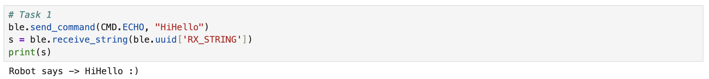
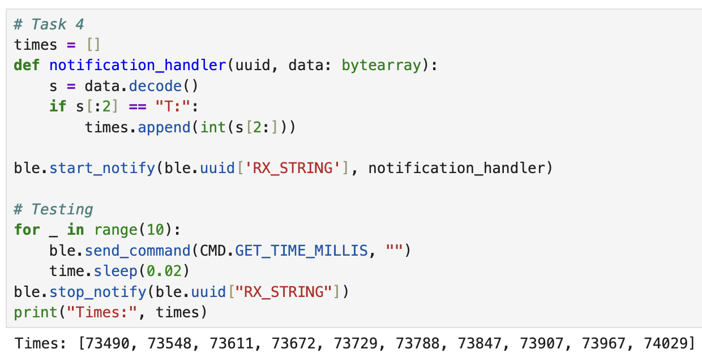
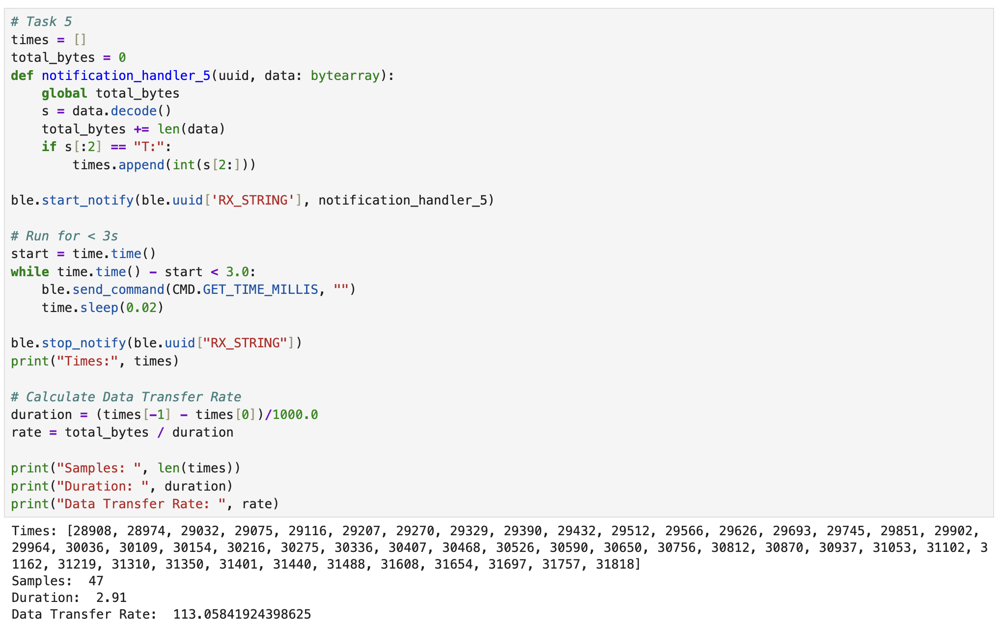
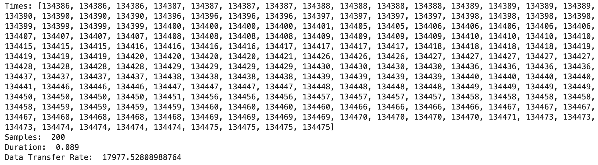
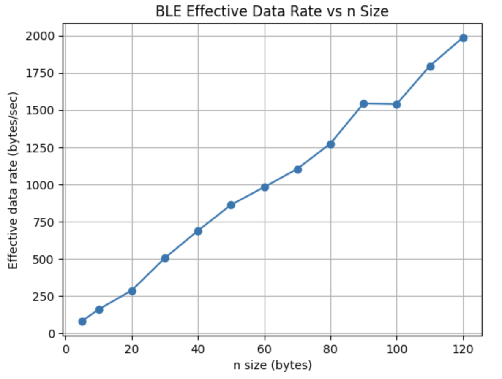

# Lab 1: The Artemis Board and Bluetooth

---

## Objective

The goal of this lab was to become familiar with the SparkFun RedBoard Artemis Nano and to establish communication between the Artemis board and the computer. This lab was divided into two parts:

- **Lab 1A:** Arduino IDE setup and programming the Artemis  
- **Lab 1B:** Bluetooth Low Energy (BLE) communication using Python and Jupyter

---

## Prelab 1A

The Arduino IDE was installed and updated to the latest version. The SparkFun Apollo3 board package was added through the Boards Manager using the provided JSON configuration. After connecting the Artemis board via USB, the corresponding board and serial port were selected.

---

## Lab 1A Tasks

<br>

#### Blink

We first ran the Blink example from File → Examples → 01.Basics.
This ensures that the board was properly connected and that we could successfully upload code.

<div style="text-align:center; margin:30px 0;">
  <iframe
    width="560"
    height="315"
    src="https://www.youtube.com/embed/dTsu4LU6gek"
    frameborder="0"
    allowfullscreen>
  </iframe>
</div>
<p style="text-align:center;">
  <b>Video 1:</b> Blink Example.
</p>
<br>

#### Serial Communication Test

Next, we ran Example4_Serial from File → Examples → Apollo3.
This example was used to test serial communication between the Artemis board and the computer.
The serial monitor was opened to see the output and send input to the board.

<div style="text-align:center; margin:30px 0;">
  <iframe
    width="560"
    height="315"
    src="https://www.youtube.com/embed/66WNAS3cpZ8"
    frameborder="0"
    allowfullscreen>
  </iframe>
</div>
<p style="text-align:center;">
  <b>Video 2:</b> Serial Communication Example.
</p>
<br>

#### Temperature Sensor Test

We then ran Example2_analogRead from File → Examples → Apollo3.
This example was used to test the onboard temperature sensor.
By blowing warm air on the chip, we were able to observe increases in the temperature values.

<div style="text-align:center; margin:30px 0;">
  <iframe
    width="560"
    height="315"
    src="https://www.youtube.com/embed/_jkc4uSTeV0"
    frameborder="0"
    allowfullscreen>
  </iframe>
</div>
<p style="text-align:center;">
  <b>Video 3:</b> Temperature Sensor Example.
</p>
<br>

#### Microphone Test

Next, we ran Example1_MicrophoneOutput from File → Examples → PDM.
This example was used to test the onboard microphone.
A C major scale audio from YouTube was played near the board, and serial monitor showed changing detected frequency content. This confirms that the microphone and PDM interface were functioning correctly.

<div style="text-align:center; margin:30px 0;">
  <iframe
    width="560"
    height="315"
    src="https://www.youtube.com/embed/HzKOsx0vtjQ"
    frameborder="0"
    allowfullscreen>
  </iframe>
</div>
<p style="text-align:center;">
  <b>Video 4:</b> Microphone Example.
</p>
<br>

#### Additional Task: Simple Electronic Tuner

For the additional task, we combined the microphone input with serial output to create a simple electronic tuner.
The code can detect three frequency ranges and print the corresponding musical note to the serial monitor. The three chosen frequencies were C4 (262 Hz), A4 (440 Hz), and E5 (659 Hz).

The implementation was built upon the code from Example1_MicrophoneOutput. An additional helper method getFreq() was implemented to help identify the dominant frequency. This function compares the detected peak frequency to the predefined frequencies and determines the closest match. If there is a match, the serial monitor will print the detected musical note.

```cpp
const char* getFreq(uint32_t freq)
{
    if (freq >= 250 && freq <= 275) return "C4";   // 262 Hz
    else if (freq >= 420 && freq <= 460) return "A4"; // 440 Hz
    else if (freq >= 625 && freq <= 690) return "E5"; // 659 Hz
    else return ""; // no matching note
}
```

The video shows serial monitor printing the three different notes, which was played from a tuner app that can select frequencies to play.

<div style="text-align:center; margin:30px 0;">
  <iframe
    width="560"
    height="315"
    src="https://www.youtube.com/embed/eilouPZ5N54"
    frameborder="0"
    allowfullscreen>
  </iframe>
</div>
<p style="text-align:center;">
  <b>Video 5:</b> Simple Electronic Tuner Example.
</p>
<br>

---

## Prelab 1B

#### Setup

Python 3.13 was installed and configured. In addition, to ensure package isolation, a virtual environment named FastRobots_ble was created using venv. This virtual environment was activated before installing any required packages. These commands were used for activating or deactivating the virtual environment.

```cpp
source FastRobots_ble/bin/activate
deactivate
```

After activating the virtual environment, the following Python packages were installed inside the virtual environment:
- numpy
- pyyaml
- colorama
- nest_asyncio
- bleak
- jupyterlab

After installation, the lab codebase was downloaded and unzipped inside project directory. JupyterLab was launched from the project directory, which can be used for BLE communication.

ArduinoBLE was then installed from library manager, and ble_arduino.ino sketch was burned and loaded. The MAC address of the Artemis was printed:

<div style="text-align:center; margin:20px 0;">
  
</div>
<p style="text-align:center;">
  <b>Figure 1:</b> Artemis MAC Address Printed on Serial Monitor.
</p>

---

#### Codebase Overview

##### Overall Architecture

The provided codebase is divided into two main components:

- Arduino code running on the Artemis board
- Python code running on the computer

These two components communicate using BLE. BLE provides a low power communication tool that allows the computer to send commands to the Artemis board and receive sensor data or responses in return.

<br>

##### BLE Communication

Communication between the computer and the Artemis board is implemented using GATT characteristics, each identified by a different UUID. Different characteristics are used for different data types, such as integers, floats, and strings. Commands are sent from the computer to the Artemis as strings, and the Artemis processes the command and sends back a response.

On the computer side, commands are sent using the function:

```cpp
ble.send_command(cmd_type, data)
```

The command is sent as a formatted string over BLE. On the Artemis side, the command string is received and parsed to determine what action to take. A switch statement is then used to execute the correct command, such as responding to a PING or sending data. The helper function handle_commmand() was used to help with switching commands.

<br>

##### Arduino Side Code (Artemis)

The Arduino sketch (ble_arduino.ino) is responsible for:
- Setting up the BLE service and characteristics
- Receiving command strings from the computer
- Parsing commands using the RobotCommand class
- Sending responses back to computer. EString is used for building response strings on the Artemis side. It provides functions like c_str() to construct messages before sending.
<br>

##### Python Side Code (Computer)

On the computer side, BLE communication is handled by the ArtemisBLEController class. This class is responsible for:
- Connecting to the Artemis board
- Sending commands
- Reading values from BLE characteristics
- Receiving asynchronous data using notifications

---

## Lab 1B Tasks

#### Configuration

Before doing the lab tasks, some configuration steps were required. First, the MAC address printed by the Artemis board in the serial monitor was copied into the computer side configuration file `connections.yaml`.

Next, a new BLE service UUID was generated and updated on both the Arduino and Python sides using the code:

```cpp
from uuid import uuid4
uuid4()
```

This prevents connections to other students’ Artemis boards that may be advertising the default service UUID. The newly generated UUID replaced the original BLE service UUID in the Arduino sketch and the Python configuration file `connections.yaml`.

The command type definitions in the Arduino enum CommandTypes and cmd_types.py were matched exactly, and ble_arduino.ino was reuploaded to Artemis. Finally, the provided Jupyter notebook demo.ipynb was opened and all cells were tested to confirm that BLE communication was functioning before proceeding to the lab tasks.

---

#### Task 1: ECHO Command

A string was sent from the computer to the Artemis using the `ECHO` command. The Artemis added onto the string and responded it back to the computer.

**Example:**
- Sent: `HiHello`
- Received: `Robot says -> HiHello :)`

The code shown below uses RobotCommand: get_next_value() to extract the received string into a character array. An EString object is then used to construct the response by appending multiple string components before sending the final array through the BLE string characteristic. The response is printed to serial monitor for verification.

```cpp
case ECHO:
            char char_arr[MAX_MSG_SIZE];
            // Extract the next value from the command string as a character array
            success = robot_cmd.get_next_value(char_arr);
            if (!success)
                return;
            
            tx_estring_value.clear();
            tx_estring_value.append("Robot says -> ");
            tx_estring_value.append(char_arr);
            tx_estring_value.append(" :)");
            tx_characteristic_string.writeValue(tx_estring_value.c_str());

            Serial.print("Sent back: ");
            Serial.println(tx_estring_value.c_str());
            
            break;
```

<div style="text-align:center; margin:20px 0;">
  
</div>
<p style="text-align:center;">
  <b>Figure 2:</b> Jupyter Lab Showing Response from Artemis for ECHO.
</p>

---

#### Task 2: Send Three Floats

The `SEND_THREE_FLOATS` command was used to send three float values from the computer to the Artemis. These values were printed to the serial monitor.

The code shown below extracts three float values from the received command string using RobotCommand:get_next_value(). Each value is stored in a separate variable.

```cpp
case SEND_THREE_FLOATS:
            float float_a, float_b, float_c;

            // Extract the next value from the command string as an integer
            success = robot_cmd.get_next_value(float_a);
            if (!success)
                return;

            // Extract the next value from the command string as an integer
            success = robot_cmd.get_next_value(float_b);
            if (!success)
                return;

            success = robot_cmd.get_next_value(float_c);
            if (!success)
                return;

            Serial.print("Three Floats: ");
            Serial.print(float_a);
            Serial.print(", ");
            Serial.print(float_b);
            Serial.print(", ");
            Serial.print(float_c);
            
            break;
```

<div style="text-align:center; margin:20px 0;">
  
</div>
<p style="text-align:center;">
  <b>Figure 3:</b> Serial Monitor Showing Response from Artemis for SEND_THREE_FLOATS.
</p>

---

#### Task 3: Get Time Millis

A new command `GET_TIME_MILLIS` was implemented to return the current time in milliseconds using the string format `T:123456`.

The code shown below builds the response string using EString by appending a prefix and the current system time obtained from millis(). The formatted string is transmitted to the computer through the BLE string characteristic and printed to the serial monitor.

```cpp
case GET_TIME_MILLIS:
            tx_estring_value.clear();
            tx_estring_value.append("T:");
            tx_estring_value.append(String(millis()).c_str());
            tx_characteristic_string.writeValue(tx_estring_value.c_str());

            Serial.print("Current Time: ");
            Serial.print(tx_estring_value.c_str());
            
            break;
```

<div style="text-align:center; margin:20px 0;">
  
</div>
<p style="text-align:center;">
  <b>Figure 4:</b> Jupyter Lab Showing Response from Artemis for GET_TIME_MILLIS.
</p>

---

#### Task 4: Notification Handler

The code shown below defines a notification handler that decodes incoming data and extracts timestamp values prefixed with "T:". These timestamps are appended to a list as integers each time a notification is received. Notifications are enabled on the string characteristic, and repeated GET_TIME_MILLIS commands are sent to collect multiple timestamp samples before stopping notifications.

```cpp
# Task 4
times = []
def notification_handler(uuid, data: bytearray):
    s = data.decode()
    if s[:2] == "T:":
        times.append(int(s[2:]))

ble.start_notify(ble.uuid['RX_STRING'], notification_handler)

# Testing
for _ in range(10):
    ble.send_command(CMD.GET_TIME_MILLIS, "")
    time.sleep(0.02)
ble.stop_notify(ble.uuid["RX_STRING"])
print("Times:", times)
```

<div style="text-align:center; margin:20px 0;">
  
</div>
<p style="text-align:center;">
  <b>Figure 5:</b> Jupyter Lab Showing Notification Handler and Printed Times.
</p>

---

#### Task 5: Notification Handler

The notification handler records incoming timestamp while also tracking the total number of bytes received over BLE. A while loop repeatedly sends GET_TIME_MILLIS commands for a fixed duration, allowing multiple samples to be collected through notifications. After completion, the total bytes and elapsed time are used to estimate the effective BLE data transfer rate.

```cpp
# Task 5
times = []
total_bytes = 0
def notification_handler_5(uuid, data: bytearray):
    global total_bytes
    s = data.decode()
    total_bytes += len(data)
    if s[:2] == "T:":
        times.append(int(s[2:]))

ble.start_notify(ble.uuid['RX_STRING'], notification_handler_5)

# Run for < 3s
start = time.time()
while time.time() - start < 3.0:
    ble.send_command(CMD.GET_TIME_MILLIS, "")
    time.sleep(0.02)

ble.stop_notify(ble.uuid["RX_STRING"])
print("Times:", times)

# Calculate Data Transfer Rate
duration = (times[-1] - times[0])/1000.0
rate = total_bytes / duration

print("Samples: ", len(times))
print("Duration: ", duration)
print("Data Transfer Rate: ", rate)
```

<div style="text-align:center; margin:20px 0;">
  
</div>
<p style="text-align:center;">
  <b>Figure 6:</b> Jupyter Lab Showing Looped Time Samples and Data Transfer Rate.
</p>

The total elapsed time was calculated from the last time data subtract the first time data.
From the shown calculation in Figure 6, the effective data transfer rate is 113 bytes/sec.

---

#### Task 6: Send Time Data

A second method to task 5 was to create a global array that can store timestamps. Instead of looping over each time and sending times, task 6 was implemented to loop over each time and store times inside the global array. The command SEND_TIME_DATA was used to send over the array.

Two additional methods were implemented in the switch statement, SEND_TIME_DATA and RECORD_TIME_DATA.

For SEND_TIME_DATA, the code iterates through the recorded timestamp array and formats each entry as a string started with "T:", same as in GET_TIME_MILLIS. Each timestamp is sent, and the total number of samples sent is printed to the serial monitor.

For RECORD_TIME_DATA, the code initializes the array index and records timestamp and temperature samples for a fixed duration of around three seconds. Each iteration stores the current time from millis() and the corresponding temperature reading into arrays until either the time limit is reached or the buffer is full.

```cpp
case SEND_TIME_DATA:
            for (int i = 0; i < time_buf_len; i++) {
                tx_estring_value.clear();
                tx_estring_value.append("T:");
                tx_estring_value.append(time_buf[i]);
                tx_characteristic_string.writeValue(tx_estring_value.c_str());
            }

            Serial.print("Sent time data count: ");
            Serial.println(time_buf_len);
        
            break;
```

```cpp
case RECORD_TIME_DATA:
        {
            time_buf_len = 0;
            unsigned long start = millis();
            while ((millis() - start) < 3000) {
                if (time_buf_len < TIME_BUF_SIZE){
                    time_buf[time_buf_len] = (int) millis();
                    temp_buf[time_buf_len] = getTempDegF();
                    time_buf_len++;
                } else {
                    break;
                }
            }

            Serial.print("Recorded samples: ");
            Serial.println(time_buf_len);

            break;
        }
```

On the computer side, the notification handler records incoming timestamp while also tracking the total number of bytes received. RECORD_TIME_DATA and SEND_TIME_DATA commands were sent to Artemis, and the system sleeps for 3.2 seconds for Artemis to record and send before stopping notification. After sending is completed, the collected timestamps and total data volume are used to calculate the effective data transfer rate.

```cpp
# Task 6
times = []
total_bytes = 0

def notification_handler_6(uuid, data: bytearray):
    global total_bytes
    s = data.decode()
    total_bytes += len(data)

    if s[:2] == "T:":
        times.append(int(s[2:]))

ble.start_notify(ble.uuid['RX_STRING'], notification_handler_6)
ble.send_command(CMD.RECORD_TIME_DATA, "")
ble.send_command(CMD.SEND_TIME_DATA, "")

# Artemis recording ~3s
time.sleep(3.2)

ble.stop_notify(ble.uuid["RX_STRING"])

print("Times:", times)

# Calculate Data Transfer Rate
duration = (times[-1] - times[0])/1000.0
rate = total_bytes / duration

print("Samples: ", len(times))
print("Duration: ", duration)
print("Data Transfer Rate: ", rate)
```

As shown from Figure 7, the data transfer rate is 17978 bytes/sec.

<div style="text-align:center; margin:20px 0;">
  
</div>
<p style="text-align:center;">
  <b>Figure 7:</b> Jupyter Lab Showing Time Samples and Data Transfer Rate.
</p>

---

#### Task 7: Get Temp Readings

A second array was added to store temperature readings at the same time with time readings. The first temperature reading corresponds to the first time reading. A new command GET_TEMP_READINGS was implemented in the switch statement. The overall structure was similar to SEND_TIME_DATA, but there was an additional temperature reading that was appended to the temperature array, separated by a ",". Print statements were again added at the end for verification.

```cpp
case GET_TEMP_READINGS:            
            for (int i = 0; i < time_buf_len; i++) {
                tx_estring_value.clear();
                tx_estring_value.append("T:");
                tx_estring_value.append(time_buf[i]);
                tx_estring_value.append(",");
                tx_estring_value.append(temp_buf[i]);
                tx_characteristic_string.writeValue(tx_estring_value.c_str());
            }

            Serial.print("Sent time, temp data count: ");
            Serial.println(time_buf_len);
        
            break;
```

On the computer side, the notification handler decodes incoming string data and parses into timestamp and temperature values. Each received message is split into time and temperature components, which are then appended to separate arrays. The overall structure is similar to task 6, and print statements are added at the end for verification.

```cpp
# Task 7
times = []
temps = []

def notification_handler_7(uuid, data: bytearray):
    s = data.decode()

    if s[:2] == "T:":
        result = s[2:]
        t, temp = result.split(",")
        times.append(int(t))
        temps.append(float(temp))

ble.start_notify(ble.uuid["RX_STRING"], notification_handler_7)

ble.send_command(CMD.RECORD_TIME_DATA, "")
ble.send_command(CMD.GET_TEMP_READINGS, "")

# Artemis recording ~3s
time.sleep(3.2)

ble.stop_notify(ble.uuid["RX_STRING"])

print("Times Samples Size:", len(times))
print("Temps Samples Size:", len(temps))
print("Times:", times)
print("Temps:", temps)
```

<div style="text-align:center; margin:20px 0;">
  
</div>
<p style="text-align:center;">
  <b>Figure 8:</b> Jupyter Lab Showing Time and Temp Samples.
</p>

---

#### Task 8: Discussion

Discuss the differences between these two methods, the advantages and disadvantages of both and the potential scenarios that you might choose one method over the other. How “quickly” can the second method record data? The Artemis board has 384 kB of RAM. Approximately how much data can you store to send without running out of memory?

---

#### Additional Task 9: Effective Data Rate And Overhead

To test for effective data rate and overhead, messages of different sizes were sent from the computer to the Artemis board, telling the Artemis to reply with a specified number of bytes. The timestamps of sent commands and received replies were recorded to calculate the effective data transfer rate. By testing reply sizes ranging from very small packets (5 bytes) to larger packets (120 bytes), the effect of packet size on transfer rate and overhead were examined. 

On the Artemis side, a new command REPLY_N is added to extract an integer value representing the reply size. An array of the specified size is filled with repeating alphabetical characters before being sent over. This allows controlled testing by varying the number of bytes sent in each reply.

```cpp
case REPLY_N:            
            char arr[MAX_MSG_SIZE];
            int n;

            success = robot_cmd.get_next_value(n);
            if (!success)
                return;

            for (int i = 0; i < n; i++) {
                arr[i] = 'a' + (i%26);
            }
            arr[n] = '\0';
            tx_characteristic_string.writeValue(arr);

            Serial.print("n: ");
            Serial.println(n);

            break;
```

On the computer side, the code shown below implements the test by repeatedly requesting the Artemis to reply with a specified number of bytes. For each size, 20 messages are sent while BLE notifications record the received data size and times. The total number of bytes received and the duration are used to compute the effective data rate. The results are then plotted for visualization.

```cpp
# Task 9
rx_times = []
rx_sizes = []
n_sizes = [5, 10, 20, 30, 40, 50, 60, 70, 80, 90, 100, 110, 120]
rates = []

def notification_handler_8(uuid, data: bytearray):
    rx_times.append(time.time())
    rx_sizes.append(len(data))

for n in n_sizes:
    rx_times.clear()
    rx_sizes.clear()

    ble.start_notify(ble.uuid['RX_STRING'], notification_handler_8)

    start = time.time()
    for _ in range(20):
        ble.send_command(CMD.REPLY_N, n)
        time.sleep(0.02)
    end = time.time()

    ble.stop_notify(ble.uuid['RX_STRING'])

    total_bytes = sum(rx_sizes)
    duration = end - start
    rate = total_bytes / duration
    
    rates.append(rate)

    print("Number of Bytes:", n)
    print("Total Bytes Received:", total_bytes)
    print("Duration:", duration)
    print("Effective data rate:", rate)

plt.figure()
plt.plot(n_sizes, rates, marker='o')
plt.xlabel("n size (bytes)")
plt.ylabel("Effective data rate (bytes/sec)")
plt.title("BLE Effective Data Rate vs n Size")
plt.grid(True)
plt.show()
```

The plot in Figure 9 shows that the effective data rate increases almost linearly as the reply size n increases. For small packets like 5 bytes, the effective data rate is very low, indicating that a large portion of the time is dominated by overhead.

As the reply size increases to 120 bytes, the effective data rate improves, reaching nearly 1800 bytes/sec at 120 bytes. This shows that larger replies reduce the relative impact of overhead. While the total duration increases slightly, the efficiency improves.

<div style="text-align:center; margin:20px 0;">
  
</div>
<p style="text-align:center;">
  <b>Figure 9:</b> Effective Data Rate vs. N Size.
</p>

<div style="text-align:center; margin:20px 0;">
  
</div>
<p style="text-align:center;">
  <b>Figure 10:</b> Number of Bytes, Total Bytesm Duration, and Data Rate Data.
</p>

---

#### Additional Task 10: Reliability

To evaluate the reliability of communication between the Artemis board and the computer, a new test that aimed at sending information at increasingly high rates is used. This test tracks if all messages sent by the Artemis are received by computer, or if there is some loss and missing data.

On the Artemis side, a new command RELIABILITY_TEST is used to send how ever many data points the computer told it to send. The format it sends is "T: i", where i increments from 0 to M−1.

```cpp
case RELIABILITY_TEST:
            int m;

            success = robot_cmd.get_next_value(m);
            if (!success)
                return;

            for (int i = 0; i < m; i++) {
                tx_estring_value.clear();
                tx_estring_value.append("T:");
                tx_estring_value.append(i);
                tx_characteristic_string.writeValue(tx_estring_value.c_str());

                }
            break;
```

On the computer side, the sequence numbers received are stored in a set to ensure that each number is only counted once. After telling the Artemis to send M numbers, the computer listens for incoming data for a fixed duration (12 seconds). Once data collection is complete, the received sequence numbers are compared against the expected range from 0 to M−1. Any missing numbers indicate that they were not successfully received. The loss percentage is then calculated as the ratio of missing number to the total number of numbers sent. 

```cpp
# Task 10
received = set()
M = 1000

def notification_handler_10(uuid, data: bytearray):
    global received
    s = data.decode()
    if s[:2] == "T:":
        received.add(int(s[2:]))

ble.start_notify(ble.uuid["RX_STRING"], notification_handler_10)
ble.send_command(CMD.RELIABILITY_TEST, M)

time.sleep(12)

ble.stop_notify(ble.uuid["RX_STRING"])

missing = []

for i in range (M):
    if i not in received:
        missing.append(i)
loss = 100.0 * len(missing) / M

print("Expected:", M)
print("Total Received:", len(received))
print("Missing:", missing)
print("Loss %:", loss)
```

From Figure 11, the computer does reaed all the data from Artemis, without missing any number.

<div style="text-align:center; margin:20px 0;">
  
</div>
<p style="text-align:center;">
  <b>Figure 11:</b> Jupyter Lab Output Showing No Missing Number.
</p>

---

## Discussion

Briefly describe what you’ve learned, challenges that you faced, and/or any unique solutions used to fix problems. It is important to keep these writeups succinct. You will not get extra points for writing more words if the content doesn’t contribute to communicating your understanding of the lab material.

---

## Reference
