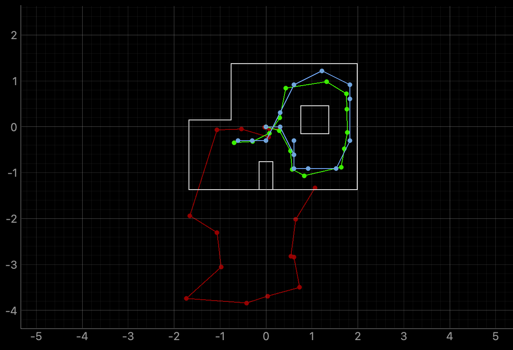
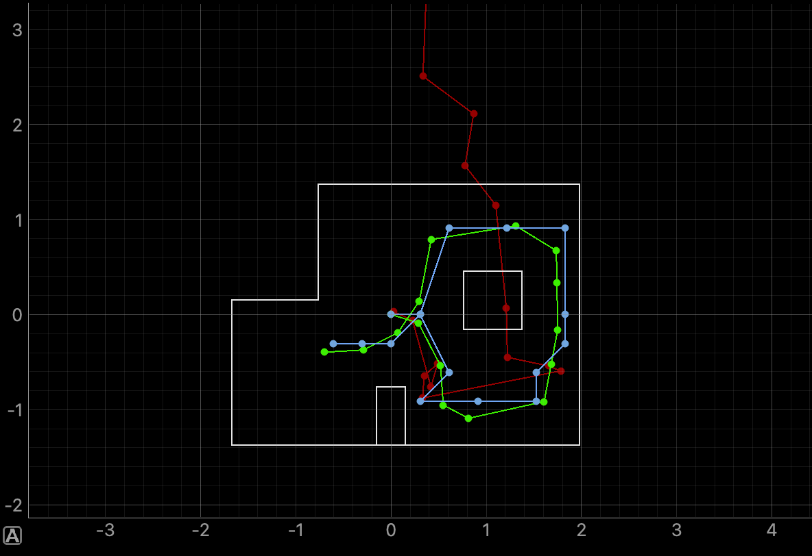
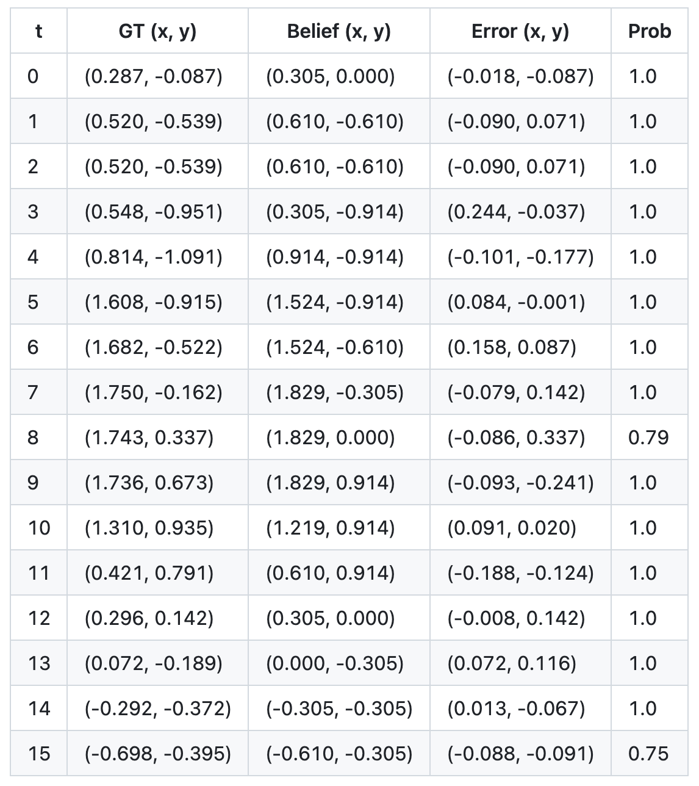

## Objective

The goal of this lab was to implement grid localization using a Bayes Filter in simulation. The robot does not know its actual position, so it must estimate its position using odometry and sensor measurements. The objective is to show that probabilistic localization can track the robot better than odometry.

---

## Code Implementation

The localization code was divided into five main functions: compute_control(), odom_motion_model(), prediction_step(), sensor_model(), and update_step(). Each one matches one part of the Bayes Filter.

#### compute_control()

This function calculates the control input between two poses. Given the previous pose and current pose, it finds the first rotation needed to face the direction of motion, the translation distance, and the second rotation needed to match the final direction.

```cpp
def compute_control(cur_pose, prev_pose):
    cur_x, cur_y, cur_theta = cur_pose
    prev_x, prev_y, prev_theta = prev_pose

    delta_x = cur_x - prev_x
    delta_y = cur_y - prev_y

    delta_rot_1 = degrees(atan2(delta_y, delta_x)) - prev_theta
    delta_rot_1 = loc.mapper.normalize_angle(delta_rot_1)

    delta_trans = dist((cur_x, cur_y), (prev_x, prev_y))

    delta_rot_2 = cur_theta - prev_theta - delta_rot_1
    delta_rot_2 = loc.mapper.normalize_angle(delta_rot_2)

    return delta_rot_1, delta_trans, delta_rot_2
```

#### odom_motion_model()

This function calculates the probability of moving from one state to another given the measured control input u. First, the function computes the motion actually required to go from prev_pose to cur_pose. Then it compares that motion to the measured odometry input u. Gaussian distributions are used for the two rotations and the translation. The final transition probability is the product of the three probabilities.

```cpp
def odom_motion_model(cur_pose, prev_pose, u):
    actual_rot_1, actual_trans, actual_rot_2 = compute_control(cur_pose, prev_pose)

    prob_rot_1 = loc.gaussian(actual_rot_1 - u[0], 0, loc.odom_rot_sigma)
    prob_trans = loc.gaussian(actual_trans - u[1], 0, loc.odom_trans_sigma)
    prob_rot_2 = loc.gaussian(actual_rot_2 - u[2], 0, loc.odom_rot_sigma)

    prob = prob_rot_1 * prob_trans * prob_rot_2
    return prob
```

#### prediction_step()

This function performs the prediction step of the Bayes Filter. It updates loc.bel_bar, which is the predicted belief before using new sensor data. The function first gets the odometry control input from the previous and current odometry poses. Then for every possible current grid cell, it adds contributions from all possible previous grid cell. Each contribution is previous belief at that state multiplied by the transition probability from motion model.

A small optimization was used. If a previous belief is less than 0.0001, it is skipped because it contributes very little but costs time.

```cpp
def prediction_step(cur_odom, prev_odom):
    u = compute_control(cur_odom, prev_odom)

    loc.bel_bar = np.zeros(loc.bel.shape)

    for x_idx in range(loc.mapper.MAX_CELLS_X):
        for y_idx in range(loc.mapper.MAX_CELLS_Y):
            for a_idx in range(loc.mapper.MAX_CELLS_A):

                cur_pose = loc.mapper.from_map(x_idx, y_idx, a_idx)
                total = 0

                for prev_x in range(loc.mapper.MAX_CELLS_X):
                    for prev_y in range(loc.mapper.MAX_CELLS_Y):
                        for prev_a in range(loc.mapper.MAX_CELLS_A):

                            bel_prev = loc.bel[prev_x, prev_y, prev_a]

                            if bel_prev < 0.0001:
                                continue

                            prev_pose = loc.mapper.from_map(prev_x, prev_y, prev_a)
                            total += odom_motion_model(cur_pose, prev_pose, u) * bel_prev

                loc.bel_bar[x_idx, y_idx, a_idx] = total

    if np.sum(loc.bel_bar) > 0:
        loc.bel_bar = loc.bel_bar / np.sum(loc.bel_bar)
```

#### sensor_model()

This function calculates the probability of a sensor observation for one grid cell. obs is the expected set of measurements for a grid cell, and loc.obs_range_data.flatten() is the actual measured sensor data. The Gaussian gives the likelihood for each individual measurement. The result is an array of 18 probabilities.

```cpp
def sensor_model(obs):
    prob_array = loc.gaussian(obs, loc.obs_range_data.flatten(), loc.sensor_sigma)
    return prob_array
```

#### update_step()

This function performs the update step of the Bayes Filter. It uses the measured sensor data to correct the predicted belief. For each grid cell, the expected observation is generated using mapper.get_views(). The sensor model compares the expected observation with the actual measurement. The probabilities are multiplied together using np.prod(prob_array). This is then multiplied by the predicted belief loc.bel_bar to get the updated belief loc.bel.

```cpp
def update_step():
    for x_idx in range(loc.mapper.MAX_CELLS_X):
        for y_idx in range(loc.mapper.MAX_CELLS_Y):
            for a_idx in range(loc.mapper.MAX_CELLS_A):

                true_obs = loc.mapper.get_views(x_idx, y_idx, a_idx)
                prob_array = sensor_model(true_obs)

                loc.bel[x_idx, y_idx, a_idx] = np.prod(prob_array) * loc.bel_bar[x_idx, y_idx, a_idx]

    if np.sum(loc.bel) > 0:
        loc.bel = loc.bel / np.sum(loc.bel)
```

<br>

---

## Results

The Bayes Filter was tested on a defined trajectory in the simulator. The results show that the estimated belief follows the ground truth closely, while the odometry drifts over time and is noisy.

Video 1 and 2 below shows two trials of the run.

<div style="text-align:center; margin:30px 0;">
  <iframe
    width="560"
    height="315"
    src="https://www.youtube.com/embed/KfRxgFy2JuE"
    frameborder="0"
    allowfullscreen>
  </iframe>
</div>
<p style="text-align:center;">
  <b>Video 1:</b> Trial 1.
</p>

<p align="center">
  
</p>
<p align="center">
  <b>Figure 1:</b> Trial 1 Final Plot.
</p>

<div style="text-align:center; margin:30px 0;">
  <iframe
    width="560"
    height="315"
    src="https://www.youtube.com/embed/3KCuoqqc-RI"
    frameborder="0"
    allowfullscreen>
  </iframe>
</div>
<p style="text-align:center;">
  <b>Video 2:</b> Trial 2.
</p>

<p align="center">
  
</p>
<p align="center">
  <b>Figure 2:</b> Trial 2 Final Plot.
</p>

---

## Most Probable States Comparison

The most probable state after each iteration of the Bayes filter was compared with the ground truth pose. From the results, the estimated belief state is very close to the ground truth in position, with errors typically within about 0.1 to 0.3m. 

After the update step, the belief often converges to a single grid cell with high probability, showing that the sensor measurements are effective in correcting the prediction. Although the angle error can appear large, this is likely due to angle wrapping, so the orientation estimate is still reasonable.

<p align="center">
  
</p>

---

## Discussion

This lab focused on using a Bayes Filter to estimate the robot's position. The robot uses odometry for motion, but it is noisy and causes error over time. The prediction step spreads the belief, while the update step uses sensor measurements to correct it. The two steps together make the estimate more accurate.

---

## Acknowledgment

I referenced [Aidan McNay](https://aidan-mcnay.github.io/fast-robots-docs/lab10/)’s pages from last year.

Parts of this report and website formatting were assisted by AI tools (ChatGPT) for grammar checking and webpage structuring. All code was written, tested, and validated by the author.
