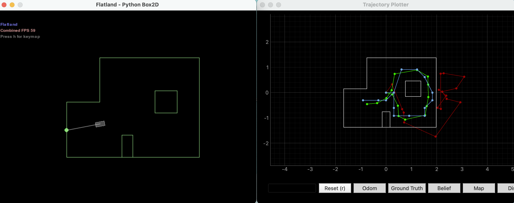
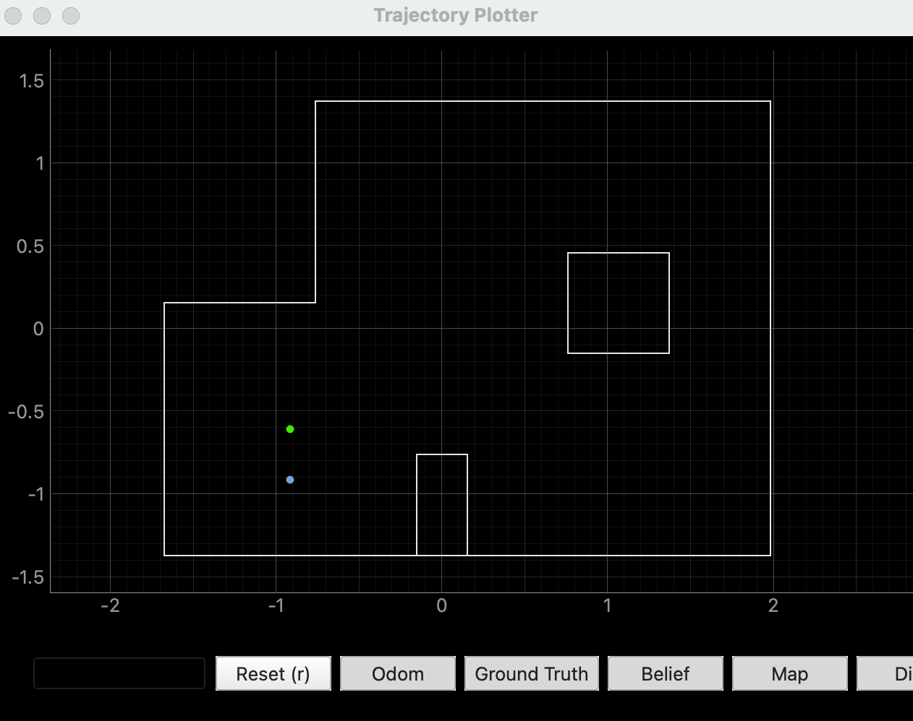
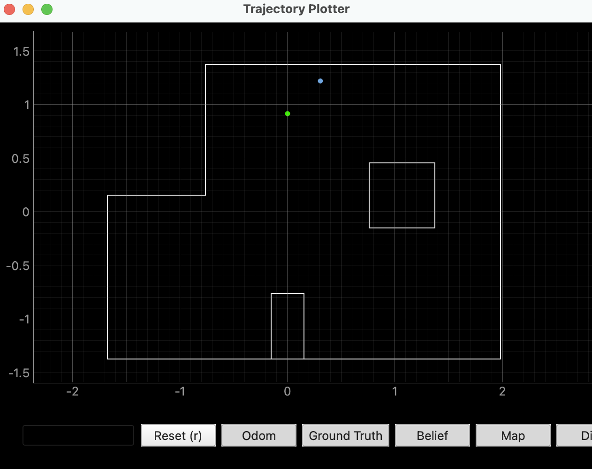
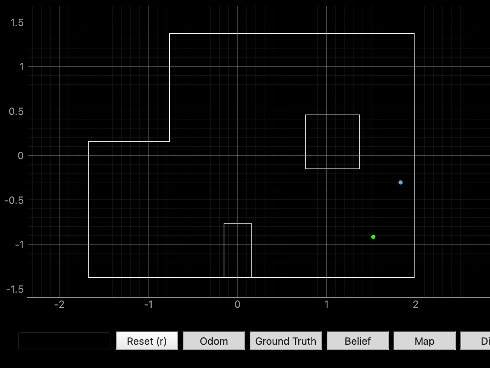
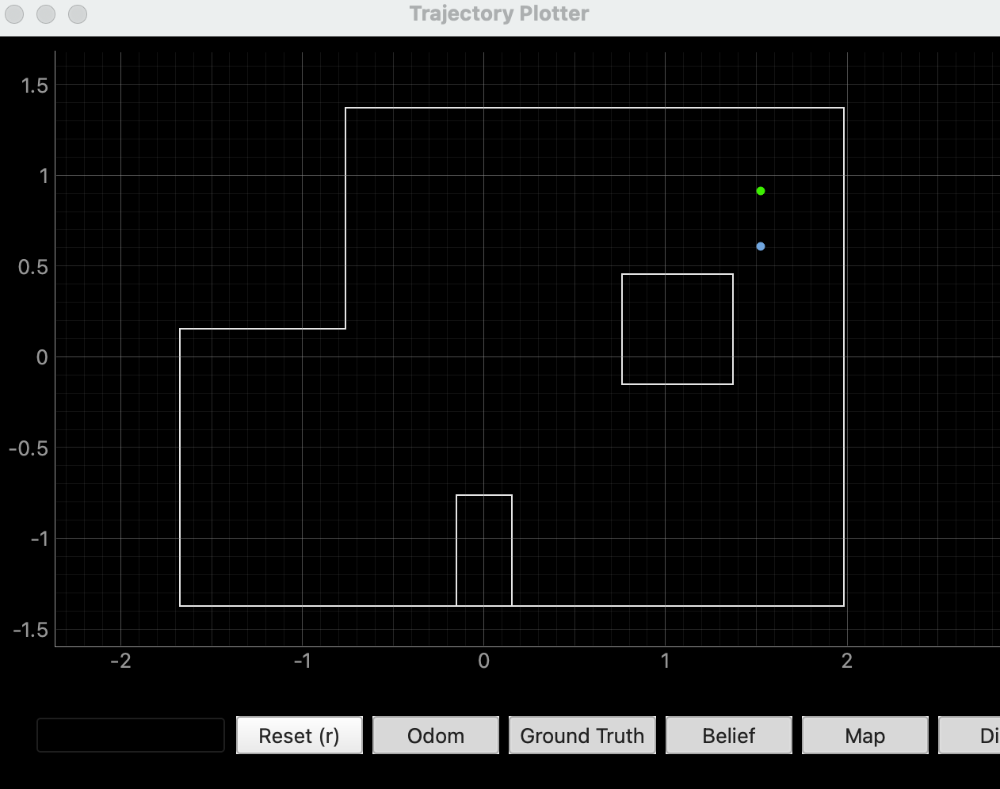

## Objective

The goal of this lab was to perform localization on the real robot using the Bayes filter. Unlike Lab 10, which used both prediction and update steps in simulation, this lab uses only the update step due to noisy motion. The robot performs a 360° scan using the TOF sensor and compares the measurements against the map to estimate its pose.

---

## Simulation Result

The notebook lab11_sim.ipynb was ran to verify the Bayes filter implementation on virtual robot, and figure 1 below shows successful implementation as the belief is relatively close to ground truth.

<p align="center">
  
</p>
<p align="center">
  <b>Figure 1:</b> Simulation Result.
</p>

---

## Code Implementation

The Bayes filter implementation from Lab 10 was reused. In Lab 10, the localization included prediction and update steps using motion and sensor models. For this lab, only the update step is used.

The main modification was implementing the function:

#### perform_observation_loop()

This function commands the robot to rotate and collects TOF measurements at fixed angles. The robot measures 18 measurements at 20° increments, starting from 0 degree. All the code was reused from Lab 9, with no important changes. 

```cpp
def perform_observation_loop(self, rot_vel=120):
    map_time = []
    map_yaw = []
    map_dist = []
    map_expected = None
    map_done = False

    def parse_map(line: str):
        parts = line.split("|")
        if len(parts) != 3:
            return None
        t_ms = int(parts[0])
        yaw_deg = float(parts[1])
        dist_mm = int(parts[2])
        return t_ms / 1000.0, yaw_deg, dist_mm

    def map_data_handler(_uuid, response: bytearray):
        nonlocal map_expected, map_done

        s = response.decode().strip()

        if s.startswith("MAP_HDR"):
            map_expected = int(s.split(",")[1])
            return

        if s == "MAP_DONE":
            map_done = True
            return

        parsed = parse_map(s)
        if parsed is None:
            return

        t, yaw_deg, dist_mm = parsed
        map_time.append(t)
        map_yaw.append(yaw_deg)
        map_dist.append(dist_mm)

    self.ble.start_notify(self.ble.uuid["RX_STRING"], map_data_handler)
    self.ble.send_command(CMD.START_MAP_RUN, "")
    time.sleep(20.0)

    map_done = False
    map_expected = None
    self.ble.send_command(CMD.GET_MAP_DATA, "")

    t0 = time.time()
    while not map_done and (time.time() - t0) < 30:
        time.sleep(0.05)

    self.ble.stop_notify(self.ble.uuid["RX_STRING"])

    if len(map_dist) == 0:
        raise RuntimeError("No observation data received from robot.")

    sensor_ranges = (np.array(map_dist)[np.newaxis].T) / 1000.0
    sensor_bearings = np.empty((1, 1))
    return sensor_ranges, sensor_bearings
```

<br>

---

## Localization Results

The robot was placed at the four marked poses:
- (-3 ft, -2 ft)
- (0 ft, 3 ft)
- (5 ft, -3 ft)
- (5 ft, 3 ft)

For each pose, a uniform belief was initialized, a 360° scan was performed, and the update step was applied. The resulting belief corresponds to the most probable pose.


<p align="center">
  
  
</p>
<p align="center">
  <b>Figure 2:</b> Localization at (-3, -2)
</p>

<div style="text-align:center; margin:30px 0;">
  <iframe
    width="560"
    height="315"
    src="https://www.youtube.com/embed/KfRxgFy2JuE"
    frameborder="0"
    allowfullscreen>
  </iframe>
</div>
<p style="text-align:center;">
  <b>Video 1:</b> Localization at (-3, -2)
</p>

<p align="center">
  
  
</p>
<p align="center">
  <b>Figure 3:</b> Localization at (0, 3)
</p>

<div style="text-align:center; margin:30px 0;">
  <iframe
    width="560"
    height="315"
    src="https://www.youtube.com/embed/KfRxgFy2JuE"
    frameborder="0"
    allowfullscreen>
  </iframe>
</div>
<p style="text-align:center;">
  <b>Video 1:</b> Localization at (-3, -2)
</p>

<p align="center">
  
  
</p>
<p align="center">
  <b>Figure 4:</b> Localization at (5, -3)
</p>

<div style="text-align:center; margin:30px 0;">
  <iframe
    width="560"
    height="315"
    src="https://www.youtube.com/embed/KfRxgFy2JuE"
    frameborder="0"
    allowfullscreen>
  </iframe>
</div>
<p style="text-align:center;">
  <b>Video 1:</b> Localization at (-3, -2)
</p>

<p align="center">
  
  
</p>
<p align="center">
  <b>Figure 5:</b> Localization at (5, 3)
</p>

<div style="text-align:center; margin:30px 0;">
  <iframe
    width="560"
    height="315"
    src="https://www.youtube.com/embed/KfRxgFy2JuE"
    frameborder="0"
    allowfullscreen>
  </iframe>
</div>
<p style="text-align:center;">
  <b>Video 1:</b> Localization at (-3, -2)
</p>

---

## Ground Truth vs Bayes Filter Result

| Test Pose | Ground Truth (ft, ft, deg) | Ground Truth (m, m, deg) | Bayes Belief (m, m, deg) | Notes |
|---|---:|---:|---:|---|
| Pose 1 | (-3, -2, 0) | (-0.914, -0.610, 0) | (-0.914, -0.914, 10) | x is accurate, y is about 1 ft low |
| Pose 2 | (0, 3, 0) | (0.000, 0.914, 0) | (fill in) | |
| Pose 3 | (5, -3, 0) | (1.524, -0.914, 0) | (fill in) | |
| Pose 4 | (5, 3, 0) | (1.524, 0.914, 0) | (fill in) | |

The most probable state after each iteration of the Bayes filter was compared with the ground truth pose. From the results, the estimated belief state is very close to the ground truth in position, with errors typically within about 0.1 to 0.3m. 

After the update step, the belief often converges to a single grid cell with high probability, showing that the sensor measurements are effective in correcting the prediction. Although the angle error can appear large, this is likely due to angle wrapping, so the orientation estimate is still reasonable.

<p align="center">
  
</p>

---

## Discussion

This lab focused on using a Bayes Filter to estimate the robot's position. The robot uses odometry for motion, but it is noisy and causes error over time. The prediction step spreads the belief, while the update step uses sensor measurements to correct it. The two steps together make the estimate more accurate.

---

## Acknowledgment

I referenced [Aidan McNay](https://aidan-mcnay.github.io/fast-robots-docs/lab10/)’s pages from last year.

Parts of this report and website formatting were assisted by AI tools (ChatGPT) for grammar checking and webpage structuring. All code was written, tested, and validated by the author.
