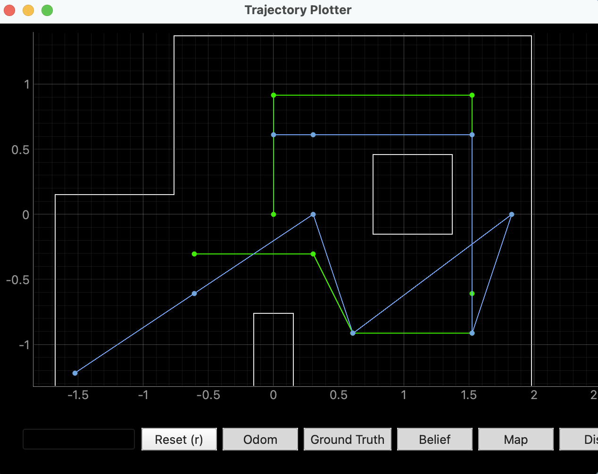
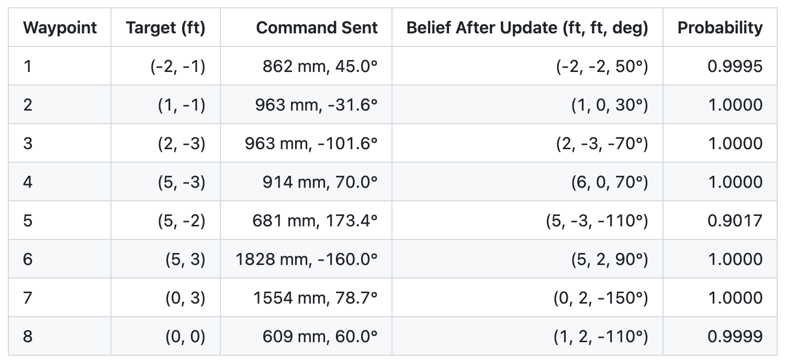

## Objective

The goal of this lab was to combine the previous parts of the labs into one complete path planning and execution lab. The robot used localization from Lab 11, yaw control from Lab 6, and translational control from Labs 5 and 7 to move through the given waypoints.

The robot was required to move through the following waypoints:
```cpp
(-4, -3)
(-2, -1)
(1, -1)
(2, -3)
(5, -3)
(5, -2)
(5, 3)
(0, 3)
(0, 0)
```

The idea was to localize the robot using the Bayes filter, calculate the distance and angle to the next waypoint, turn toward that waypoint, move forward, and then localize again. PID control were used for both turning and moving.

---

## Path Planning Method

A local waypoint-to-waypoint planning method was used since the required path was already given. At each step, the robot used the most probable pose from the Bayes filter as its current position. The next waypoint was then selected from the waypoint list. The angle and distance to the next waypoint were calculated using the difference in x and y position.

```cpp
curr_pose, curr_prob, curr_idx = get_max_belief()

target_x, target_y = waypoints[next_pose_idx]

dx = target_x - curr_pose[0]
dy = target_y - curr_pose[1]

desired_heading = math.degrees(math.atan2(dy, dx))
angle_deg = normalize_angle(desired_heading - curr_pose[2])

dist_m = math.sqrt(dx**2 + dy**2)
dist_mm = int(dist_m * 1000)
```

The angle command was calculated relative to the robot's current heading. This allowed the robot to turn toward the next waypoint before moving forward. The distance command was calculated as the straight line distance between the current belief and the target waypoint.

After calculating the angle and distance, the command was sent to the robot:

```cpp
robot.execute_trajectory(dist_mm, angle_deg)
```

On the robot side, this command was executed by turning and moving. The robot first used yaw control (Lab 6) to rotate toward the target direction. After the turn was complete, the robot used the front TOF sensor and translational control to move forward (Lab 5, 7).

After the robot finished the command, the Python code ran the prediction step and then performed another localization update:

```cpp
next_pose = (target_x, target_y, desired_heading)
loc.prediction_step(next_pose, curr_pose)

loc.get_observation_data()
loc.update_step()
loc.plot_update_step_data(plot_data=True)
```

--- 

## Code Implementation

The implementation reused the Bayes filter localization code from Lab 11. The robot still performed a 360 degree scan with the TOF sensor, and Python used the update step to estimate the most likely pose.

Similar to previous labs, a RealRobot class was first defined. This class is used by the localization code to collect TOF observations from the real robot and to send trajectory commands.

The perform_observation_loop() function commands the robot to perform a 360 degree scan and then receives the TOF measurements from the Artemis. These measurements are returned to the Bayes filter as sensor_ranges.

```cpp
def perform_observation_loop(self, rot_vel=120):
    initialize lists

    def parse_map(line: str):
        parse incoming data

    def map_data_handler(_uuid, response: bytearray):
        s = response.decode().strip()
        if s is header return
        parsed = parse_map(s)
        t, yaw_deg, dist_mm = parsed
        append data

    self.ble.start_notify(self.ble.uuid["RX_STRING"], map_data_handler)

    self.ble.send_command(CMD.START_MAP_RUN, "")
    time.sleep(30.0)
    self.ble.send_command(CMD.GET_MAP_DATA, "")
    wait for GET_MAP_DATA to finish
    self.ble.stop_notify(self.ble.uuid["RX_STRING"])

    sensor_ranges = (np.array(map_dist)[np.newaxis].T) / 1000.0
    sensor_bearings = np.empty((1, 1))

    return sensor_ranges, sensor_bearings
```

The execute_trajectory() function sends a distance and angle command to the robot. The robot executes the turn and translation on the Artemis, then sends "done" back to Python when the movement is finished.

The main function is lab12_step(). Each call moves the robot from the current belief to the next waypoint. The function calculates the required turn angle and distance, sends the command to the robot, runs the prediction step, and then localizes again.

```cpp
def lab12_step():
    global next_pose_idx
    # Current pose from Bayes filter
    curr_pose, curr_prob, curr_idx = get_max_belief()
    target_x, target_y = waypoints[next_pose_idx]

    # Turn and distance
    dx = target_x - curr_pose[0]
    dy = target_y - curr_pose[1]

    desired_heading = math.degrees(math.atan2(dy, dx))
    angle_deg = normalize_angle(desired_heading - curr_pose[2])

    dist_m = math.sqrt(dx**2 + dy**2)
    dist_mm = int(dist_m * 1000)

    # Send command to robot
    robot.execute_trajectory(dist_mm, angle_deg)

    # Prediction step
    next_pose = (target_x, target_y, desired_heading)
    loc.prediction_step(next_pose, curr_pose)

    # Localization update after movement
    loc.get_observation_data()
    loc.update_step()
    loc.plot_update_step_data(plot_data=True)

    new_pose, new_prob, new_idx = get_max_belief()
    next_pose_idx += 1
    return next_pose_idx >= len(waypoints)
```

This is called in a while loop so it keeps stepping into next waypoints.

On the Artemis side, a new command was added for Lab 12 navigation:

```cpp
EXECUTE_TRAJECTORY
```

When Python sends this command, the Artemis gets the distance and angle, then calls start_nav_target().

```cpp
case EXECUTE_TRAJECTORY:
{
    int dist_mm;
    float angle_deg;

    success = robot_cmd.get_next_value(dist_mm);
    if (!success) return;

    success = robot_cmd.get_next_value(angle_deg);
    if (!success) return;

    start_nav_target(dist_mm, angle_deg);

    tx_characteristic_string.writeValue("NAV_STARTED");
    break;
}
```

The start_nav_target() function stores the desired movement and initializes the turning state. The robot first turns toward the target direction, then moves forward.

```cpp
void start_nav_target(int dist_mm, float angle_deg) {
    save commanded distance and angle
    stop robot

    reset yaw PID
    read current yaw
    reset angle unwrap

    target_yaw = current_yaw + commanded_angle

    reset turn check counter
    enable navigation
    state = NAV_TURN
}
```

The main navigation state machine is implemented in nav_step(). It contains four main states:

```cpp
NAV_TURN      → turn toward waypoint
NAV_TURN_WAIT → wait for robot to settle
NAV_MEASURE   → average front TOF readings
NAV_DRIVE     → run translational PID
```

```cpp
NAV_TURN:
    run yaw PID
    if turn reached:
        stop
        reset averaging
        state = NAV_TURN_WAIT

NAV_TURN_WAIT:
    wait 500 ms for robot to settle
    state = NAV_MEASURE

NAV_MEASURE:
    collect 5 valid TOF readings
    avg_distance = average(readings)
    setpoint_mm = avg_distance - target_distance - sensor_offset
    reset PID and KF
    start translational PID
    state = NAV_DRIVE

NAV_DRIVE:
    run translational PID
    if PID finished:
        stop
        reset nav/map state
}
```

The translation control used the front TOF sensor. After the turn, the robot averaged several TOF readings to estimate the current distance to the wall. Then it calculated a new setpoint based on how far the robot needed to move.

The final movement was handled by the existing translational PID function from Lab 5 and 7.

---

## Navigation Results

The robot was able to complete the full waypoint sequence. The full run was recorded in Video 1, and the Figure 1 below shows the Bayes filter belief updates during the run.

<p align="center">
  
</p>
<p align="center">
  <b>Figure 1:</b> Full Execution Belief (Blue) vs. Ideal (Green)
</p>

<div style="text-align:center; margin:30px 0;">
  <iframe
    width="560"
    height="315"
    src="https://www.youtube.com/embed/ZeK7T0E3Zq4"
    frameborder="0"
    allowfullscreen>
  </iframe>
</div>
<p style="text-align:center;">
  <b>Video 1:</b> Run 1
</p>

During the run, the robot localized after each waypoint movement. The Bayes filter result after each update step was recorded. The table below shows the target waypoint, the movement command sent to the robot, and the most likely belief after localization.

<p align="center">
  
</p>

From the table, most of the beliefs were close to the target waypoint. The robot localized exactly at waypoint 3, and several other positions were within around one grid cell. The largest error occurred around waypoint 4, where the target was (5, -3) but the belief after update was (6, 0). Even with this error, the robot was still able to continue navigating and complete the full path.

Overall, the robot successfully moved through the full path and reached the final region of the map. The localization was not perfect, but repeated Bayes filter updates allowed the robot to keep correcting its estimated pose throughout the run.

---

## Ground Truth vs. Bayes Filter Result

The robot visually completed the full path. After each movement, the robot performed another 360 degree scan and updated its belief using the Bayes filter. The result was not always exactly at the target waypoint, but most of the beliefs were close enough for the robot to continue the run.

For the first few waypoints, the belief was mostly within about one grid cell of the target. For waypoint 1, the target was (-2, -1), while the belief after update was (-2, -2). For waypoint 2, the target was (1, -1), while the belief was (1, 0). Waypoint 3 gave the best result, where the belief matched the target exactly at (2, -3).

The largest localization error happened at waypoint 4. The target was (5, -3), but the belief after update was (6, 0). This was likely caused by a movement error before the scan, or by the TOF readings matching a nearby pose better than the true pose. Even though the belief was off at this step, the robot was still able to continue navigating after the next localization updates.

The final waypoint also had some error. The target was (0, 0), while the final belief was (1, 2). From the video, the robot stopped early before (0, 0), suggesting that the robot matched a nearby pose better than the true pose.

Several sources of error likely affected the final result. One major source of error was translational movement. The robot used the front TOF sensor to estimate how far it should move after each turn. If the robot was angled slightly, the TOF sensor could measure a different part of the wall than expected. This could make the robot stop too early or too late.

Another source of error was yaw drift and imperfect rotation. During each localization scan, the robot needed to rotate and collect TOF readings. If the yaw estimate drifted or the robot did not rotate exactly, the measured scan could be shifted compared to the expected scan. This would cause the Bayes filter to choose a nearby pose instead of the true pose.

Overall, the Bayes filter result was good enough for navigation. The localization was not perfect, but repeated localization after each movement helped the robot recover from errors and continue moving through the waypoints.

---

## Discussion

This lab was much harder than only doing localization because the robot had to physically move before each update step. Any small error in turning or translation could affect the next waypoint command.

One major issue was translational movement. At first, timed open loop movement was tested, but the distance traveled changed depending on the battery level. This made the robot inconsistent, especially for longer movements. To improve this, the robot used the front TOF sensor during translation. This was more consistent.

Overall, the full path was completed successfully. The localization was not perfect, but repeated Bayes filter updates after each waypoint helped the robot recover from movement error and continue through the waypoint sequence.

---

## Acknowledgment

I referenced [Aidan McNay](https://aidan-mcnay.github.io/fast-robots-docs/lab12/)’s pages from last year.

Parts of this report and website formatting were assisted by AI tools (ChatGPT) for grammar checking and webpage structuring. All code was written, tested, and validated by the author.
