## IMU Setup

The "SparkFun 9DOF IMU Breakout_ICM 20948_Arduino Library" was installed. IMU was connected to Artemis using QWIIC connectors, as shown in figure 1. Example1_Basics was ran to verify functionality.

<p align="center">
  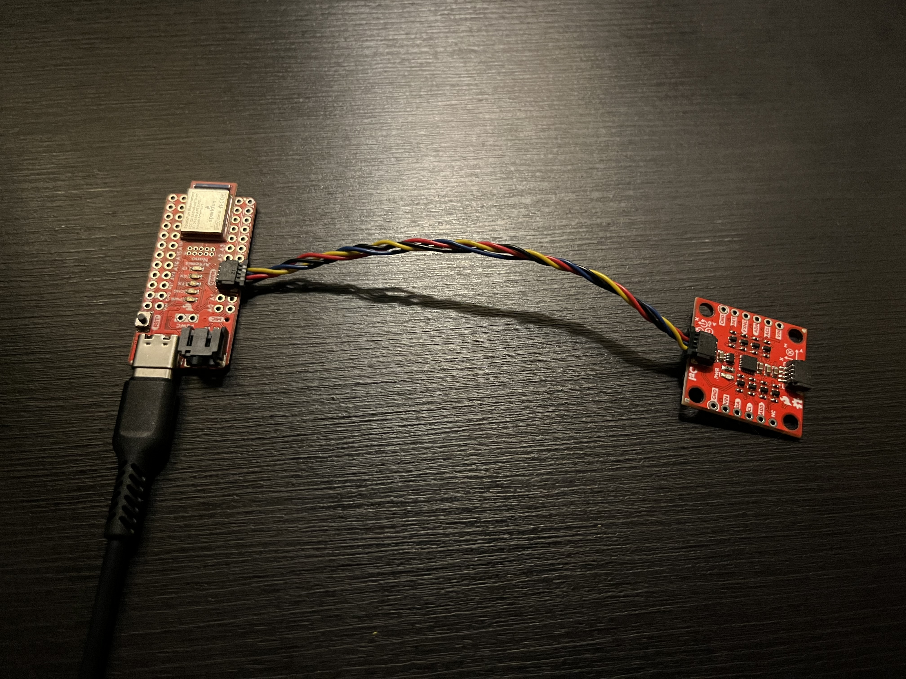
</p>
<p align="center">
  <b>Figure 0:</b> Artemis IMU Connection.
</p>

<br>

#### Observations

Accelerometer: When the board is held still, z axis reads about 1 g because it is measuring gravity, while the other two axes are close to zero. If the board is flipped over, the sign of z axis changes and becomes -1 g. When the board is accelerated, the acceleration values increase on the axis in the direction of motion.

Gyroscope: The gyroscope measures angular velocity. When the board is not rotating, the gyroscope values stay near zero. When the board is rotated, the corresponding gyroscope axis values changes, and faster rotations produce larger values.

Raw accelerometer data shows a little inaccuracy (around 2°) with some jitter, especially during motion. Gyroscope raw data is smoother short term but accumulates drift over time.

<div style="text-align:center; margin:30px 0;">
  <iframe
    width="560"
    height="315"
    src="https://www.youtube.com/embed/jOivJuVg31c"
    frameborder="0"
    allowfullscreen>
  </iframe>
</div>
<p style="text-align:center;">
  <b>Video 1:</b> Example1_Basics Demo.
</p>

<br>

#### AD0_VAL

AD0_VAL is the last bit of I2C address of the IMU, and the IMU supports two possible I2C addresses. The default setting is AD0_VAL = 1. If the ADR jumper is closed, the address bit flips and AD0_VAL should be changed to 0. This allows multiple identical devices to share the same I2C bus without address conflicts.

<br>

#### Visual Indication

To make it obvious that the board is running, a simple visual indicator was added in setup(). It blinks the LED three times slowly.

```cpp
for (int k = 0; k < 3; k++) {
    digitalWrite(LED_BUILTIN, HIGH);
    delay(400);
    digitalWrite(LED_BUILTIN, LOW);
    delay(400);
```

<div style="text-align:center; margin:30px 0;">
  <iframe
    width="560"
    height="315"
    src="https://www.youtube.com/embed/MZmRoheMmXI"
    frameborder="0"
    allowfullscreen>
  </iframe>
</div>
<p style="text-align:center;">
  <b>Video 2:</b> Setup Indicator: Blink.
</p>

<br>

---

## Accelerometer

#### Pitch and Roll

Pitch and roll were computed from the accelerometer using atan2. A new switch case GET_PITCH_ROLL was added that sends time, pitch degree, and roll degree over BLE.

```cpp
pitch_deg = atan2f(ax_g, az_g) * 180.0f / (float)M_PI;
roll_deg  = atan2f(ay_g, az_g) * 180.0f / (float)M_PI;
```

When the board was placed flat on the table, both pitch and roll were near 0°. Tilting the board forward and backward produced pitch values near ±90°. Tilting the board sideways produced roll values near ±90°. Figures below show the output at {-90, 0, 90} degrees.

<p align="center">
  
  
  
</p>
<p align="center">
  <b>Figure 1:</b> Ouputs showing pitch at {-90, 0, 90} degrees.
</p>

<p align="center">
  
  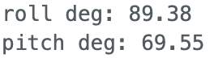
</p>
<p align="center">
  <b>Figure 2:</b> Ouputs showing roll at {-90, 90} degrees.
</p>

Raw readings are quite accurate, but there are always a small offset. This was reduced by two point calibration mentioned in section below.

<br>

#### Jupyter Plotting Function

A function was implemented in Python that calls GET_PITCH_ROLL and plots the corresponding data from Artemis.

```cpp
initialize t_list, pitch_list, roll_list

def notification_handler_pr(uuid, data: bytearray):
    s = data.decode()
    append data to each list

start BLE notifications
while elapsed_time < T:
    send GET_PITCH_ROLL
stop BLE notifications
plot t_list vs pitch_list and roll_list
```

Example outputs with are shown in figure 3 and 4.

<p align="center">
  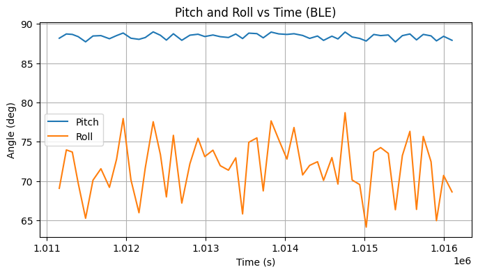
  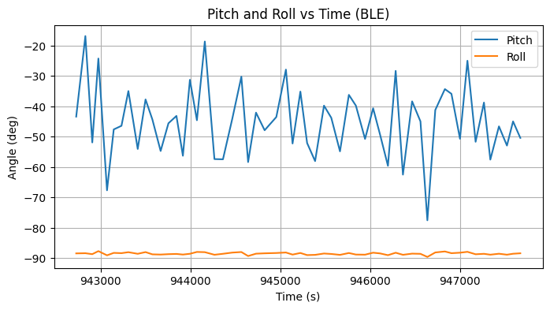
</p>

<p align="center">
  <b>Figure 3,4:</b> Example Ouputs from Jupyter Showing Pitch at 90° and Roll at -90°.
</p>

<br>

#### Two Point Calibration

Two point calibration is used to map the accelerometer's reading as a linear function, allowing to reduce systematic measurement errors.

To implement two point calibration, a helper function in Python was made to generate scale and offset. A new switch case TWO_POINT_CALIBRATION was implemented that returns t, ax, ay, az over BLE. 

```cpp
Initialize t_acc, ax_list, ay_list, az_list

def notification_handler_acc(uuid, data: bytearray):
    s = data.decode()
    append data to each list

start BLE notifications
while elapsed_time < T:
    send TWO_POINT_CALIBRATION

// Only one of these were called at a time, the other was commented out
#ax_mean_pos = float(np.mean(ax_list))
#ay_mean_pos = float(np.mean(ay_list))
#az_mean_pos = float(np.mean(az_list))

ax_mean_neg = float(np.mean(ax_list))
ay_mean_neg = float(np.mean(ay_list))
az_mean_neg = float(np.mean(az_list))
```

<br>

For two point calibration, the board was placed in two orientations for each axis so the expected acceleration along that axis was +1 g and −1 g. The mean value measured from each orientation was used to compute a linear scale and offset.

```cpp
def two_point(r_pos, r_neg):
    s = 2.0 / (r_pos - r_neg)
    o = -s * r_neg - 1.0
    return s, o

r_pos_z = az_mean_pos

r_neg_z = az_mean_neg

sz, oz = two_point(r_pos_z, r_neg_z)
```

These printed scale and offset values were then applied in the Artemis to correct accelerometer readings.

```cpp
ax_cal = sx * ax_raw + ox;
ay_cal = sy * ay_raw + oy;
az_cal = sz * az_raw + oz;
```

The calibration values are:

```cpp
float sx = 1.000051455432029f, ox = 0.0033058601683502165f;
float sy = 1.0003119421412863f, oy = 0.014637164105158806f;
float sz = 0.9869166257320566f, oz = -0.01036935354718016f;
```

After calibration, the same test of pitch at 90° and roll at -90° were ran, and results are shown in figure 5 and 6. 

<p align="center">
  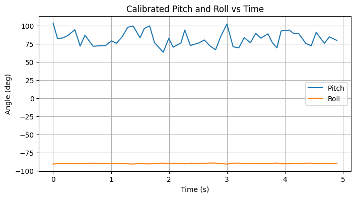
  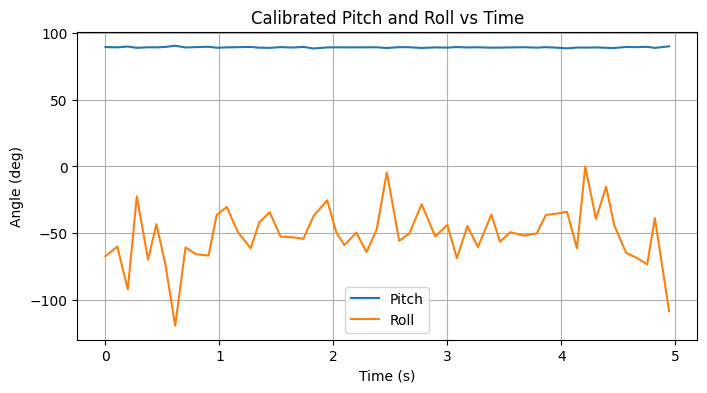
</p>

<p align="center">
  <b>Figure 5,6:</b> Calibrated Ouputs Showing Pitch at 90° and Roll at -90°.
</p>

<br>

Some data points of calibrated results and raw data are shown below in figure 7 and 8, with the calibrated values being slightly closer to actual results.

<p align="center">
  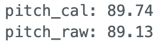
  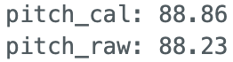
  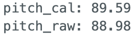
</p>
<p align="center">
  <b>Figure 7:</b> Calibrated vs. Raw Pitch Ouputs at 90°.
</p>

<p align="center">
  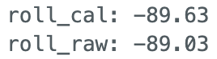
  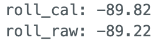
  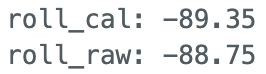
</p>
<p align="center">
  <b>Figure 8:</b> Calibrated vs. Raw Roll Ouputs at -90°.
</p>

<br>

#### FFT

A new function plot_fft() was implemented in Python which takes a time list and data list, and convert into frequency spectrum. 

```cpp
def plot_fft(t_s, data_list, title="FFT", xlim_hz=None):
    convert t_s, data_list to array
    shift t_s so time starts at 0

    dt = np.mean(np.diff(t))
    fs = 1.0 / dt
    subtract mean from data_list to remove DC

    # FFT
    N = len(time_data)
    freq_data = fft(time_data)
    y = 2.0 / N * np.abs(freq_data[0:int(N/2)])

    create frequency axis from 0 to fs/2
    plot frequency vs magnitude
```

<br>

#### Accelerometer Raw Data

Pitch and roll data obtained while running the RC car in proximity are then recorded and taken into frequency domain for noise analysis.
The time domain and frequency domain plots of pitch and roll are shown in figure 9 and 10.

<p align="center">
  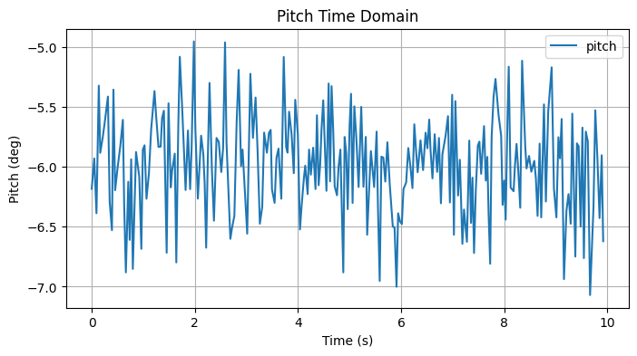
  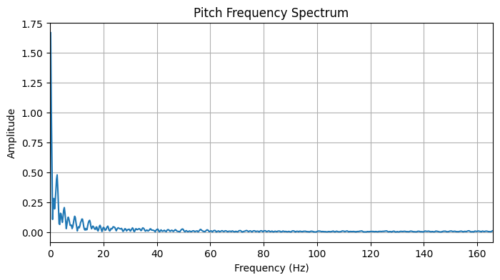
</p>
<p align="center">
  <b>Figure 9:</b> Pitch Time and Frequency Domain Signal.
</p>

<p align="center">
  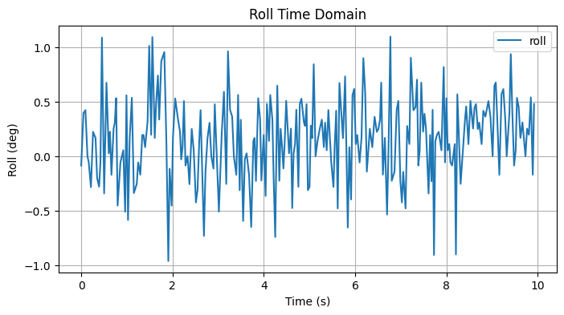
  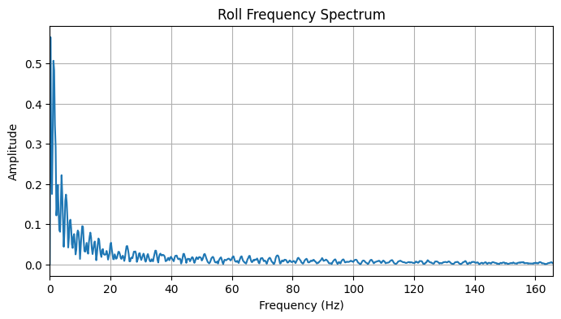
</p>
<p align="center">
  <b>Figure 10:</b> Roll Time and Frequency Domain Signal.
</p>

There are some high frequency noises, as indicated by the jitter in time domain signal, and the amplitude of high frequencies in frequency spectrum.

<br>

#### Low Pass Filter

From the frequency plot of pitch and roll, the low frequency data ends around 5Hz, so a cutoff frequency of 10Hz is chosen to remove higher frequency noise. 

Cutoff frequency determines the balance between noise attenuation and signal integrity. Lower cutoff frequency can reduce more high frequency noise, but it also attenuates quick, transient signal response. Higher cutoff frequency brings in more noise.

The low pass filter coefficient alpha was calculated as follows:

dt = 1 / sample rate

RC = 1 / (2π*RC)

alpha = dt / (dt + RC)

Sample rate (350Hz) was calculated in section **Sample Data**. After plugging in values, the calculated alpha is 0.15.

```cpp
alpha = 0.15
pitch_LPF = np.zeros(len(pitch))
roll_LPF  = np.zeros(len(roll))

pitch_LPF[0] = pitch[0]
roll_LPF[0]  = roll[0]

for n in range(1, len(pitch)):
    pitch_LPF[n] = alpha * pitch[n] + (1 - alpha) * pitch_LPF[n-1]
    roll_LPF[n]  = alpha * roll[n]  + (1 - alpha) * roll_LPF[n-1]
```

The overlayed raw and low pass filtered outputs are shown in figure 11 and 12. The high frequency noise is removed, as shown from the smoother waveform. In frequency domain, the amplitude of noise after 10 Hz are attenuated.

<p align="center">
  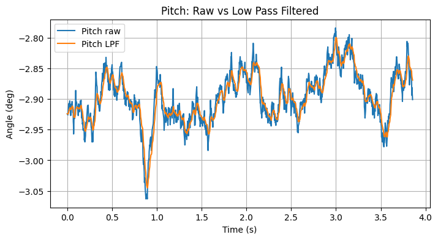
  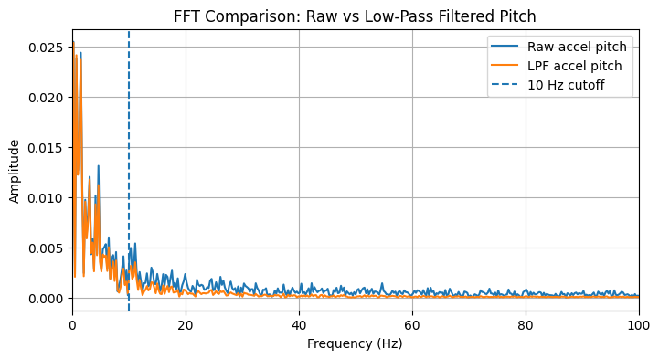
</p>
<p align="center">
  <b>Figure 11:</b> Pitch Raw vs. LPF Results.
</p>

<p align="center">
  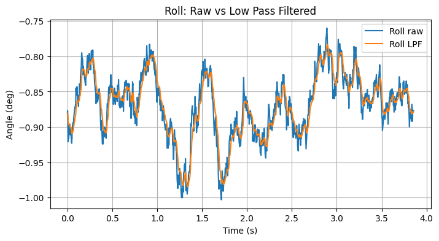
  
</p>
<p align="center">
  <b>Figure 12:</b> Roll Raw vs. LPF Results.
</p>

<br>

---

## Gyroscope

#### Pitch, Roll, and Yaw

For pitch, roll, and yaw calculation using gyroscope, these equations from class were implemented:

```cpp
roll_gyro = roll_gyro + gx_dps * dt;
pitch_gyro = pitch_gyro + gy_dps * dt;
yaw_gyro = yaw_gyro + gz_dps * dt;
```

The results of accelerometer raw, filtered, and gyro values are plotted in figure 13 below. The IMU started at roll = 90°, rotated to roll = -90°, and back to 90°. Gyroscope does capture this rotation, but due to drift it is off by around 100°.

<p align="center">
  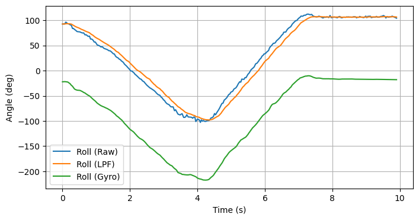
</p>
<p align="center">
  <b>Figure 13:</b> Roll Raw Accel vs. LPF vs. Gyro Results.
</p>

Another issue with gyroscope is that the sign convention for pitch is incorrect, which results in a 180° error on pitch, as shown in figure 14 below. To account for this issue, the code

```cpp
pitch_gyro = pitch_gyro + gy_dps * dt;
```

was changed to 

```cpp
pitch_gyro = pitch_gyro - gy_dps * dt;
```

<p align="center">
  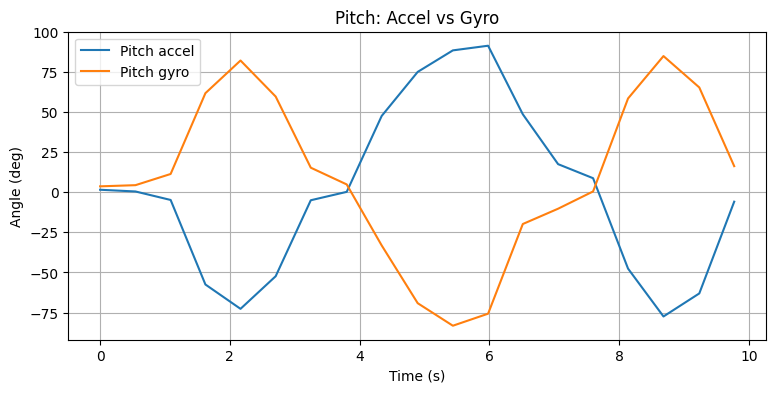
</p>
<p align="center">
  <b>Figure 14:</b> Incorrect Pitch Value.
</p>

<br>

#### Sampling Frequency

To investigate the effect of sampling frequency on gyroscope drift, two sampling frequencies of 200Hz (sleep 0.005) and 2Hz (sleep 0.5) were introduced. 

```cpp
while time.time() - start < 10.0:
    ble.send_command(CMD.GET_PITCH_ROLL, "")
    time.sleep(0.5) # This was modified
```

As shown in figure 15, the higher sampling frequency results in more noise.

<p align="center">
  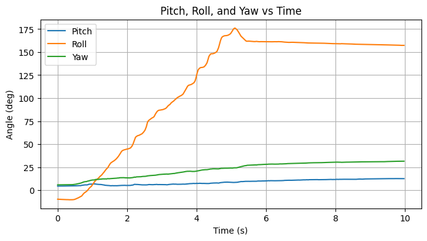
  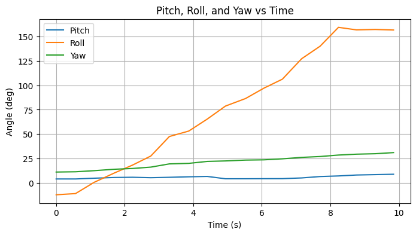
</p>
<p align="center">
  <b>Figure 15:</b> Gyroscope Data for Roll from -90° to 90°, 200Hz (Left) vs. 2Hz (Right).
</p>

<br>

#### Complementary Filter

In order to reduce the drift on gyroscope, the complementary filter assigns a weight for pitch and roll value calculated from accelerometer or gyroscope. 

```cpp
float pitch_gyro_pred = pitch_cf + gy_dps * dt;
float roll_gyro_pred  = roll_cf  + gx_dps * dt;

pitch_cf = alpha_cf * pitch_gyro_pred + (1.0f - alpha_cf) * pitch_cal;
roll_cf  = alpha_cf * roll_gyro_pred  + (1.0f - alpha_cf) * roll_cal;
```

An alpha_cf of 0.95 was chosen. Since gyroscope is a lot more stable than accelerometer, a higher weight was assigned to it. The rest was assigned to accelerometer, which is enough to reduce the drift from gyroscope.

The complementary filter values are tested with two tests:
- Placing IMU flat on table, hitting table for vibration.
- Rotating IMU about each axis for pitch and roll to see range.

When placing IMU flat and creating sources of vibration, the complementary filter shows resilient to noise and is relatively flat, while accelerometer shows vibrations and gyroscope shows drifts.

<p align="center">
  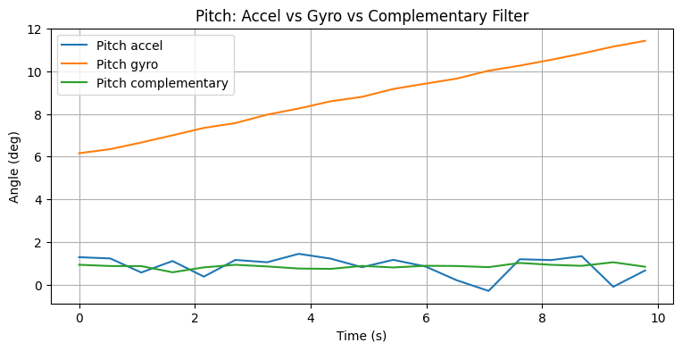
  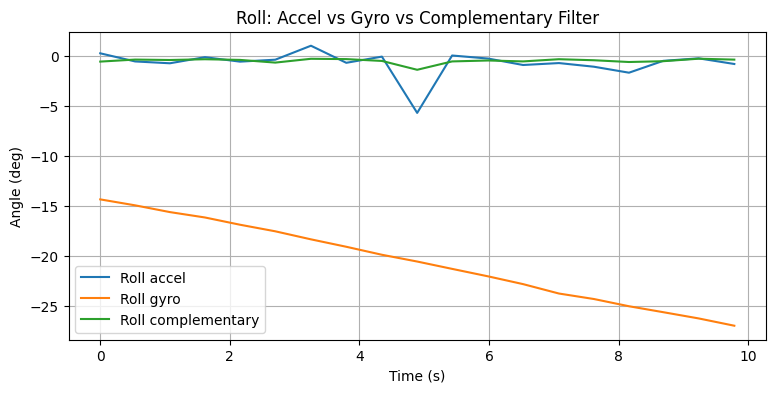
</p>
<p align="center">
  <b>Figure 16:</b> Complementary Filter Value when Placed Flat.
</p>

When rotating IMU about each axis, pitch and roll value does confirm -90° to 90° range with smooth transition.

<p align="center">
  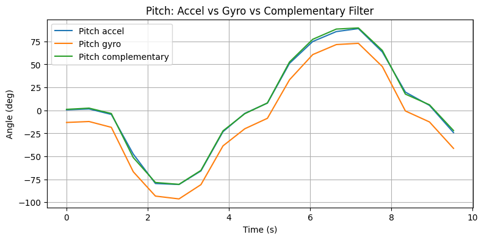
  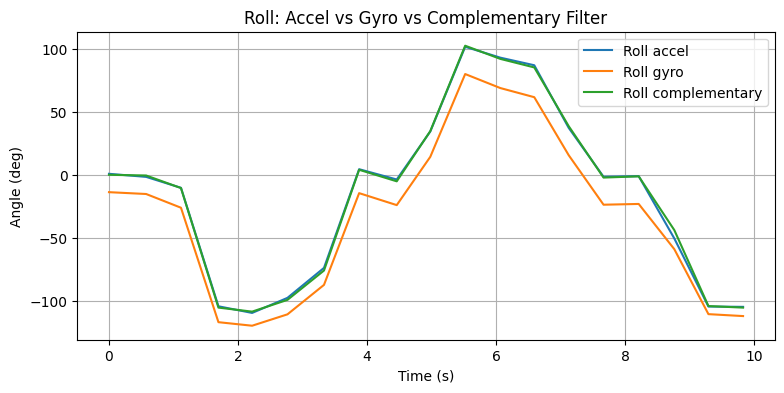
</p>
<p align="center">
  <b>Figure 17:</b> Complementary Filter Value from -90° to 90°.
</p>

<br>

---

## Sample Data

#### Loop Time and IMU

To check the IMU sampling speed, the main loop was written so it does not wait for new IMU data. Instead, the loop runs continuously and only reads the IMU when dataReady() indicates a new sample is ready.

```cpp
update_imu();  
loop_count++;

uint32_t now_ms = millis();
if (now_ms - last_rate_ms >= 1000) {
    print loop time

    loop_count = 0;
    imu_sample_count = 0;
    last_rate_ms = now_ms;
```

When IMU reads were disabled (commented), the main loop ran at about 39,000 loops/second. When IMU reads were enabled, IMU data was read at about 350 samples/second. This shows that the main loop itself is much faster than the IMU, and the sampling rate is limited by the IMU.

<p align="center">
  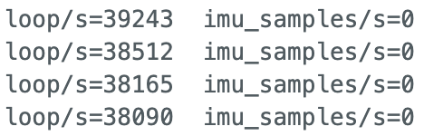
  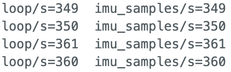
</p>
<p align="center">
  <b>Figure 18:</b> Loop Time without IMU Read vs. with IMu Read.
</p>

<br>

#### IMU Flag and Array

In main loop, update_imu() was called every iteration. update_imu() is non blocking because it first checks myICM.dataReady(). If no new data, it returns immediately.

A boolean flag **recording** was used to control logging:
- When recording = true, data was saved into arrays at index imu_len.
- When recording = false, nothing was stored.

Recording was started using the BLE command START_IMU_RECORD, which sets recording to true and clears the index.

```cpp
case START_IMU_RECORD:
            imu_len = 0;
            record_done = false;
            recording = true;

            tx_estring_value.clear();
            tx_estring_value.append("REC_STARTED");
            tx_characteristic_string.writeValue(tx_estring_value.c_str());
            break;
```

Recording stopped when 5 seconds passes or the array fills (imu_len >= IMU_BUF_SIZE). The stored samples are then sent over BLE using SEND_IMU_RECORD.

```cpp
case SEND_IMU_RECORD:
        {
        recording = false;

        for (int i = 0; i < imu_len; i++) {
            send time, pitch, roll
            tx_characteristic_string.writeValue(tx_estring_value.c_str());
        }
        tx_estring_value.clear();
        tx_estring_value.append("REC_DONE");
        tx_characteristic_string.writeValue(tx_estring_value.c_str());
        break;
        }
```

<br>

#### Array Structure

Separate arrays are used with the same index:

```cpp
imu_t_us[i]
pitch_acc_buf[i], roll_acc_buf[i]
pitch_gyr_buf[i], roll_gyr_buf[i]
pitch_cf_buf[i], roll_cf_buf[i]
```

This is simple because every sample uses the same index i, so signals stay the same in time. It’s also easier to plot and compare signals. I can also choose which signals to transmit later.

<br>

#### Data Types and Memory

Timestamps are stored as unsigned long because unsigned long imu_t_us[] stores micros() directly. Angles are stored as float because angles are real numbers, and float is accurate enough for the measurements. Doubles are too precise and use too much memory.

Each measurement consists of a timestamp stored as an unsigned long (4 Bytes) and six angle values (accelerometer, gyroscope, and complementary filter pitch and roll) stored as floats (6 × 4 Bytes), resulting in 28 Bytes per measurement.

The Artemis has 384 kB of RAM, which allows storage of approximately 14,043 measurements. With a measured sampling rate of 350 Hz, this corresponds to 40 seconds of continuous data, which exceeds the 5 second requirement.

<br>

#### Recording

The code below successfully record 5 seconds of data from IMU.

```cpp
Initialize t_us, pitch, roll
done = False

def handler(uuid, data: bytearray):
    global done
    s = data.decode()

    if s start with REC_LEN: print
    if s is REC_DONE: done = True
    if s start with REC: print
    append data to each list

start BLE notifications
done = False
send START_IMU_RECORD
time.sleep(5.3)
send SEND_IMU_RECORD

while elapsed_time < 15:
    time.sleep(0.05)

stop BLE notifications
```

Figure 19 below shows the pitch and roll value recorded using the above method.

<p align="center">
  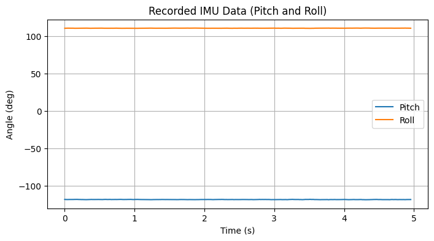
</p>
<p align="center">
  <b>Figure 19:</b> 5 Seconds of IMU Data Recorded.
</p>

<br>

---

## Record a stunt

Battery was mounted onto the RC car, and video 3 below shows recorded motion.

One observation I noticed was that the RC car flips over when stopped suddenly at high speeds. Future control adjustments may be needed to prevent flipping during braking.

<div style="text-align:center; margin:30px 0;">
  <iframe
    width="560"
    height="315"
    src="https://www.youtube.com/embed/eilouPZ5N54"
    frameborder="0"
    allowfullscreen>
  </iframe>
</div>
<p style="text-align:center;">
  <b>Video 3:</b> RC Car Stunt!
</p>

<br>

---

## Discussion

This lab provids hands on experience working with the IMU. This helped me understand how filtering and sensor techniques can improve angle estimation. There was no significant challenge encountered during this lab. Overall, this lab built a strong foundation in IMU data processing.

---

## Acknowledgment

I referenced [Aidan McNay](https://aidan-mcnay.github.io/fast-robots-docs/lab2/)’s pages from last year.

Parts of this report and website formatting were assisted by AI tools (ChatGPT) for grammar checking and webpage structuring. All code was written, tested, and validated by the author.
