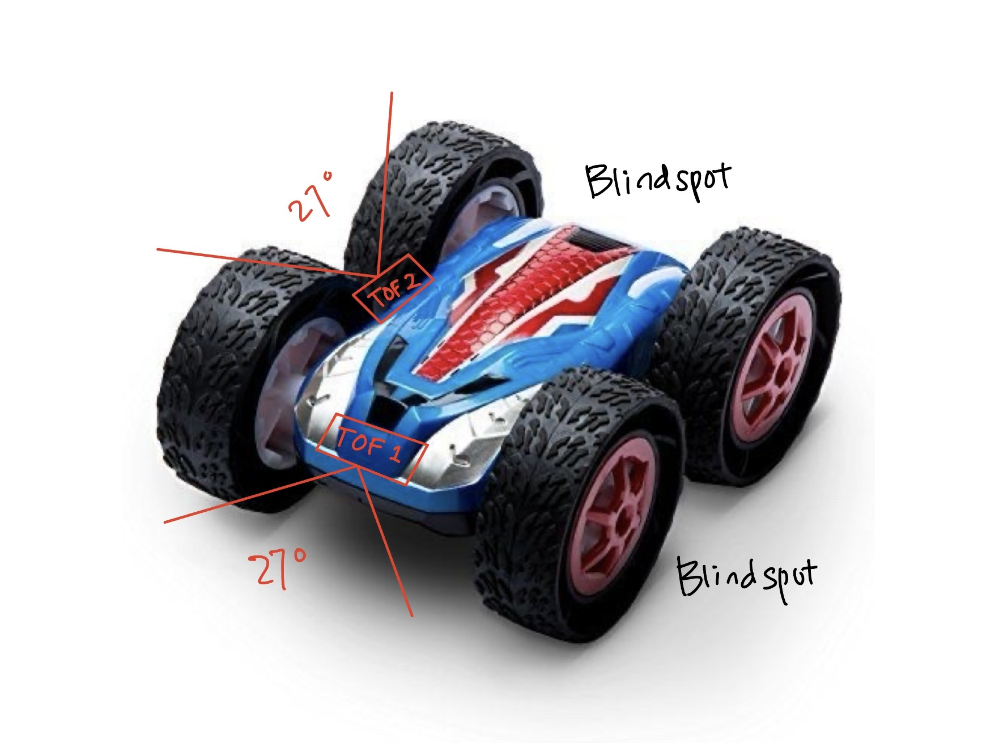
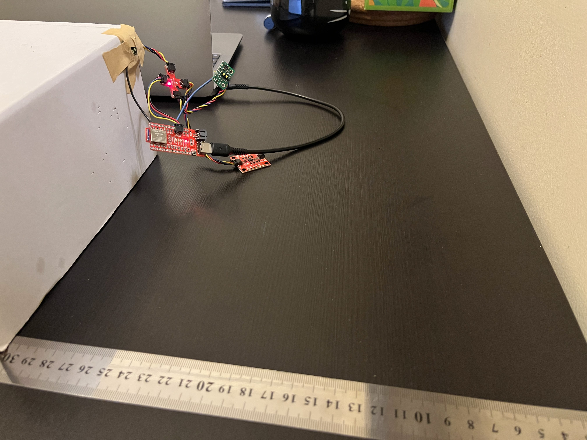
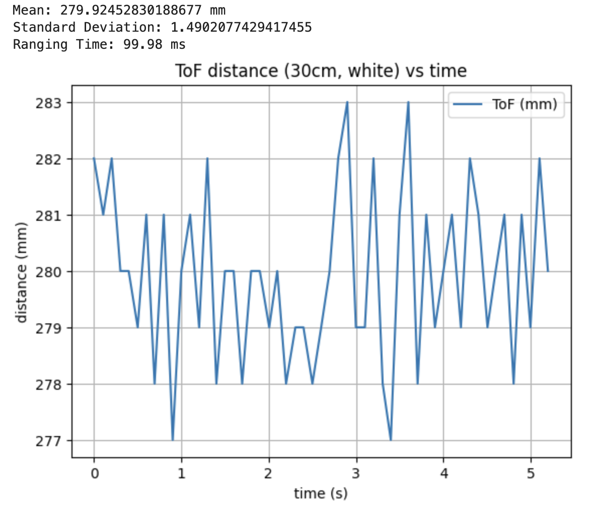
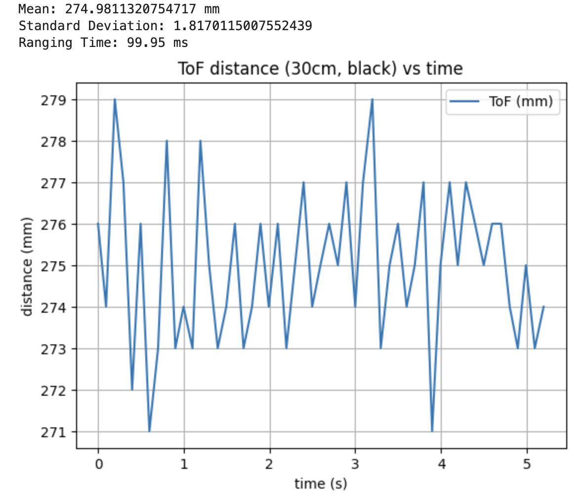
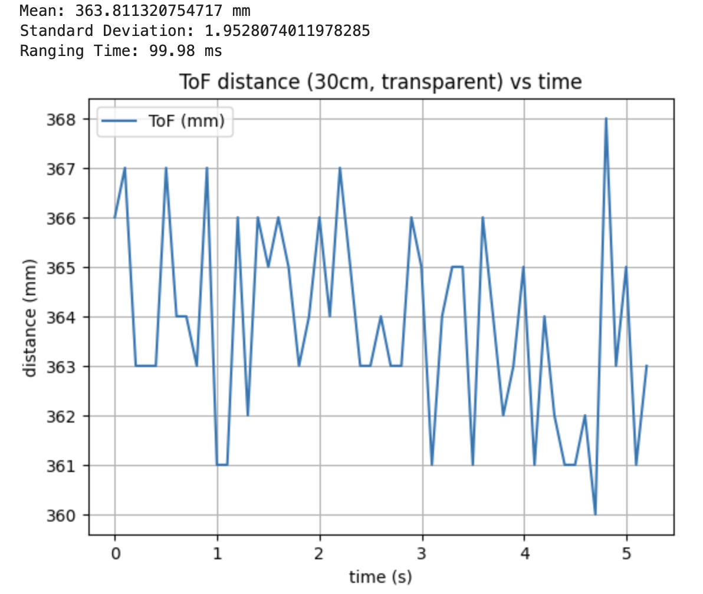
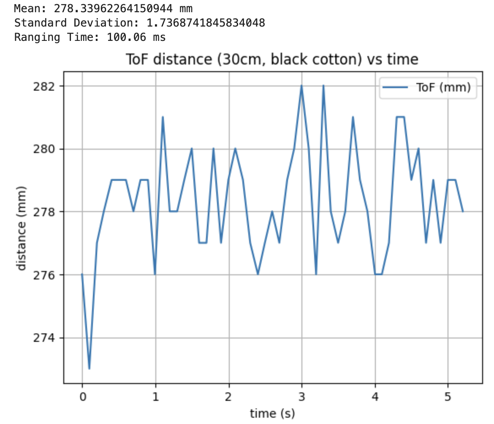
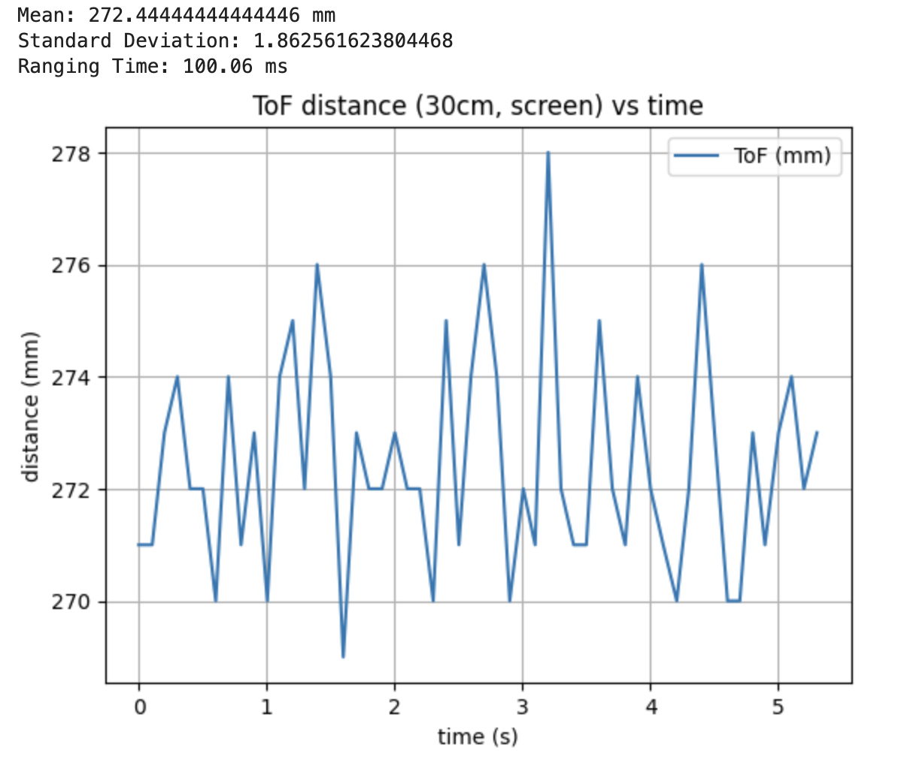

## Prelab

#### I2C Sensor Address

VL53L1X Time of Flight Sensors are used. The default I2C address is 0x52 from the datasheet.

<br>

#### ToF Sensors Approach

Both VL53L1X sensors share the same I2C address. As a result, they can't be connected to the same I2C bus at the same time. There are two approaches to solve this:

###### 1) Programmatically Change Address:

One sensor is powered on first. Its address is changed to a new value programmatically. The second sensor is then powered and kept at the default address.

Advantage:
- Both TOF sensors are active
- Fast and real time sampling

Disadvantage:
- More complex initialization for each power cycle

<br>

###### 2) Continuously Enable/Disable Sensors

One sensor is powered first, the other in shutdown, and vice versa. This avoids changing address.

Advantage:
- Simpler, no address reassignment
- Fast and real time sampling

Disadvantage:
- Only one sensor active
- Reduced sampling rate

<br>
  
The first option is chosen because for a fast moving robot that relies on quick and continuous distance updates, it is important to have both sensors operate at the same time and provide real time obstacle detection.

<br>

#### Placement and Miss

The VL53L1X has a narrow field of view of 27°. One sensor will be facing directly forward, the other facing outward to the side. This approach prioritizes detecting obstacles directly ahead while also providing side distance information. 

However, this approach may lead to a blind spot on the left of the RC car. Figure 1 below shows possible blind spots. In addition, low obstacles, dark absorptive materials, or transparent surfaces may not reflect enough infrared light, resulting in missed readings.

<p align="center">
  
</p>
<p align="center">
  <b>Figure 1:</b> TOF Placement and Potential Blind Spots.
</p>

<br>

#### Wiring Diagram

<p align="center">
  
</p>
<p align="center">
  <b>Figure 2:</b> Wiring Diagram.
</p>

<br>

---

## Lab Tasks

#### Solder Connections

One of the 650mAh batteries was cut and soldered to JST connector. TOF sensor was soldered to QWIIC cable:

- Red: 3.3V
- Black: GND
- Yellow: SCL
- Blue: SDA

<p align="center">
  
</p>
<p align="center">
  <b>Figure 3:</b> TOF sensor connected to QWIIC Breakout Board.
</p>

<br>

#### I2C Scanning

After the first TOF was connected, Example05_wire_I2C was ran to verify I2C address.

The address shown is 0x29, which doesn't match with the datasheet's 0x52. However, this makes sense because 0x29 in binary is 0101001, and 0x52 in binary is 01010010. The I2C 8 bit format is the 7 bit address << 1 + R/W bit. The Arduino is using the 7 bit format.

<p align="center">
  
</p>
<p align="center">
  <b>Figure 4:</b> Screenshot of Artemis scanning for I2C device.
</p>

<br>

#### TOF Mode

The VL53L1X supports short, medium, and long distance modes. These modes trade off range and measurement stability.

- Short mode (~1.3 m) provides more stable and reliable readings at close distances.
- Long mode (~4 m) allows greater range but can be noisier and more sensitive to surface conditions.
- Medium mode (~3 m) is a balance between the two.

Since the robot mainly needs to detect nearby obstacles, short mode was chosen. Most obstacles are within 1 meter, and short mode provides more consistent and stable readings in this range.

#### TOF Sensor Tests

The following tests were ran to verify TOF sensor capability:

- Range
- Accuracy
- Repeatability
- Ranging Time

TOF sensor was taped to corner of a box facing to white wall, and ruler was used to measure distance.

<p align="center">
  
</p>
<p align="center">
  <b>Figure 5:</b> TOF Test Setup.
</p>

###### Range Test

A set of distances from 10cm to 100cm, with 10 cm increments, are tested. Measured values are close to actual distance, which confirms functionality of sensor in the range. 

<p align="center">
  
</p>
<p align="center">
  <b>Figure 6:</b> TOF Range Test.
</p>

<br>

###### Accuracy Test

The error between measured and true distances are plotted. Errors fall between 2 to 3 cm, which is acceptable. Two point calibration or similar methods can be used to reduce this error.

<p align="center">
  
</p>
<p align="center">
  <b>Figure 7:</b> TOF Accuracy Test.
</p>

<br>

###### Repeatability Test

A distance of 50 cm was chosen, and 50 points were taken in the same run. 

<p align="center">
  
</p>
<p align="center">
  <b>Figure 8:</b> TOF Repeatability Test.
</p>

Standard deviation was also calculated at different distances, and it shows that the measurements are consistent and precise.

<p align="center">
  
</p>
<p align="center">
  <b>Figure 9:</b> TOF Repeatability Test.
</p>

<br>

###### Ranging Time

Average ranging time at each distances are calculated by averaging time between each measurements.

<p align="center">
  
</p>
<p align="center">
  <b>Figure 10:</b> TOF Ranging Time.
</p>

<br>

#### Two TOF Sensors

To hook up both TOF sensors, GPIO 4 and 6 on the Artemis are used to connect to XSHUT pins on TOFs. init_tof() are called to first initialize TOF1, change its address to 0x30, then initialize TOF2.

```cpp
void init_tof() {
  Wire.begin();
  Wire.setClock(400000);
  set XSHUT_1 and XSHUT_2 as OUTPUT
  set XSHUT_1 and XSHUT_2 low
  delay(10);

  digitalWrite(XSHUT_1, HIGH);
  delay(10);
  
  distanceSensor1.setI2CAddress(0x30);

  digitalWrite(XSHUT_2, HIGH);
  delay(10);

  set both TOF short distance mode
  set both TOF timing budget 33ms
  start ranging on both TOF
}
```

To test for functionality, code below was ran in loop().

```cpp
if (distanceSensor1.checkForDataReady() &&
  distanceSensor2.checkForDataReady()) {

  int d1 = distanceSensor1.getDistance();
  int d2 = distanceSensor2.getDistance();

  distanceSensor1.clearInterrupt();
  distanceSensor2.clearInterrupt();

  print result
}
```

<div style="text-align:center; margin:30px 0;">
  <iframe
    width="560"
    height="315"
    src="https://www.youtube.com/embed/lIg7rgF5KvY"
    frameborder="0"
    allowfullscreen>
  </iframe>
</div>
<p style="text-align:center;">
  <b>Video 1:</b> Two TOF Sensor.
</p>

<br>

#### TOF Sensor Speed

To ensure that it doesn't block while waiting for TOF data, the code below was tested.

```cpp
Serial.println((uint32_t)micros());

if (distanceSensor1.checkForDataReady()) {
  int d1 = distanceSensor1.getDistance();
  distanceSensor1.clearInterrupt();

  print d1 result
}

if (distanceSensor2.checkForDataReady()) {
  int d2 = distanceSensor2.getDistance();
  distanceSensor2.clearInterrupt();

  print d2 result
}
```

The loop continuously prints results while TOF is running in parallel, which proves that it is non-blocking.

<p align="center">
  
</p>
<p align="center">
  <b>Figure 11:</b> Non-blocking Serial Monitor Output.
</p>

Next, to investigate limiting factor and loop time, the code below was used:

```cpp
if (distanceSensor1.checkForDataReady()) {
  tof1_ready_count++;
  int d1 = distanceSensor1.getDistance();
  distanceSensor1.clearInterrupt();
}
if (distanceSensor2.checkForDataReady()) {
  tof2_ready_count++;
  int d2 = distanceSensor2.getDistance();
  distanceSensor2.clearInterrupt();
}

loop_count++;

uint32_t now_ms = millis();
  if (now_ms - last_rate_ms >= 1000) {
        print results to serial monitor

  make all counts = 0
  last_rate_ms = now_ms;
```

Loop time was measured under different settings:
- With no IMU and no ToF sensors, the loop ran at 49,000 loops/second.
- With two ToF sensors enabled, the loop time decreased to 650 loops/second.
- With both ToF sensors and the IMU enabled, the loop time decreased to 200 loops/second.

This shows that the main limiting factor is not the processor, but the time required for sensor communication and data acquisition. Although checkForDataReady() prevents the loop from blocking, the overall system speed is still restricted by how quickly the sensors can produce new data.

<p align="center">
  
  
  
</p>
<p align="center">
  <b>Figure 12:</b> Loop time with Nothing, TOF, TOF and IMU.
</p>

<br>

#### TOF and IMU Record

The switch statements START_IMU_RECORD and SEND_IMU_RECORD from lab 2 were modified to START_RECORD and SEND_RECORD. It now sends data in the format I: IMU data, T1: TOF1 data, T2: TOF2 data.

```cpp
case START_RECORD:
  IMU, TOF index = 0
  record_done = false;
  recording = true;
  record_start_us = micros();

  tx_estring_value.clear();
  tx_estring_value.append("REC_STARTED");
  tx_characteristic_string.writeValue(tx_estring_value.c_str());
  break;
```

```cpp
case SEND_RECORD:
  send header with imu, tof index length
  // IMU
  for (int i = 0; i < imu_len; i++) {
    send I, time, pitch, roll over BLE
  }

  // TOF1
  for (int i = 0; i < tof1_len; i++) {
    send T1, time, tof1 over BLE
  }

  // TOF2
  for (int i = 0; i < tof2_len; i++) {
    send T2, time, tof2 over BLE
  }
```
Similarly, Python code was modified as well to parse the additional TOF data. Graph of data sent over BLE for TOF and IMU are shown below.

<p align="center">
  
  
</p>
<p align="center">
  <b>Figure 13:</b> Plot of IMU and TOF Data vs. Time from BLE, in Parallel. 
</p>

<br>

#### Infrared Based Distance Sensors

Many distance sensors use infrared light, but they differ in how distance is estimated. The three common approaches are amplitude-based, triangulation-based, and time of flight sensing.

###### 1) Amplitude-Based IR Sensors

Amplitude-based IR estimate distance by measuring the intensity of reflected IR. The assumption is that reflected light decreases as distance increases.

Pros:
- Very simple and cheap
- Works well for object detection and short range distance sensing
- High sample rate

Cons:
- Sensitive to surface color, texture, and ambient light (does not work)

###### 2) Triangulation-Based IR Sensors

Triangulation-based sensors emit an IR beam and measure the angle of the reflected light on a detector. Distance is calculated from geometry.

Pros:
- More accurate than amplitude-based sensors
- Less sensitive to surface color or texture

Cons:
- Sensitive to ambient light
- Low sample rate

###### 3) TOF Sensors

TOF sensors, such as the VL53L1X used in this lab, emit short IR pulses and measure the time it takes for the light to return. Distance is calculated directly from the speed of light.

Pros:
- Longer range
- Less sensitive to surface color, texture, and ambient light

Cons:
- More complex
- Low sample rate

<br>

#### Sensitivity to Color and Texture

Although TOF sensors measure time, they still require sufficient reflected light. Dark or absorptive materials reduce return signal, which can increase noise. Transparent surfaces may allow light to pass through, causing no return signal. Highly angled surfaces can reflect return signal away from the receiver.

To test for this theory, five different backgrounds were used: white, black, transparent, black cotton (absorb well), screen (reflect well).
Distance is kept at 30 cm.

From figure 14, white and black background do not affect too much, proving that TOF sensors are insensitive to color. However, when the background is transparent, light passes through, and bounce back from wall behind, which shows larger distance.

<p align="center">
  
  
  
</p>
<p align="center">
  <b>Figure 14:</b> TOF distance with white, black, transparent background.
</p>

From figure 15, absorbing and reflecting background do not affect too much, which is surprising. TOF sensors might be insensitive to absorption/reflection. but it's also likely that the black cotton used isn't absorptive enough.

<p align="center">
  
  
</p>
<p align="center">
  <b>Figure 15:</b> TOF distance with absorbing, reflecting background.
</p>

Overall, TOF sensors are less sensitive to color and texture than amplitude-based sensors, but they are not completely immune.

---

## Discussion

This lab provided experience working with two TOF sensors and managing I2C communication. Measuring loop speed showed that sensor measurement time, not processor speed, is the main limiting factor. Overall, this lab helped build a better understanding of TOF sensors.

---

## Acknowledgment

I referenced [Aidan McNay](https://aidan-mcnay.github.io/fast-robots-docs/lab3/)’s pages from last year.

Parts of this report and website formatting were assisted by AI tools (ChatGPT) for grammar checking and webpage structuring. All code was written, tested, and validated by the author.
