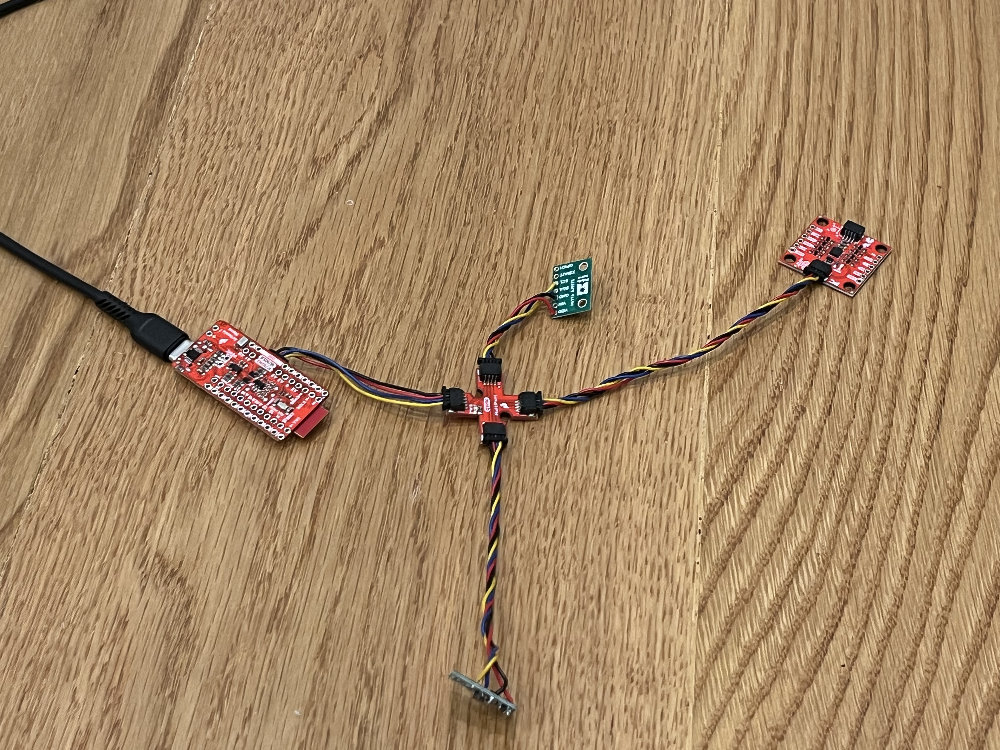
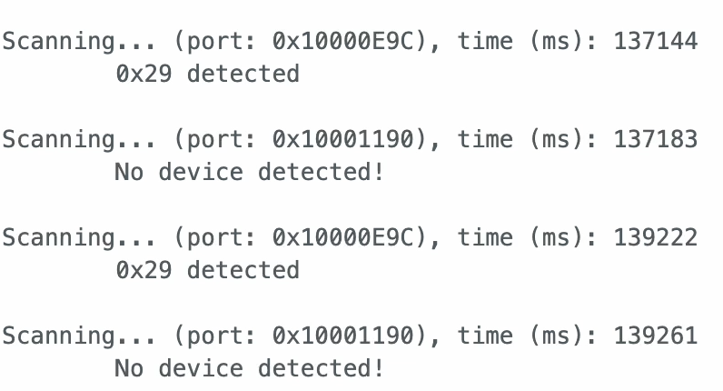

## Prelab

For this lab, the DRV8833 dual H bridge motor driver is used to power two DC motors. The Artemis generates PWM signals to control motor speed. Analog pins A0 to A3 are used. 

To supply sufficient current, we will parallel the two channels. Because both H bridges are on the same IC and share the same internal timing circuit, it is acceptable to parallel the outputs to double the average current.

<p align="center">
  
</p>
<p align="center">
  <b>Figure 1:</b> Wiring Diagram.
</p>

The DRV8833 uses a separate power source (850mAh) from the Artemis. This is because motors create high frequency electrical noise and current spikes that could harm the Artemis.

For wiring, motor power wires will be kept short and routed away from signal wires to reduce EMI noise. PWM and control wires will also be kept short. Stranded wire will be used instead of solid core wire so it doesn’t break when the car accelerates. 

<br>

---

## Lab Tasks

Picture of your setup with power supply and oscilloscope hookup
Power supply setting discussion
Include the code snippet for your analogWrite code that tests the motor drivers
Image of your oscilloscope
Short video of wheels spinning as expected (including code snippet it’s running on)
Short video of both wheels spinning (with battery driving the motor drivers)
Picture of all the components secured in the car
Consider labeling your picture if you can’t see all the components
Lower limit PWM value discussion
Calibration demonstration (discussion, video, code, pictures as needed)
Open loop code and video
(5000) analogWrite frequency discussion (include screenshots and code)
(5000) Lowest PWM value speed (once in motion) discussion (include videos where appropriate)

#### Solder Connections

One of the 650mAh batteries was cut and soldered to JST connector. TOF sensor was soldered to QWIIC cable:

- Red: 3.3V
- Black: GND
- Yellow: SCL
- Blue: SDA

<p align="center">
  
</p>
<p align="center">
  <b>Figure 3:</b> TOF sensor connected to QWIIC Breakout Board.
</p>

<br>

#### TWo Motor Code

```cpp
#define IN1 2
#define IN2 3
#define IN3 0
#define IN4 1


void setup() {
  pinMode(IN1, OUTPUT);
  pinMode(IN2, OUTPUT);
  pinMode(IN3, OUTPUT);
  pinMode(IN4, OUTPUT);
  Serial.begin(115200);
  delay(1000);
}

void loop() {
  // Forward
  analogWrite(IN1, 255);
  analogWrite(IN2, 150);
  analogWrite(IN3, 150);
  analogWrite(IN4, 255);
  Serial.println("forward");
  delay(2000);

  // Coast (free spin)
  analogWrite(IN1, 0);
  analogWrite(IN2, 0);
  analogWrite(IN3, 0);
  analogWrite(IN4, 0);
  Serial.println("stop");
  delay(2000);

  // Reverse
  analogWrite(IN1, 150);
  analogWrite(IN2, 255);
  analogWrite(IN3, 255);
  analogWrite(IN4, 150);
  Serial.println("reverse");
  delay(2000);

  analogWrite(IN1, 0);
  analogWrite(IN2, 0);
  analogWrite(IN3, 0);
  analogWrite(IN4, 0);
  Serial.println("stop");
  delay(2000);
}
```

<p align="center">
  
</p>
<p align="center">
  <b>Figure 4:</b> Screenshot of Artemis scanning for I2C device.
</p>

<br>

#### TOF Mode

The VL53L1X supports short, medium, and long distance modes. These modes trade off range and measurement stability.

- Short mode (~1.3 m) provides more stable and reliable readings at close distances.
- Long mode (~4 m) allows greater range but can be noisier and more sensitive to surface conditions.
- Medium mode (~3 m) is a balance between the two.

Since the robot mainly needs to detect nearby obstacles, short mode was chosen. Most obstacles are within 1 meter, and short mode provides more consistent and stable readings in this range.

#### TOF Sensor Tests

- Range
- Accuracy
- Repeatability
- Ranging Time

TODO: Discussion and pictures of sensor data with chosen mode

#### Range Test

TOF sensor was taped perpendicular to white wall. A set of distances: {10, 20, 30, 40, 50, 60, 70, 80, 90, 100, 110, 120, 130, 140, 150} cm are tested.

TODO

#### Two TOF Sensors

To hook up both TOF sensors, GPIO 4 and 6 on the Artemis are used to connect to XSHUT pins on TOFs. init_tof() are called to first initialize TOF1, change its address to 0x30, then initialize TOF2.

```cpp
void init_tof() {
  Wire.begin();
  Wire.setClock(400000);
  set XSHUT_1 and XSHUT_2 as OUTPUT
  set XSHUT_1 and XSHUT_2 low
  delay(10);

  digitalWrite(XSHUT_1, HIGH);
  delay(10);
  
  distanceSensor1.setI2CAddress(0x30);

  digitalWrite(XSHUT_2, HIGH);
  delay(10);

  set both TOF short distance mode
  set both TOF timing budget 33ms
  start ranging on both TOF
}
```

To test for functionality, code below was ran in loop().

```cpp
if (distanceSensor1.checkForDataReady() &&
  distanceSensor2.checkForDataReady()) {

  int d1 = distanceSensor1.getDistance();
  int d2 = distanceSensor2.getDistance();

  distanceSensor1.clearInterrupt();
  distanceSensor2.clearInterrupt();

  print result
}
```

<div style="text-align:center; margin:30px 0;">
  <iframe
    width="560"
    height="315"
    src="https://www.youtube.com/embed/lIg7rgF5KvY"
    frameborder="0"
    allowfullscreen>
  </iframe>
</div>
<p style="text-align:center;">
  <b>Video 1:</b> Two TOF Sensor.
</p>

<br>

#### TOF Sensor Speed

To ensure that it doesn't block while waiting for TOF data, the code below was tested.

```cpp
Serial.println((uint32_t)micros());

if (distanceSensor1.checkForDataReady()) {
  int d1 = distanceSensor1.getDistance();
  distanceSensor1.clearInterrupt();

  print d1 result
}

if (distanceSensor2.checkForDataReady()) {
  int d2 = distanceSensor2.getDistance();
  distanceSensor2.clearInterrupt();

  print d2 result
}
```

The loop continuously prints results while TOF is running in parallel, which proves that it is non-blocking.

<p align="center">
  
</p>
<p align="center">
  <b>Figure TODO:</b> Non-blocking Serial Monitor Output.
</p>

Next, to investigate limiting factor and loop time, the code below was used:

```cpp
if (distanceSensor1.checkForDataReady()) {
  tof1_ready_count++;
  int d1 = distanceSensor1.getDistance();
  distanceSensor1.clearInterrupt();
}
if (distanceSensor2.checkForDataReady()) {
  tof2_ready_count++;
  int d2 = distanceSensor2.getDistance();
  distanceSensor2.clearInterrupt();
}

loop_count++;

uint32_t now_ms = millis();
  if (now_ms - last_rate_ms >= 1000) {
        print results to serial monitor

  make all counts = 0
  last_rate_ms = now_ms;
```

Loop time was measured under different settings:
- With no IMU and no ToF sensors, the loop ran at 49,000 loops/second.
- With two ToF sensors enabled, the loop time decreased to 650 loops/second.
- With both ToF sensors and the IMU enabled, the loop time decreased to 200 loops/second.

This shows that the main limiting factor is not the processor, but the time required for sensor communication and data acquisition. Although checkForDataReady() prevents the loop from blocking, the overall system speed is still restricted by how quickly the sensors can produce new data.

<p align="center">
  
  
  
</p>
<p align="center">
  <b>Figure TODO:</b> Loop time with Nothing, TOF, TOF and IMU.
</p>

<br>

---

## Discussion

This lab provided experience working with two TOF sensors and managing I2C communication. Measuring loop speed showed that sensor measurement time, not processor speed, is the main limiting factor. Overall, this lab helped build a better understanding of TOF sensors.

---

## Acknowledgment

I referenced [Aidan McNay](https://aidan-mcnay.github.io/fast-robots-docs/lab3/)’s pages from last year.

Parts of this report and website formatting were assisted by AI tools (ChatGPT) for grammar checking and webpage structuring. All code was written, tested, and validated by the author.
