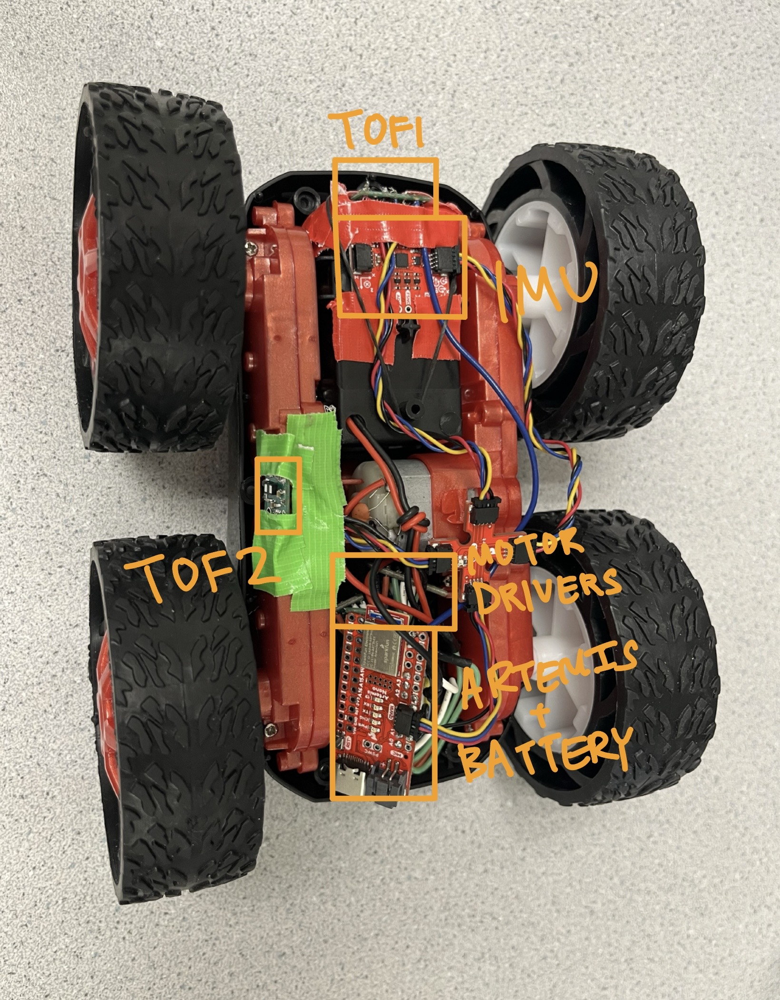

## Prelab

For this lab, the DRV8833 dual H bridge motor drivers are used to power two DC motors. The Artemis generates PWM signals to control motor speed. Analog pins A0 to A3 are used. 

To supply sufficient current, we will parallel the two channels. Because both H bridges are on the same IC and share the same internal timing circuit, it is acceptable to parallel the outputs to double the average current.

<p align="center">
  
</p>
<p align="center">
  <b>Figure 1:</b> Wiring Diagram.
</p>

The DRV8833 uses a separate power source (850mAh) from the Artemis. This is because motors create high frequency electrical noise and current spikes that could harm the Artemis.

For wiring, motor power wires will be kept short and routed away from signal wires to reduce EMI noise. PWM and control wires will also be kept short. Stranded wire will be used instead of solid core wire so it doesn’t break when the car accelerates. 

<br>

---

## Lab Tasks
#### Motor Driver with Oscilloscope

Firstly, one motor driver chip was soldered to the Artemis and powered using dc power supply. Since the battery has supply voltage of 3.7V, the dc power supply was set to same level.

<p align="center">
  
  
</p>
<p align="center">
  <b>Figure 2:</b> Motor Driver Setup with Oscilloscope.
</p>

Code below was uploaded, and corresponding output of motor driver was probed.

```cpp
void loop() {
  // 50% Duty Cycle
  analogWrite(IN2, 128);
  delay(2000);

  // 100% Duty Cycle
  analogWrite(IN2, 255);
  delay(2000);

  // Off
  analogWrite(IN2, 0);
  delay(2000);
}
```

Video 1 below shows the oscilloscope results. Channel 2 shows changing PWM signals that matches the code, while channel 1's PWM is likely due to interference since the amplitude is only around 0.09V. This verifies functionality of motor driver.

<div style="text-align:center; margin:30px 0;">
  <iframe
    width="560"
    height="315"
    src="https://www.youtube.com/embed/oFxlku3yY9s"
    frameborder="0"
    allowfullscreen>
  </iframe>
</div>
<p style="text-align:center;">
  <b>Video 1:</b> Motor Driver with Oscilloscope.
</p>

RC car was then used to test if wheel turns. Video 2 below shows RC car wheel turning forward and reverse, confirming functionality. Battery was used instead of external DC power supply.

<div style="text-align:center; margin:30px 0;">
  <iframe
    width="560"
    height="315"
    src="https://www.youtube.com/embed/sf4BN3Vpjv8"
    frameborder="0"
    allowfullscreen>
  </iframe>
</div>
<p style="text-align:center;">
  <b>Video 2:</b> Motor Driver with Wheels on One Side.
</p>

<br>

#### Two Motor Drivers

After the first motor driver confirmed functionality, same process was applied to the second motor driver. Code below was used for both wheels turing forward and reverse.

```cpp
#define IN1 2
#define IN2 3
#define IN3 0
#define IN4 1

void setup() {
  initialize pins
  Serial.begin(115200);
}

void loop() {
  move forward
  stop
  move reverse
  stop
}
```

Video 3 below shows both wheels turning forward and reverse, powering using battery.

<div style="text-align:center; margin:30px 0;">
  <iframe
    width="560"
    height="315"
    src="https://www.youtube.com/embed/cwK3nXUN26Y"
    frameborder="0"
    allowfullscreen>
  </iframe>
</div>
<p style="text-align:center;">
  <b>Video 3:</b> Motor Driver with Wheels on Both Sides.
</p>

<br>

#### RC Car Assembly

RC car was assembled with all components: Artemis, IMU, TOF sensors, motor drivers. The two TOF sensors are placed as discussed in lab 3.

<p align="center">
  
</p>
<p align="center">
  <b>Figure 3:</b> Assembled RC Car.
</p>

<br>

#### Lower Limit PWM

Next, the minimum PWM to make RC car travel was experimentally determined to be 25 = 10% duty cycle. Video 4 below shows RC car moving while on the setting.

<div style="text-align:center; margin:30px 0;">
  <iframe
    width="560"
    height="315"
    src="https://www.youtube.com/embed/Rtli0zgsHWg"
    frameborder="0"
    allowfullscreen>
  </iframe>
</div>
<p style="text-align:center;">
  <b>Video 4:</b> Lower Limit PWM Forward.
</p>

<br>

For on axis turn, the lower limit PWM is 95 = 37% duty cycle. Video 5 below shows RC car turning while on the setting.

<div style="text-align:center; margin:30px 0;">
  <iframe
    width="560"
    height="315"
    src="https://www.youtube.com/embed/IvMr34Qdg7I"
    frameborder="0"
    allowfullscreen>
  </iframe>
</div>
<p style="text-align:center;">
  <b>Video 5:</b> Lower Limit PWM Turn.
</p>

<br>

#### Calibration Factor

The two motors moved at differnet speeds, making the car unable to travel in straight line. To combat this, a calibration factor was introduced to reduce pwm on the more powerful side. Calibration factor was experimentally determined to be 0.8. The function clipPWM() is used to make sure pwm value is within 0 to 255 after calibration.

```cpp
void driveForward(int pwm) {
  int pwmL = pwm;
  int pwmR = clipPWM((int)(pwm * calibration));

  analogWrite(L_IN1, pwmL);
  analogWrite(L_IN2, 255);

  analogWrite(R_IN1, 255);
  analogWrite(R_IN2, pwmR);
}
```

Video 6 successfully demonstrates RC car traveling in a straight line.

<div style="text-align:center; margin:30px 0;">
  <iframe
    width="560"
    height="315"
    src="https://www.youtube.com/embed/BOTg3QIemNw"
    frameborder="0"
    allowfullscreen>
  </iframe>
</div>
<p style="text-align:center;">
  <b>Video 6:</b> RC Car in Straight Line.
</p>

<br>

#### Open Loop Control

Code below was sent from Python to Artemis for open loop control.

```cpp
ble.send_command(CMD.FORWARD, "1000")
ble.send_command(CMD.LEFT, "500")
ble.send_command(CMD.BACKWARD, "1000")
ble.send_command(CMD.RIGHT, "500")
ble.send_command(CMD.FORWARD, "1000")
```

Video 7 below shows the RC car traveling forward and turning.

<div style="text-align:center; margin:30px 0;">
  <iframe
    width="560"
    height="315"
    src="https://www.youtube.com/embed/JOQKsnqk7UQ"
    frameborder="0"
    allowfullscreen>
  </iframe>
</div>
<p style="text-align:center;">
  <b>Video 7:</b> Open Loop Control.
</p>

<br>

#### analogWrite Frequency

The PWM frequency generated by analogWrite() was measured using an oscilloscope by probing the Artemis input to the motor driver. The measured frequency was around 180 Hz, corresponding to a period of about 5.6 ms.

<p align="center">
  
</p>
<p align="center">
  <b>Figure 4:</b> Input PWM Frequency.
</p>

This PWM frequency is fast enough for motors. The motor cannot react to each individual PWM pulse because it changes much more slowly than the switching signal. It effectively sees the average voltage over time. Because of this, the motor speed is mainly determined by the duty cycle of the PWM signal.

The advantages of a higher PWM frequency are:
- Reduced audible noise, since the switching frequency would be higher than the human hearing range.
- Reduced current ripple that leads to smoother operation.
- Less nosiy sensor readings since lower frequency vibration and noise can couple into IMU and TOF measurements.

The disadvantages of a higher PWM frequency are:
- Higher switching losses in the motor driver.
- Higher EMI noise.

<br>

#### Lower Limit PWM While Moving

Lastly, the lowest PWM value at which the robot can run while in motion was determined to be 10 (4% duty cycle). This was tested using code below. Robot was first traveling at a higher speed, then slowed down.

```cpp
driveForward(220);
delay(1000);

driveForward(245);
delay(3000);

coastStop();
delay(1000);
```

Video 8 below shows the forward lower limit PWM in motion.

<div style="text-align:center; margin:30px 0;">
  <iframe
    width="560"
    height="315"
    src="https://www.youtube.com/embed/OyFa-V3Fv2Q"
    frameborder="0"
    allowfullscreen>
  </iframe>
</div>
<p style="text-align:center;">
  <b>Video 8:</b> Lower Limit PWM in Motion Forward.
</p>

However, the lowest PWM value at which the robot can turn while in motion was the same (95 = 37% duty cycle) as before. This is likely because turning requires overcoming similar friction regardless of whether the robot is starting from rest or already turning.

---

## Discussion

This lab provided experience working with motor drivers and final robot assembly. Overall, this lab improved understanding of PWM motor control and tuning required for open loop robot.

---

## Acknowledgment

I referenced [Aidan McNay](https://aidan-mcnay.github.io/fast-robots-docs/lab4/)’s pages from last year.

Parts of this report and website formatting were assisted by AI tools (ChatGPT) for grammar checking and webpage structuring. All code was written, tested, and validated by the author.
