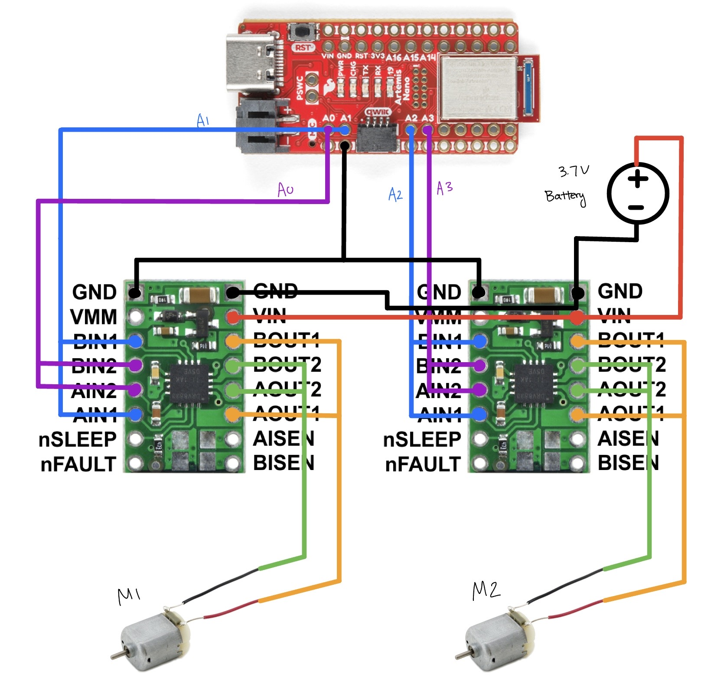
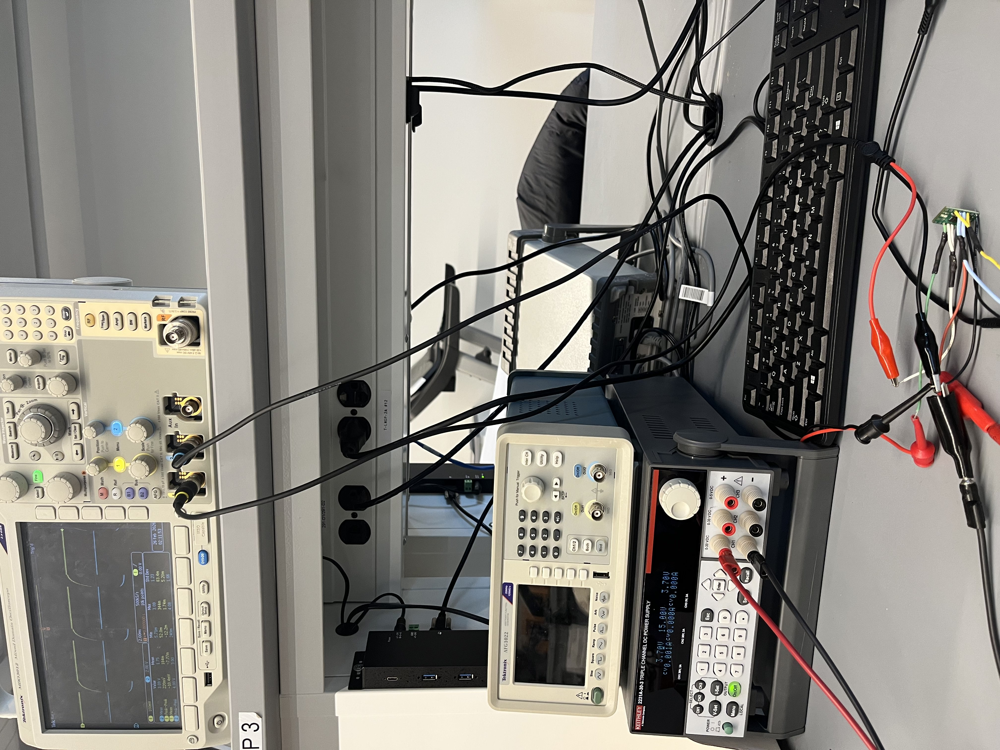
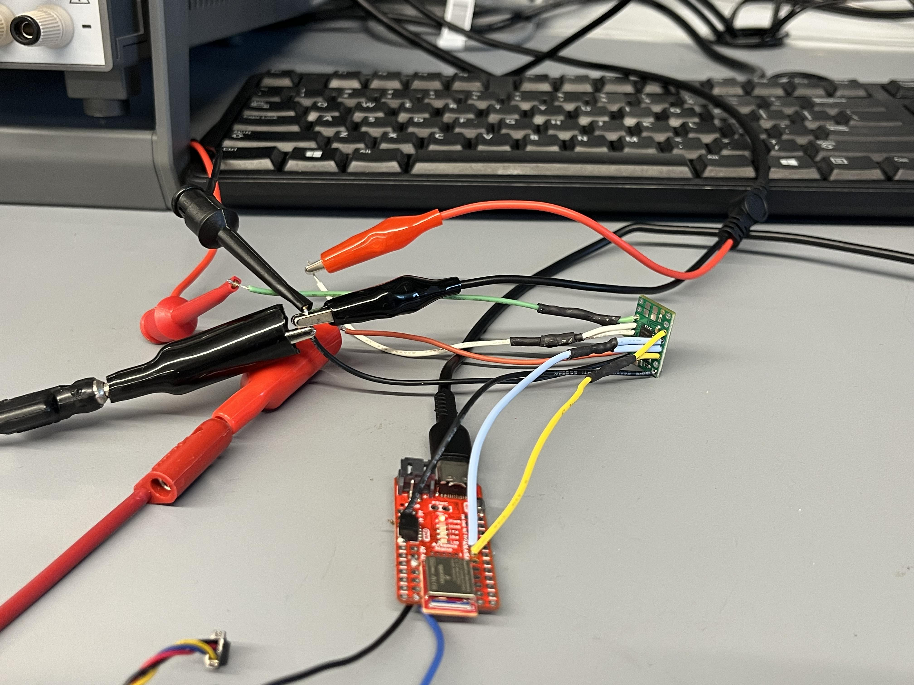

## Prelab

For this lab, the DRV8833 dual H bridge motor driver is used to power two DC motors. The Artemis generates PWM signals to control motor speed. Analog pins A0 to A3 are used. 

To supply sufficient current, we will parallel the two channels. Because both H bridges are on the same IC and share the same internal timing circuit, it is acceptable to parallel the outputs to double the average current.

<p align="center">
  
</p>
<p align="center">
  <b>Figure 1:</b> Wiring Diagram.
</p>

The DRV8833 uses a separate power source (850mAh) from the Artemis. This is because motors create high frequency electrical noise and current spikes that could harm the Artemis.

For wiring, motor power wires will be kept short and routed away from signal wires to reduce EMI noise. PWM and control wires will also be kept short. Stranded wire will be used instead of solid core wire so it doesn’t break when the car accelerates. 

<br>

---

## Lab Tasks

Picture of your setup with power supply and oscilloscope hookup
Power supply setting discussion
Include the code snippet for your analogWrite code that tests the motor drivers
Image of your oscilloscope
Short video of wheels spinning as expected (including code snippet it’s running on)
Short video of both wheels spinning (with battery driving the motor drivers)

Picture of all the components secured in the car
Consider labeling your picture if you can’t see all the components

Lower limit PWM value discussion
Calibration demonstration (discussion, video, code, pictures as needed)
Open loop code and video
(5000) analogWrite frequency discussion (include screenshots and code)
(5000) Lowest PWM value speed (once in motion) discussion (include videos where appropriate)

#### Motor Driver with Oscilloscope TODO

Firstly, one motor driver chip was soldered to the Artemis and powered using dc power supply. Since the battery has supply voltage of 3.7V, the dc power supply was set to same level.

<p align="center">
  
  
</p>
<p align="center">
  <b>Figure 2:</b> Motor Driver Setup with Oscilloscope.
</p>

Code below was uploaded, and corresponding output of motor driver was probed.

```cpp
void loop() {
  // 50% Duty Cycle
  analogWrite(IN2, 128);
  delay(2000);

  // 100% Duty Cycle
  analogWrite(IN2, 255);
  delay(2000);

  // Off
  analogWrite(IN2, 0);
  delay(2000);
}
```

Video 1 below shows the oscilloscope results. Channel 2 shows changing PWM signals that matches the code, while channel 1's PWM is likely due to interference since the amplitude is only around 0.09V. This verifies functionality of motor driver.

<div style="text-align:center; margin:30px 0;">
  <iframe
    width="560"
    height="315"
    src="https://www.youtube.com/embed/lIg7rgF5KvY"
    frameborder="0"
    allowfullscreen>
  </iframe>
</div>
<p style="text-align:center;">
  <b>Video TODO:</b> Two TOF Sensor.
</p>

RC car was then used to test if wheel turns. Video 2 below shows RC car wheel turning forward and reverse, confirming functionality. Battery was used instead of external DC power supply.

<div style="text-align:center; margin:30px 0;">
  <iframe
    width="560"
    height="315"
    src="https://www.youtube.com/embed/lIg7rgF5KvY"
    frameborder="0"
    allowfullscreen>
  </iframe>
</div>
<p style="text-align:center;">
  <b>Video TODO:</b> Two TOF Sensor.
</p>

<br>

#### Two Motor Drivers

After first motor driver confirmed functionality, same process was applied to the second motor driver. Code below was used for both wheels turing forward and reverse.

```cpp
#define IN1 2
#define IN2 3
#define IN3 0
#define IN4 1

void setup() {
  initialize pins
  Serial.begin(115200);
}

void loop() {
  move forward
  stop
  move reverse
  stop
}
```

Video 3 below shows both wheels turning forward and reverse, powering using battery.

<div style="text-align:center; margin:30px 0;">
  <iframe
    width="560"
    height="315"
    src="https://www.youtube.com/embed/lIg7rgF5KvY"
    frameborder="0"
    allowfullscreen>
  </iframe>
</div>
<p style="text-align:center;">
  <b>Video TODO:</b> Two TOF Sensor.
</p>

<br>

#### RC Car Assembly

RC car was assembled with all components: Artemis, IMU, TOF sensors, motor drivers.

Figure TODO below shows the car.

<p align="center">
  
</p>
<p align="center">
  <b>Figure TODO:</b> Assembled RC Car.
</p>

<br>

#### Lower Limit PWM

The minimum PWM to run was determined to be TODO.

<div style="text-align:center; margin:30px 0;">
  <iframe
    width="560"
    height="315"
    src="https://www.youtube.com/embed/lIg7rgF5KvY"
    frameborder="0"
    allowfullscreen>
  </iframe>
</div>
<p style="text-align:center;">
  <b>Video TODO:</b> Two TOF Sensor.
</p>

<br>

#### Calibration Factor

The two motors might move at differnet speeds, making the car unable to travel in straight line. 

<p align="center">
  
  
  
</p>
<p align="center">
  <b>Figure TODO:</b> Loop time with Nothing, TOF, TOF and IMU.
</p>

<br>

#### Open Loop Control

<p align="center">
  
  
  
</p>
<p align="center">
  <b>Figure TODO:</b> Loop time with Nothing, TOF, TOF and IMU.
</p>

<br>

#### analogWrite Frequency

<p align="center">
  
  
  
</p>
<p align="center">
  <b>Figure TODO:</b> Loop time with Nothing, TOF, TOF and IMU.
</p>

<br>

#### Lower Limit PWM While Moving

<p align="center">
  
  
  
</p>
<p align="center">
  <b>Figure TODO:</b> Loop time with Nothing, TOF, TOF and IMU.
</p>

<br>

---

## Discussion

This lab provided experience working with two TOF sensors and managing I2C communication. Measuring loop speed showed that sensor measurement time, not processor speed, is the main limiting factor. Overall, this lab helped build a better understanding of TOF sensors.

---

## Acknowledgment

I referenced [Aidan McNay](https://aidan-mcnay.github.io/fast-robots-docs/lab3/)’s pages from last year.

Parts of this report and website formatting were assisted by AI tools (ChatGPT) for grammar checking and webpage structuring. All code was written, tested, and validated by the author.
