## Prelab

A bluetooth debugging setup was implemented before controller tuning. It let the Artemis run PID for a fixed amount of time while storing data locally, and then send the recorded data. 

```cpp
initalize lists

def parse_pid(line: str):
    parts = line.split(",")
    parse parts

def data_handler(_uuid, response: bytearray):
    parse_pid(incoming data)
    store in local lists

start BLE notification
set PID gains
start PID run
get PID data
wait for PID data
stop BLE notification
```

On Artemis side, when the laptop sent START_PID_RUN, the robot cleared the old PID log, reset the controller state, and began the closed loop run. 

```cpp
case START_PID_RUN:
        {
        pid_len = 0;
        pid_running = true;
        pid_start_ms = millis();
        prev_pid_us = 0;
        i_accum = 0.0f;
        prev_err = 0.0f;
        d_filt = 0.0f;
        break;
        }
```

To make tuning easier, PID gains were also sent over BLE with SET_PID_GAINS. This helped test gain values without needing to upload code every time.

```cpp
case SET_PID_GAINS:
        float kp, ki, kd;
        success = robot_cmd.get_next_value(kp); if (!success) return;
        success = robot_cmd.get_next_value(ki); if (!success) return;
        success = robot_cmd.get_next_value(kd); if (!success) return;
        Kp = kp; Ki = ki; Kd = kd;
        break;
```

For safety, there is a hard stop. The robot stopped if the run time exceeded the set limit, if the measured distance became too small, or if BLE connection was lost.

```cpp
if (now_ms - pid_start_ms >= PID_RUN_MS) {
        coastStop();
        pid_running = false;
        return;
}

if (last_dist_mm > 0 && last_dist_mm < 120) {
        coastStop();
        pid_running = false;
        return;
}
```

After the run finished, GET_PID_DATA was called to get data. Artemis first sent a header containing the number of samples, then sent each saved data.

```cpp
case GET_PID_DATA:
        send headers
        for (int i = 0; i < pid_len; i++) {
                send data: time, TOF ready, distance, error, P, I, D, PWM
        }
        break;
```

<br>

---

## Lab Tasks

### Position Control

The goal of the task was to make the robot drive toward a wall as quickly as possible and stop at a target distance of 304 mm.

The controller was implemented using the front TOF sensor as feedback. At each step, the robot measured the distance to wall, computed the error, and then generated a motor PWM from the PID terms.

`u_k = K_p e_k + K_i \sum e_k \Delta t + K_d \frac{e_k - e_{k-1}}{\Delta t}`

In code, the error was computed as:

```cpp
int dist = last_dist_mm;
int err = dist - setpoint_mm;
```

#### P Control

The proportional term was added. The proportional controller directly scales the distance error to generate a motor command.

```cpp
float p = Kp * (float)err;
```

After tuning, Kp of 0.1 was chosen. Proportional control was able to drive the robot toward the wall and stop near the target distance, but some oscillation occurred.

<p align="center">
  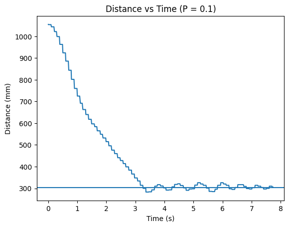
  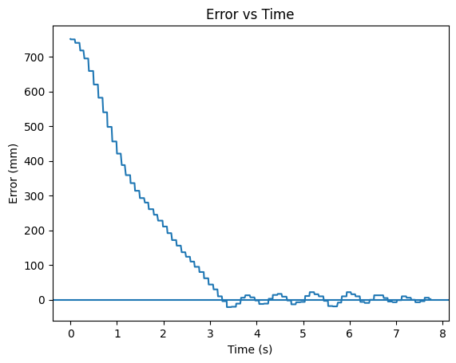
  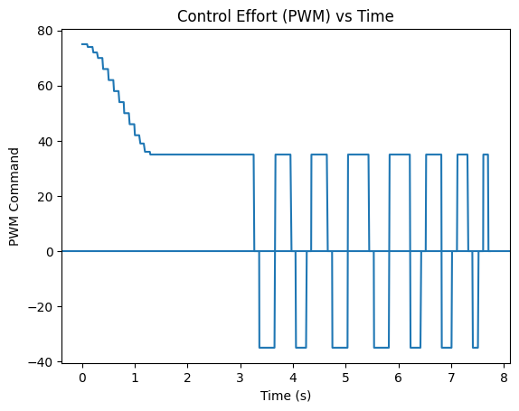
</p>
<p align="center">
  <b>Figure 1:</b> Plots of P Control Data.
</p>

Video 1 below shows the result of P only controller.

<div style="text-align:center; margin:30px 0;">
  <iframe
    width="560"
    height="315"
    src="https://www.youtube.com/embed/fP9MSvP5kSc"
    frameborder="0"
    allowfullscreen>
  </iframe>
</div>
<p style="text-align:center;">
  <b>Video 1:</b> P Only Controller.
</p>

<br>

#### PI Control

To improve the steady state accuracy, an integral term was added. The integral accumulates error over time and moves the robot closer setpoint.

```cpp
i_accum += (float)err * dt;
float i = Ki * i_accum;
```

With Ki = 0.001, the PI controller reduced the steady state error and allowed the robot to stop without oscillation.

<p align="center">
  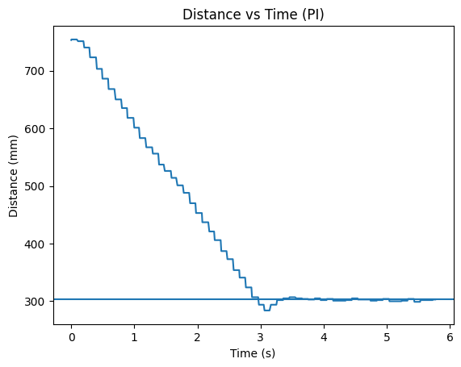
  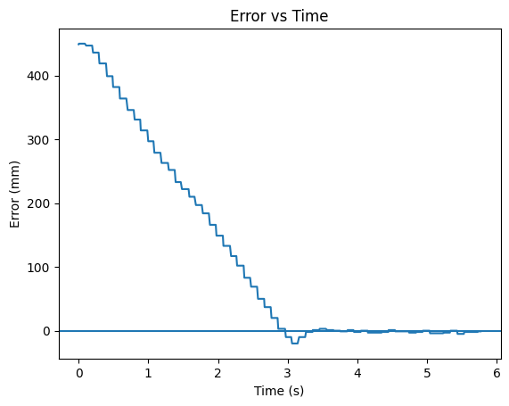
  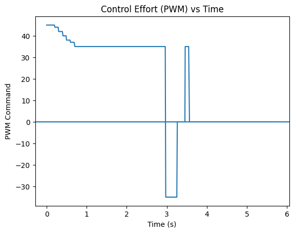
</p>
<p align="center">
  <b>Figure 2:</b> Plots of PI Control Data.
</p>

Video 2 below shows the result of PI controller.

<div style="text-align:center; margin:30px 0;">
  <iframe
    width="560"
    height="315"
    src="https://www.youtube.com/embed/8dwQlHGNRlU"
    frameborder="0"
    allowfullscreen>
  </iframe>
</div>
<p style="text-align:center;">
  <b>Video 2:</b> PI Controller.
</p>

<br>

#### PID Control

Next, a derivative term was added to help reduce overshoot and slow the robot as it approached the wall. The derivative term reacts to the rate of change of the error, which helps dampen motion near the setpoint. Kd was chosen to be 0.001.

```cpp
float d_raw = ((float)err - prev_err) / dt;
float d = Kd * d_raw;
```

Because the ToF sensor measurements are discrete and noisy, using the raw derivative caused unstable behavior. To reduce this noise, a low pass filter was applied.

```cpp
d_filt = alpha_d * d_raw + (1.0f - alpha_d) * d_filt;
float d = Kd * d_filt;
```

This smoothing reduced sudden spikes in the derivative signal and improved stability.

<p align="center">
  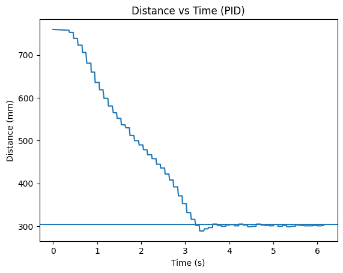
  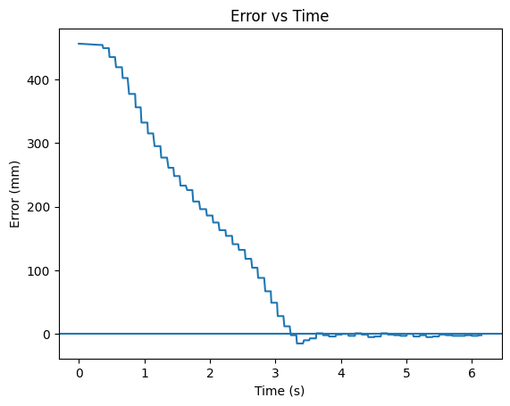
  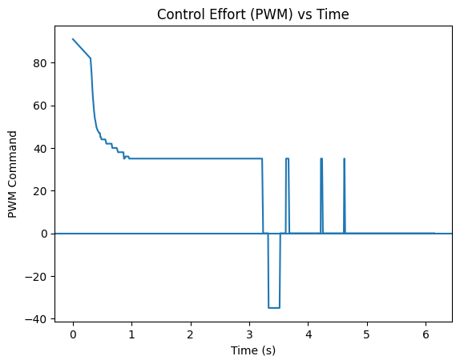
</p>
<p align="center">
  <b>Figure 3:</b> Plots of PID Control Data.
</p>

Video 3 below shows the result of PID controller.

<div style="text-align:center; margin:30px 0;">
  <iframe
    width="560"
    height="315"
    src="https://www.youtube.com/embed/bTfX_to0jH8"
    frameborder="0"
    allowfullscreen>
  </iframe>
</div>
<p style="text-align:center;">
  <b>Video 3:</b> PID Controller.
</p>

<br>

#### TOF Sensor Setup

The ToF sensor settings also affect performance. Faster sensing allows the controller to react more quickly to changes.

For this lab, the sensor was configured in short distance mode with a 33 ms timing budget, which provided sufficiently fast updates. 

A faster sampling rate can help reduce the delay between measurement and controller response.


```cpp
distanceSensor1.setDistanceModeShort();
distanceSensor1.setTimingBudgetInMs(33);
distanceSensor1.startRanging();
```

<br>

#### Motor Deadband

From Lab 4, motors have a minimum PWM limit. If the controller output became too small near the setpoint, the robot might stop moving even though the error was not zero.

To address this, a deadband helper function was applied to the PWM command before sending it to the motors.

```cpp
int apply_deadband(int pwm)
{
  int a = abs(pwm);
  if (a == 0) return 0;
  if (a < PWM_DEADBAND) a = PWM_DEADBAND;
  if (a > 255) a = 255;
  return (pwm < 0) ? -a : a;
}
```

<br>

#### Perturbation Test

The robot was also tested with external perturbations. After reaching the target distance, the robot was manually pushed closer and farther away.

In both cases, the controller responded by driving the robot back toward the setpoint.

<p align="center">
  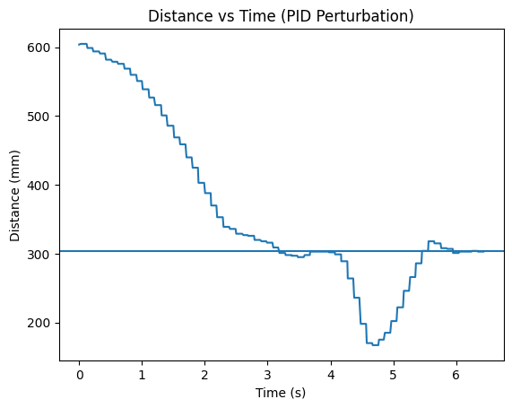
  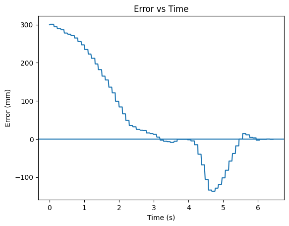
  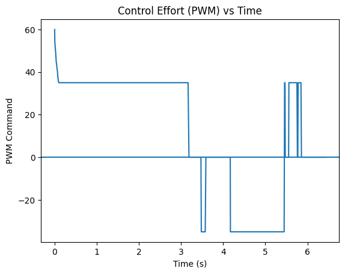
</p>
<p align="center">
  <b>Figure 4:</b> Plots of PID Control Perturbation Data.
</p>

Video 4 below shows the result of PID controller under perturbation.

<div style="text-align:center; margin:30px 0;">
  <iframe
    width="560"
    height="315"
    src="https://www.youtube.com/embed/-B3x1WbUun4"
    frameborder="0"
    allowfullscreen>
  </iframe>
</div>
<p style="text-align:center;">
  <b>Video 4:</b> PID Control, Perturbation.
</p>

<br>

---

### Extrapolation

#### TOF Sensor Frequency

The update frequency of the TOF sensor was measured and compared to the PID control loop rate. 

This was done by counting how many times the main loop ran in one second and how many times the TOF sensor reported a new reading in that same time.

<p align="center">
  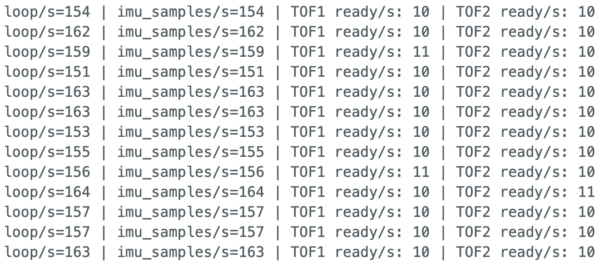
</p>
<p align="center">
  <b>Figure 5:</b> TOF and Main Loop Frequency.
</p>

This shows that the control loop is running much faster than the TOF sensor (160Hz vs. 10Hz). Because of this, the controller cannot depend on receiving a new distance reading every loop.

To handle this, the PID controller was allowed to run every loop, even when no new TOF data was available. If a new measurement was available, the stored distance value was updated. If no new measurement was available, the controller continued to run using the most recent saved value.

<br>

#### Linear Extrapolation

The controller acts on a step signal because the TOF only updates every 0.1 s. To improve this, a simple linear extrapolation method was added.

The robot stores the two most recent TOF readings and their timestamps. When a new TOF measurement arrives, the slope between the two points is calculated as:

`m = (d_current - d_previous) / (t_current - t_previous)`

This slope is then used to estimate the distance at the current time:

`d_est = d_current + m * (t_now - t_current)`

This gives an estimated distance that updates every PID loop instead of only when a new TOF sample arrives.

When a new TOF reading is available, the previous distance and timestamp are shifted into previous value, and the new reading becomes the latest sample.

```cpp
prev_dist_mm = last_dist_mm;
prev_tof_us = last_tof_us;

last_dist_mm = d1;
last_tof_us = now_us;
```

The extrapolated distance is then calculated from the last two TOF samples:

```cpp
int get_extrapolated_dist_mm(uint32_t now_us)
{
    if (!tof_hist_valid) return last_dist_mm;

    float dt_sample = (last_tof_us - prev_tof_us) / 1e6f;
    if (dt_sample <= 0.0f) return last_dist_mm;

    float slope = ((float)last_dist_mm - (float)prev_dist_mm) / dt_sample;
    float dt_now = (now_us - last_tof_us) / 1e6f;
    float d_est = (float)last_dist_mm + slope * dt_now;

    if (d_est < 0.0f) d_est = 0.0f;
    if (d_est > 4000.0f) d_est = 4000.0f;

    return (int)roundf(d_est);
}
```

Inside the PID loop, the raw ToF distance and extrapolated distance were both available, and the controller used the extrapolated value:

```cpp
int raw_dist = last_dist_mm;
int dist = get_extrapolated_dist_mm(now_us);
int err = dist - setpoint_mm;
```

With this approach, the PID controller still runs at 160 Hz, but instead of using the same TOF value, it uses a continuously updated estimate. This helps smooth the distance input to the controller.

To evaluate this method, both the raw TOF distance and the extrapolated distance were recorded and plotted on the same graph. The raw signal shows jumps, while the extrapolated signal is more smooth.

<p align="center">
  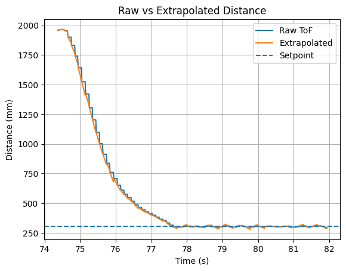
  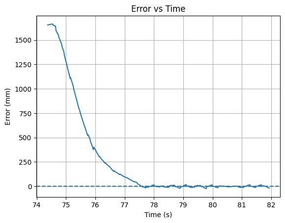
  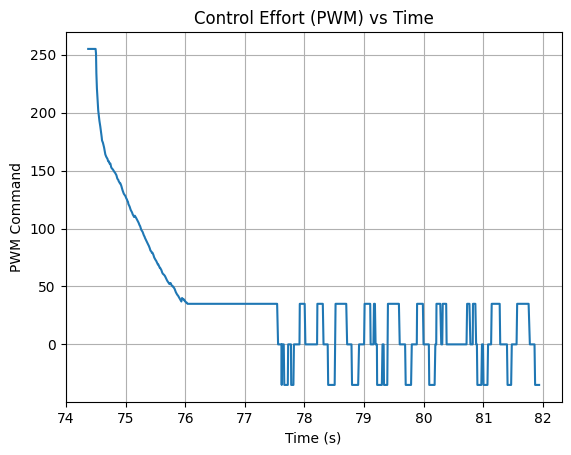
</p>
<p align="center">
  <b>Figure 6:</b> Extrapolated vs. Raw Plots
</p>

<br>

#### Final Run TODO

The final controller was tested for three times at different speed, and video 5 below shows the results.

<div style="display:flex; justify-content:center; gap:20px; margin:30px 0; flex-wrap:wrap;">

<iframe width="360" height="200"
src="https://www.youtube.com/embed/VIDEO1"
frameborder="0" allowfullscreen></iframe>

<iframe width="360" height="200"
src="https://www.youtube.com/embed/VIDEO2"
frameborder="0" allowfullscreen></iframe>

<iframe width="360" height="200"
src="https://www.youtube.com/embed/VIDEO3"
frameborder="0" allowfullscreen></iframe>

</div>

<p style="text-align:center;">
<b>Video 5:</b> Three Runs of the Final Controller.
</p>

Maximum speed is calculated to be 2071 mm/s.

```cpp
window_pts = 10
initialize lists

for i in range(len(est_dist) - window_pts):
    dd = est_dist[i] - est_dist[i + window_pts]
    dt = t[i + window_pts] - t[i]
    if dt > 0:
        speeds.append(dd / dt)
        t_speed.append((t[i] + t[i + window_pts]) / 2)

# keep first part
valid = est_dist[:len(speeds)] > 400
speeds_valid = speeds[valid]
t_speed_valid = t_speed[valid]
 
print max speed
plot
```

<p align="center">
  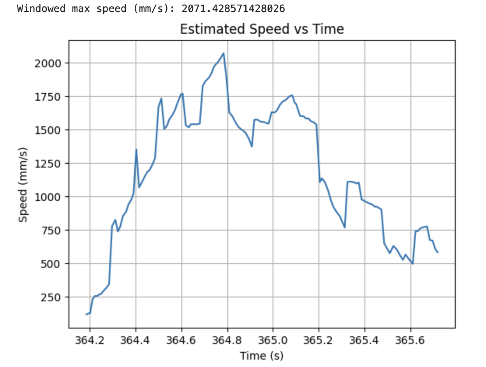
</p>
<p align="center">
  <b>Figure 7:</b> Speed During Final Run.
</p>

---

#### Wind Up Protection

When the robot starts far from the wall, the error can remain large for a long time. This causes the integral term to accumulate, which can lead to overshoot and unstable behavior.

To prevent this, the accumulated integral value was clamped within a fixed range.

```cpp
if (i_accum > I_CLAMP) i_accum = I_CLAMP;
if (i_accum < -I_CLAMP) i_accum = -I_CLAMP;
```

To test for the differences, robot was held by hand for a while to accumulate I error, then released. Figure 8 below shows that with wind up protection, there are no steady state error. However, without wind up protection, there exists a small steady state error.

<p align="center">
  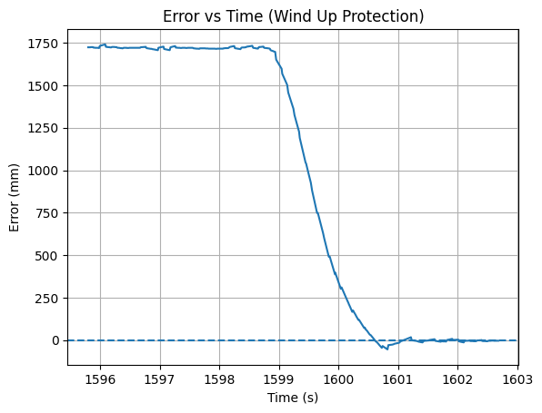
  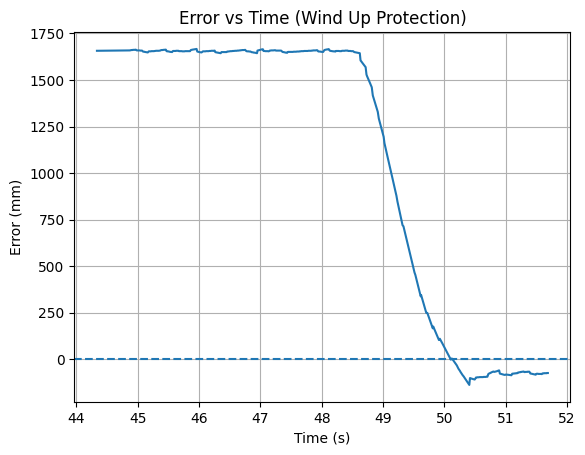
</p>
<p align="center">
  <b>Figure 8:</b> Error with Wind Up vs. No Wind Up Protection.
</p>

---

## Discussion

This lab provided experience implementing closed loop control and sensor based navigation on the robot. Overall, this lab improved understanding of PID control, tuning controller gains, and integrating sensor feedback to achieve stable position control. The addition of distance extrapolation also demonstrated how estimation techniques can improve controller performance.

---

## Acknowledgment

I referenced [Aidan McNay](https://aidan-mcnay.github.io/fast-robots-docs/lab5/)’s pages from last year.

Parts of this report and website formatting were assisted by AI tools (ChatGPT) for grammar checking and webpage structuring. All code was written, tested, and validated by the author.
