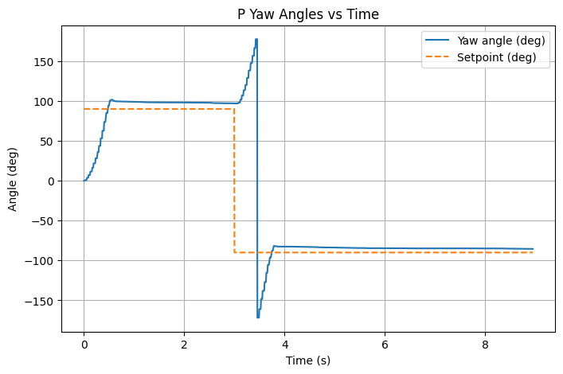
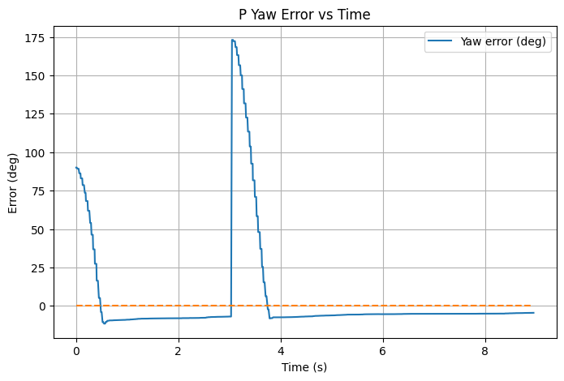
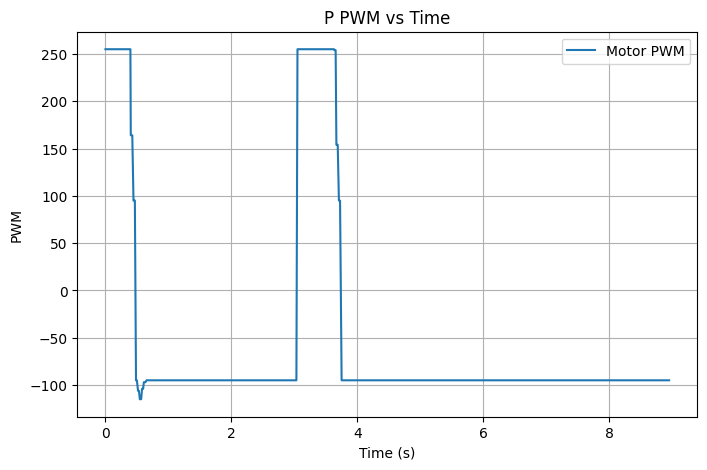
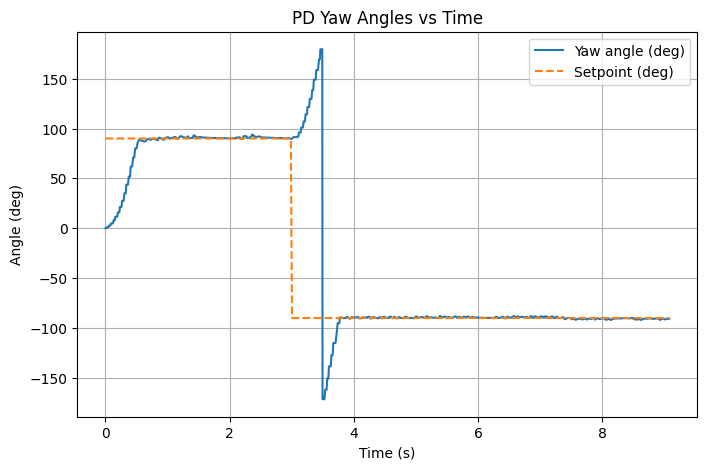
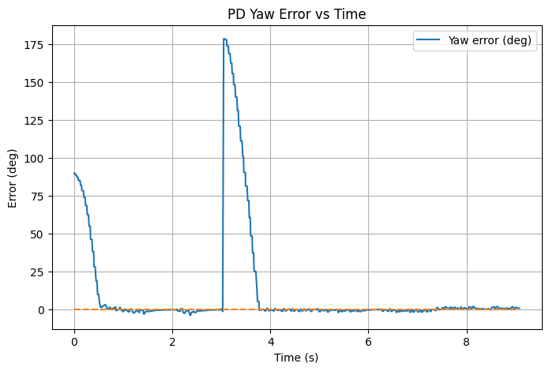
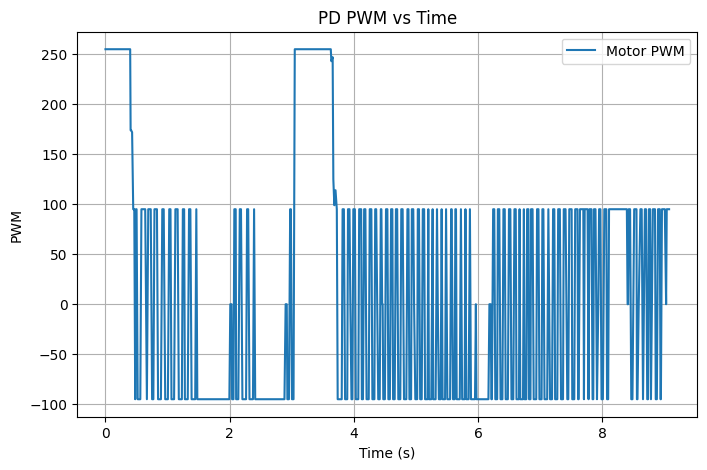

## Prelab

Before tuning the orientation controller, a bluetooth debugging system was set up similar to lab 5. It runs the PID controller for fixed time, stores data, and sends data to laptop.

On the Python side, the code was similar to Lab 5.

```cpp
initialize lists

def parse_yaw_pid(line: str):
    parts = line.split(",")
    parse time, yaw angle, error, P, I, D, control effort, pwm

def data_handler(_uuid, response: bytearray):
    parse_yaw_pid(incoming data)
    store in local lists

start BLE notification
set yaw PID gains
set yaw setpoint
start yaw PID run
get PID data
wait for PID data
stop BLE notification
```

On the Artemis side, START_PID_RUN was reused. The robot cleared the old yaw PID log, reset controller memory, zeroed the yaw reference.

```cpp
case START_PID_RUN:
{
    pid_running = true;
    pid_start_ms = millis();
    yaw_prev_us = 0;
    yaw_i_accum = 0;
    yaw_prev_err = 0;
    yaw_gyro = 0.0f;
    yaw_zero_offset = dmp_ok ? yaw_dmp : 0.0f;
    yaw_pid_len = 0;
    tx_characteristic_string.writeValue("YAW_PID_STARTED");
    break;
}
```

Similarly, SET_PID_GAINS was reused to set PID gains for yaw.

Since Lab 6 requires changing the setpoint while the robot is running, a separate command was added to update the yaw setpoint.

```cpp
case SET_YAW_SETPOINT:
{
    float sp;
    success = robot_cmd.get_next_value(sp);
    if (!success) return;

    setpoint_deg = wrap_angle_deg(sp);
    break;
}
```

After the run finished, GET_PID_DATA was reused to get data. Artemis first sent a header containing the number of samples, then sent each saved data.

```cpp
case GET_PID_DATA:
        send headers
        for (int i = 0; i < yaw_pid_len; i++) {
                send data: time, yaw angle, error, P, I, D, control effort, pwm
        }
        break;
```

---

## Lab Tasks

### Digital Motion Processing

Digital integration of gyroscope data often introduces drift over time (shown in lab 2). To reduce this drift, DMP built into the ICM-20948 IMU was used. The DMP internally performs sensor fusion and outputs orientation as a quaternion, which can then be converted to yaw angle.

```cpp
float yaw_raw = dmp_ok ? yaw_dmp : wrap_angle_deg(yaw_gyro);
```

At the start of each PID run, the current yaw value is used as the reference orientation. This allows the controller to use relative angles instead of absolute angles.

```cpp
yaw_zero_offset = dmp_ok ? yaw_dmp : 0.0f;
float yaw = wrap_angle_deg(yaw_raw - yaw_zero_offset);
```

Using the DMP reduces yaw drift compared to gyro integration.

<br>

### Limitation on Sensor TODO

Are there limitations on the sensor itself to be aware of? What is the maximum rotational velocity that the gyroscope can read (look at spec sheets and code documentation on github). Is this sufficient for our applications, and is there was to configure this parameter?


### Orientation Control

The goal of this lab was to control the robot's orientation. The robot rotates in place by driving the wheels at equal speeds in opposite directions.

Yaw was used as the feedback signal for the controller. The orientation error was computed as the difference between the target yaw setpoint and the measured yaw.

```cpp
float err = wrap_angle_deg(setpoint_deg - yaw);
```

The wrap_angle_deg() function ensures the controller always takes the shortest rotational path by keeping the error between −180° and 180°.

<br>

#### P Control

The proportional term generates a control signal proportional to the orientation error.

```cpp
float p = Kp_yaw * err;
```

After tuning, Kp of 10 was chosen. Proportional control was able to make the robot rotate close to setpoint, but with some steady state error.

<p align="center">
  
  
  
</p>
<p align="center">
  <b>Figure 1:</b> Plots of P Control Data.
</p>

Video 1 below shows the result of P only controller.

<div style="text-align:center; margin:30px 0;">
  <iframe
    width="560"
    height="315"
    src="https://www.youtube.com/embed/fP9MSvP5kSc"
    frameborder="0"
    allowfullscreen>
  </iframe>
</div>
<p style="text-align:center;">
  <b>Video TODO:</b> P Only Controller.
</p>

<br>

#### PI Control

To improve the steady state accuracy, an integral term was added. The integral term accumulates the error over time and helps remove steady state error.

```cpp
yaw_i_accum += err * dt;
float i = Ki_yaw * yaw_i_accum;
```

With Ki = 0.01, the controller reduced the steady state error.

<p align="center">
  
  
  
</p>
<p align="center">
  <b>Figure 2:</b> Plots of PI Control Data.
</p>

Video 2 below shows the result of PI controller.

<div style="text-align:center; margin:30px 0;">
  <iframe
    width="560"
    height="315"
    src="https://www.youtube.com/embed/8dwQlHGNRlU"
    frameborder="0"
    allowfullscreen>
  </iframe>
</div>
<p style="text-align:center;">
  <b>Video TODO:</b> PI Controller.
</p>

<br>

#### PID Control

Next, a derivative term was added to help reduce overshoot. Instead of calculating the derivative of the error, the gyroscope angular velocity was used directly since angular velocity is the derivative of orientation.

```cpp
float d = -Kd_yaw * gz_dps;
```

This also helps avoid derivative kick, which can occur when the setpoint changes suddenly. Because the derivative term depends on angular velocity rather than the error derivative, sudden setpoint changes do not create large spikes in the control signal.

Because the derivative term comes directly from the gyroscope measurement rather than from finite-differencing noisy angle samples, an additional low-pass filter was not needed here. This is different from the Lab 5 TOF controller, where the derivative had to be filtered because it was computed from discrete error measurements.

This smoothing reduced sudden spikes in the derivative signal and improved stability.

<p align="center">
  
  
  
</p>
<p align="center">
  <b>Figure 3:</b> Plots of PID Control Data.
</p>

Video 3 below shows the result of PID controller.

<div style="text-align:center; margin:30px 0;">
  <iframe
    width="560"
    height="315"
    src="https://www.youtube.com/embed/bTfX_to0jH8"
    frameborder="0"
    allowfullscreen>
  </iframe>
</div>
<p style="text-align:center;">
  <b>Video TODO:</b> PID Controller.
</p>

<br>

#### Motor Deadband

From Lab 4, motors have a minimum PWM limit. If the controller output became too small near the setpoint, the robot might stop moving even though the error was not zero.

To address this, a deadband helper function was applied to the PWM command before sending it to the motors.

```cpp
int apply_deadband(int pwm)
{
  int a = abs(pwm);
  if (a == 0) return 0;
  if (a < PWM_DEADBAND) a = PWM_DEADBAND;
  if (a > 255) a = 255;
  return (pwm < 0) ? -a : a;
}
```

<br>

#### Perturbation Test

The robot was also tested with external perturbations. After reaching the target distance, the robot was manually pushed closer and farther away.

In both cases, the controller responded by driving the robot back toward the setpoint.

<p align="center">
  
  
  
</p>
<p align="center">
  <b>Figure 4:</b> Plots of PID Control Perturbation Data.
</p>

Video 4 below shows the result of PID controller under perturbation.

<div style="text-align:center; margin:30px 0;">
  <iframe
    width="560"
    height="315"
    src="https://www.youtube.com/embed/-B3x1WbUun4"
    frameborder="0"
    allowfullscreen>
  </iframe>
</div>
<p style="text-align:center;">
  <b>Video 4:</b> PID Control, Perturbation.
</p>

<br>

---

### Extrapolation

#### TOF Sensor Frequency

The update frequency of the TOF sensor was measured and compared to the PID control loop rate. 

This was done by counting how many times the main loop ran in one second and how many times the TOF sensor reported a new reading in that same time.

<p align="center">
  
</p>
<p align="center">
  <b>Figure 5:</b> TOF and Main Loop Frequency.
</p>

This shows that the control loop is running much faster than the TOF sensor (160Hz vs. 10Hz). Because of this, the controller cannot depend on receiving a new distance reading every loop.

To handle this, the PID controller was allowed to run every loop, even when no new TOF data was available. If a new measurement was available, the stored distance value was updated. If no new measurement was available, the controller continued to run using the most recent saved value.

<br>

#### Linear Extrapolation

The controller acts on a step signal because the TOF only updates every 0.1 s. To improve this, a simple linear extrapolation method was added.

The robot stores the two most recent TOF readings and their timestamps. When a new TOF measurement arrives, the slope between the two points is calculated as:

`m = (d_current - d_previous) / (t_current - t_previous)`

This slope is then used to estimate the distance at the current time:

`d_est = d_current + m * (t_now - t_current)`

This gives an estimated distance that updates every PID loop instead of only when a new TOF sample arrives.

When a new TOF reading is available, the previous distance and timestamp are shifted into previous sample, and the new reading becomes the latest sample.

```cpp
prev_dist_mm = last_dist_mm;
prev_tof_us = last_tof_us;

last_dist_mm = d1;
last_tof_us = now_us;
```

The extrapolated distance is then calculated from the last two TOF samples:

```cpp
int get_extrapolated_dist_mm(uint32_t now_us)
{
    if (!tof_hist_valid) return last_dist_mm;

    float dt_sample = (last_tof_us - prev_tof_us) / 1e6f;
    if (dt_sample <= 0.0f) return last_dist_mm;

    float slope = ((float)last_dist_mm - (float)prev_dist_mm) / dt_sample;
    float dt_now = (now_us - last_tof_us) / 1e6f;
    float d_est = (float)last_dist_mm + slope * dt_now;

    if (d_est < 0.0f) d_est = 0.0f;
    if (d_est > 4000.0f) d_est = 4000.0f;

    return (int)roundf(d_est);
}
```

Inside the PID loop, the raw ToF distance and extrapolated distance were both available, and the controller used the extrapolated value:

```cpp
int raw_dist = last_dist_mm;
int dist = get_extrapolated_dist_mm(now_us);
int err = dist - setpoint_mm;
```

With this approach, the PID controller still runs at 160 Hz, but instead of using the same TOF value, it uses a continuously updated estimate. This helps smooth the distance input to the controller.

To evaluate this method, both the raw TOF distance and the extrapolated distance were recorded and plotted on the same graph. The raw signal shows jumps, while the extrapolated signal is more smooth.

<p align="center">
  
  
  
</p>
<p align="center">
  <b>Figure 6:</b> Extrapolated vs. Raw Plots
</p>

<br>

#### Final Run

The final controller was tested for three times at different distances, and video 5 below shows the results.

<div style="display:flex; justify-content:center; gap:20px; margin:30px 0; flex-wrap:wrap;">

<iframe width="360" height="200"
src="https://www.youtube.com/embed/0nrV3FTbbqM"
frameborder="0" allowfullscreen></iframe>

<iframe width="360" height="200"
src="https://www.youtube.com/embed/yZh0VrxaNQA"
frameborder="0" allowfullscreen></iframe>

<iframe width="360" height="200"
src="https://www.youtube.com/embed/sUXtRFqiyBQ"
frameborder="0" allowfullscreen></iframe>

</div>

<p style="text-align:center;">
<b>Video 5:</b> Three Runs of the Final Controller.
</p>

Maximum speed is calculated to be 2071 mm/s.

```cpp
window_pts = 10
initialize lists

for i in range(len(est_dist) - window_pts):
    dd = est_dist[i] - est_dist[i + window_pts]
    dt = t[i + window_pts] - t[i]
    if dt > 0:
        speeds.append(dd / dt)
        t_speed.append((t[i] + t[i + window_pts]) / 2)

# keep first part
valid = est_dist[:len(speeds)] > 400
speeds_valid = speeds[valid]
t_speed_valid = t_speed[valid]
 
print max speed
plot
```

<p align="center">
  
</p>
<p align="center">
  <b>Figure 7:</b> Speed During Final Run.
</p>

---

#### Wind Up Protection

When the robot starts far from the wall, the error can remain large for a long time. This causes the integral term to accumulate, which can lead to overshoot and unstable behavior.

To prevent this, the accumulated integral value was clamped within a fixed range.

```cpp
if (i_accum > I_CLAMP) i_accum = I_CLAMP;
if (i_accum < -I_CLAMP) i_accum = -I_CLAMP;
```

To test for the differences, robot was held by hand for a while to accumulate I error, then released. Figure 8 below shows that with wind up protection, there are no steady state error. However, without wind up protection, the accumulated integral term caused the robot to drive more aggressively after release, resulting in larger overshoot.

<p align="center">
  
  
</p>
<p align="center">
  <b>Figure 8:</b> Error with Wind Up vs. No Wind Up Protection.
</p>

<div style="display:flex; justify-content:center; gap:20px; margin:30px 0; flex-wrap:wrap;">

<iframe width="360" height="200"
src="https://www.youtube.com/embed/h-kXEtOBWFc"
frameborder="0" allowfullscreen></iframe>

<iframe width="360" height="200"
src="https://www.youtube.com/embed/jhuoMP1gch8"
frameborder="0" allowfullscreen></iframe>

</div>

<p style="text-align:center;">
<b>Video 6:</b> Windup vs. No Windup Protection Controller.
</p>

---

## Discussion

This lab provided experience implementing closed loop control and sensor based navigation on the robot. Overall, this lab improved understanding of PID control, tuning controller gains, and integrating sensor feedback to achieve stable position control. The addition of distance extrapolation also demonstrated how estimation techniques can improve controller performance.

---

## Acknowledgment

I referenced [Aidan McNay](https://aidan-mcnay.github.io/fast-robots-docs/lab5/)’s pages from last year.

Parts of this report and website formatting were assisted by AI tools (ChatGPT) for grammar checking and webpage structuring. All code was written, tested, and validated by the author.
