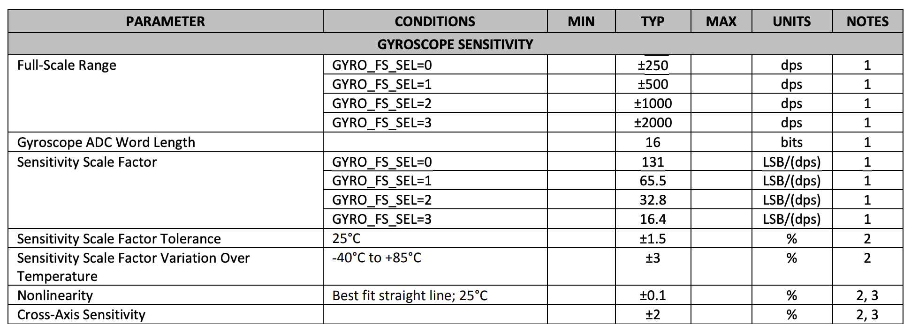

## Estimate Drag and Momentum

Choose your step responce, u(t), to be of similar size to the PWM value you used in Lab 5 (to keep the dynamics similar). Pick something between 50%-100% of the maximum u.
- PWM = 120

Make sure your step time is long enough to reach steady state (you likely have to use active braking of the car to avoid crashing into the wall). Make sure to use a piece of foam to avoid hitting the wall and damaging your car.
- 3 seconds

Show graphs for the TOF sensor output, the (computed) speed, and the motor input. Please ensure that the x-axis is in seconds.
Measure the steady state speed, 90% rise time, and the speed at 90% risetime. Note, this doesn’t have to be 90%, you could also use somewhere between 60-90, but the speed and time must correspond to get an accurate estimate for m.

When sending this data back to your laptop, make sure to save the data in a file so that you can use it even after your Jupyter kernel restarts. Consider writing the data to a CSV file, pickle file, or shelve file.

```cpp
case SET_YAW_SETPOINT:
{
    float sp;
    success = robot_cmd.get_next_value(sp);
    if (!success) return;

    setpoint_deg = wrap_angle_deg(sp);
    break;
}
```

---

## Initialize KF (Python)

Digital integration of gyroscope data often introduces drift over time (shown in lab 2). To reduce this drift, DMP built into the ICM-20948 IMU was used. The DMP internally performs sensor fusion and outputs orientation as a quaternion, which can then be converted to yaw angle.

```cpp
void update_dmp()
{
    yaw_dmp_fresh = false;
    if (!dmp_ok) return;

    icm_20948_DMP_data_t data;
    while (true) {
        myICM.readDMPdataFromFIFO(&data);
        if (!((myICM.status == ICM_20948_Stat_Ok) ||
              (myICM.status == ICM_20948_Stat_FIFOMoreDataAvail))) {
            break;
        }
        if ((data.header & DMP_header_bitmap_Quat6) > 0) {
            double q1 = ((double)data.Quat6.Data.Q1) / 1073741824.0; // 2^30
            double q2 = ((double)data.Quat6.Data.Q2) / 1073741824.0;
            double q3 = ((double)data.Quat6.Data.Q3) / 1073741824.0;

            double q0_sq = 1.0 - ((q1 * q1) + (q2 * q2) + (q3 * q3));
            if (q0_sq < 0.0) q0_sq = 0.0;
            double q0 = sqrt(q0_sq);

            double ysqr = q2 * q2;

            double t3 = +2.0 * (q0 * q3 + q1 * q2);
            double t4 = +1.0 - 2.0 * (ysqr + q3 * q3);
            yaw_dmp = (float)(atan2(t3, t4) * 180.0 / M_PI);
            yaw_dmp = wrap_angle_deg(yaw_dmp);

            yaw_dmp_fresh = true;
        }

        if (myICM.status != ICM_20948_Stat_FIFOMoreDataAvail) {
            break;
        }
    }
}
```

---

## KF Implementation on Jupyter

There are limitations of the gyroscope sensor. By default, the ICM-20948 gyroscope is configured with a range of ±250 degrees per second (dps), as shown in the Arduino code.

According to the ICM-20948 datasheet, the gyroscope supports four ranges: ±250, ±500, ±1000, and ±2000 dps. The robot can rotate faster than this, so default setting may not be enough. The range can be adjusted by changing the GYRO_FS_SEL register.

<p align="center">
  
</p>
<p align="center">
  <b>Figure 1:</b> ICM-20948 Datasheet, Gyroscope Angular Velocity.
</p>

---

## KF Implementation on the Robot

The goal of this lab was to control the robot's orientation. The robot rotates in place by driving the wheels at equal speeds in opposite directions.

Yaw was used as the feedback signal for the controller. The orientation error was computed as the difference between the target yaw setpoint and the measured yaw.

```cpp
float err = wrap_angle_deg(setpoint_deg - yaw);
```

The wrap_angle_deg() function ensures the controller always takes the shortest rotational path by keeping the error between −180° and 180°.

<br>

#### PID Control

Next, a derivative term was added to help reduce overshoot. Instead of calculating the derivative of the error, the gyroscope angular velocity was used directly since angular velocity is the derivative of orientation.

```cpp
float d = -Kd_yaw * gz_dps;
```

This also helps avoid derivative kick, which can occur when the setpoint changes suddenly. Because the derivative term depends on angular velocity rather than the error derivative, sudden setpoint changes do not create large spikes in the control signal.

Because the derivative term comes directly from the gyroscope measurement rather than the noisy angle samples, an additional low pass filter was not needed.

Kd of 0.3 was chosen for best response.

<p align="center">
  
  
  
</p>
<p align="center">
  <b>Figure 4:</b> Plots of PID Control Data.
</p>

Video 3 below shows the result of PID controller.

<div style="text-align:center; margin:30px 0;">
  <iframe
    width="560"
    height="315"
    src="https://www.youtube.com/embed/yNlylsxH1b8"
    frameborder="0"
    allowfullscreen>
  </iframe>
</div>
<p style="text-align:center;">
  <b>Video 3:</b> PID Controller.
</p>

<br>

---

## Discussion

This lab provided experience implementing closed loop orientation control using IMU and DMP. Overall, it improved understanding of PID control, tuning controller gains, and using IMU data to tune stable orientation control. The use of the DMP for yaw estimation demonstrated how sensor fusion can reduce drift and provide more reliable orientation measurements.

---

## Acknowledgment

I referenced [Aidan McNay](https://aidan-mcnay.github.io/fast-robots-docs/lab6/)’s pages from last year.

Parts of this report and website formatting were assisted by AI tools (ChatGPT) for grammar checking and webpage structuring. All code was written, tested, and validated by the author.
