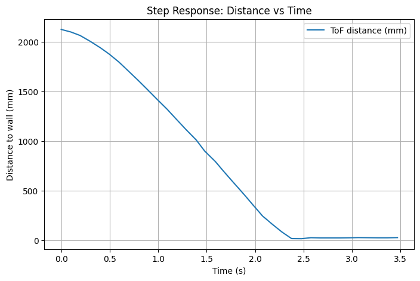
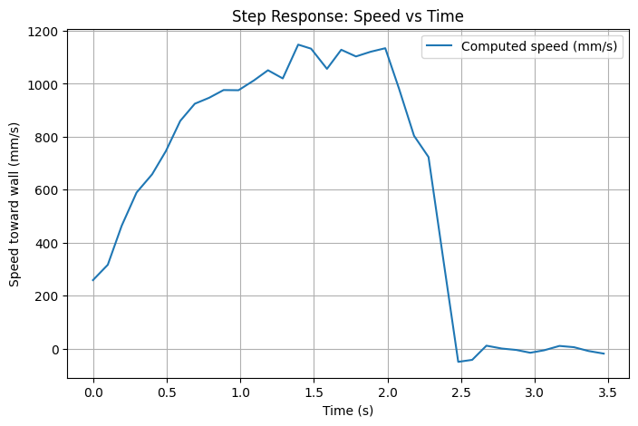
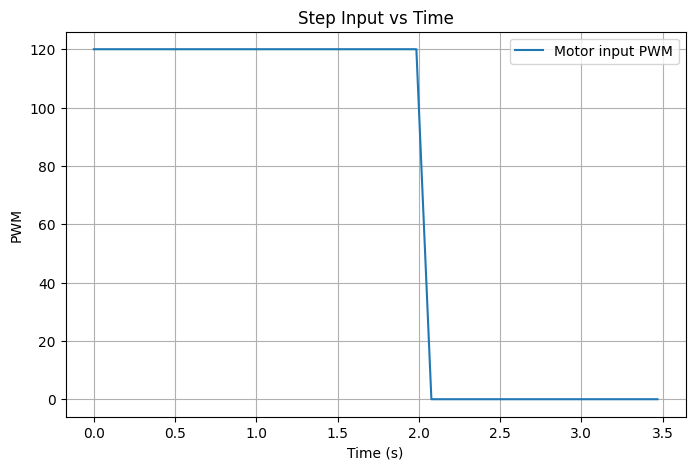
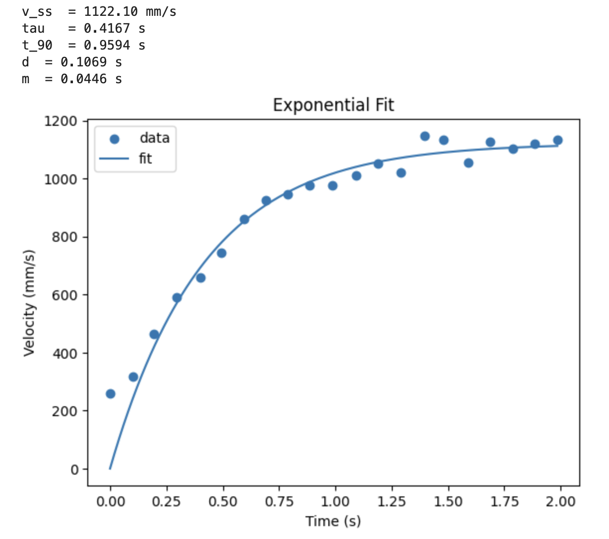
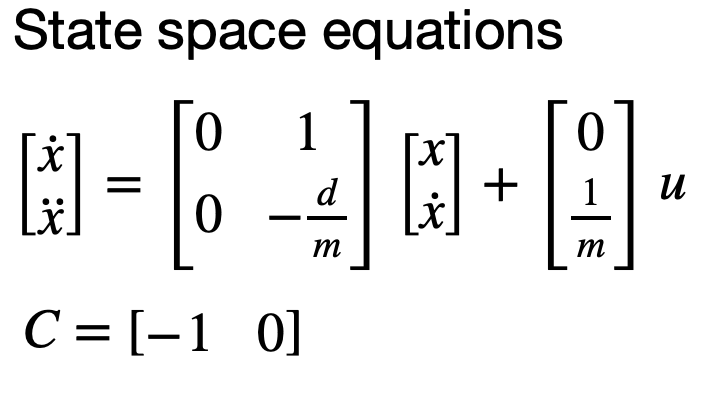
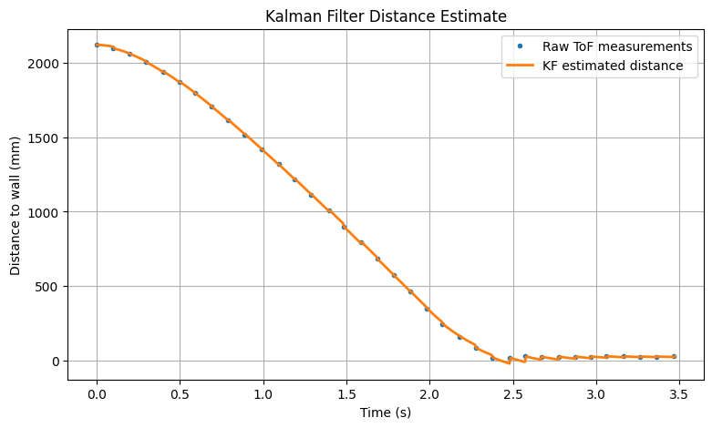
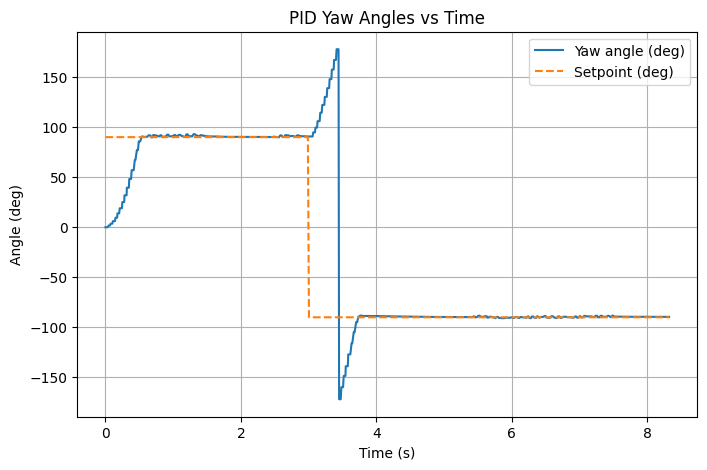
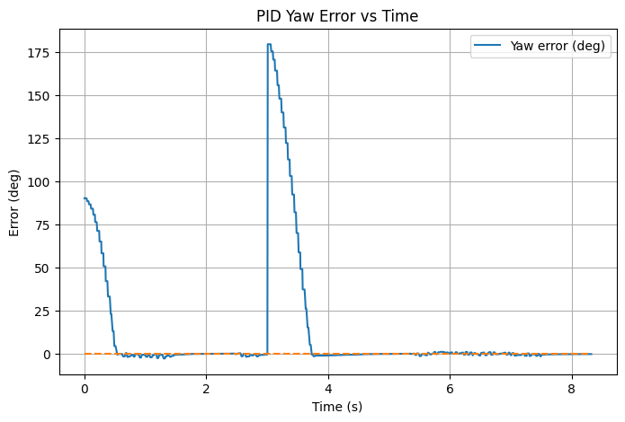
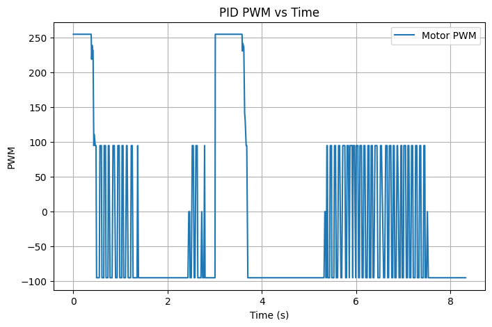

## Estimate Drag and Momentum

To build the state space model for the Kalman Filter, the robot step response was recorded. It was driven toward a wall using a constant motor pwm while recording the front TOF sensor. 

The PWM used for this test was chosen to be 120. A foam barrier was placed at the wall to avoid damage.

On the Artemis, STEP_RESPONSE_RUN command was added that starts the run, records data, and stops the robot after its done. During the run, the robot stores TOF data and later sends it to laptop.

```cpp
void start_step_response_run(int pwm, int duration_ms)
{    
    step_test_pwm = pwm;
    step_test_duration_ms = duration_ms;

    recording = false;
    record_done = false;
    imu_len = 0;
    tof1_len = 0;
    tof2_len = 0;

    recording = true;
    record_start_us = micros();

    driveForward(step_test_pwm);
    step_test_end_ms = millis() + step_test_duration_ms;
    step_test_active = true;
}
```

A safety stop was included so the robot would stop if it got too close to the wall.

```cpp
if (step_test_active && last_dist_mm > 0 && last_dist_mm < 200) {
    coastStop();
    step_test_active = false;
    recording = false;
    record_done = true;
}
```

<br>

On Python side, code was used to send step command, request data, and parse the returned samples. The recorded times were converted to seconds, and the speed was calculated from the distance data using the gradient:

```cpp
t = np.array(tof1_t)
d = np.array(tof1_mm)

t = t - t[0]
v = -np.gradient(d, t)
```

The plots are shown in Figure 1 below.

<p align="center">
  
  
  
</p>
<p align="center">
  <b>Figure 1:</b> Step Response Distance, Speed, PWM vs. Time.
</p>

To estimate the model parameters, the measured velocity was fit to an exponential model. Only the data during the active step input (t < 2 seconds) was used.

```cpp
mask = t_fit < 2.0
t_fit = t_fit[mask]
v_fit = v_fit[mask]

def model(t, v_ss, tau):
    return v_ss * (1 - np.exp(-t / tau))

popt, _ = curve_fit(model, t_fit, v_fit, p0=[np.max(v_fit), 0.5])

v_ss_fit, tau_fit = popt
```

The steady state velocity and time constant came from curve fitting. The 90 percent rise time was calculated as:

```cpp
t_90 = tau_fit * np.log(10)
```

The steady state velocity and time constant were then used to estimate d and m of the system. d and m were estimated using:

```cpp
d = u / v_ss_fit
m = d * tau_fit
```

The fitted curve was plotted with the measured velocity data in Figure 2.

<p align="center">
  
</p>
<p align="center">
  <b>Figure 2:</b> Exponential Fit of Velocity Data.
</p>

---

## Initialize KF (Python)

After estimating d and m from the step response, a 2 state model was built. The state vector was defined as position and velocity relative to the wall.

<p align="center">
  
</p>
<p align="center">
</p>

Using the fitted values, the A and B matrices were calculated in Python:

```cpp
A = np.array([
    [0.0,  1.0],
    [0.0, -(d / m)]
], dtype=float)

B = np.array([
    [0.0],
    [1.0 / m]
], dtype=float)

C = np.array([[-1.0, 0.0]], dtype=float)
```

The model was then discretized. A sampling time of Delta_T = 1/150 = 0.0067s was used, which is the PID control loop frequency measured in Lab 5. This allows the filter to run faster than the sensor and estimate the system state between measurements.

```cpp
Delta_T = 0.067

Ad = np.eye(2) + Delta_T * A
Bd = Delta_T * B
```

The initial state was set using the first TOF measurement. Position was initialized as the negative distance from the wall, and the initial velocity was set to zero.

The state covariance matrix was initialized next. A relatively large uncertainty in both position and velocity was used at the beginning, since the exact initial state is not known accurately.

```cpp
Sigma = np.array([
    [150.0**2, 0.0],
    [0.0, 400.0**2]
], dtype=float)
```

Next, process noise and measurement noise covariance matrices were chosen. Assuming the noise terms were uncorrelated, both matrices were diagonal. A measurement standard deviation of about 20 mm was chosen for TOF readings.

```cpp
sigma_3 = 20.0
Sigma_z = np.array([[sigma_3**2]], dtype=float)
```

The process noise covariance represents uncertainty in the system model. Since the robot does not exactly follow an ideal first order model, uncertainty was included in both position and velocity. Initial values of 30 mm and 30 mm/s were used.

```cpp
sigma_1 = 30.0
sigma_2 = 30.0

Sigma_u = np.array([
    [sigma_1**2, 0.0],
    [0.0, sigma_2**2]
], dtype=float)
```

During tuning, the measurement noise (sigma 3) had the most noticeable effect. Increasing sigma 3 resulted in smoother estimates by reducing the influence of noisy measurements, while decreasing sigma 3 caused the filter to closely follow the raw sensor data.

In contrast, changing the process noise terms (sigma 1 and sigma 2) had a smaller effect on the position estimate. This is likely because the system model was already a reasonable approximation and measurements were incorporated frequently.

These values determine how much the filter trusts the model vs. the measurements. Larger process noise increases reliance on measurements, while larger measurement noise increases reliance on the model.

---

## KF Implementation on Jupyter TODO

Finally, the Kalman Filter was implemented, including the prediction step, Kalman gain computation, and measurement update.

The Kalman Filter was implemented such that prediction is performed at every control loop iteration, while measurement updates are only applied when a new TOF sample is available. This allows the model to estimate system behavior between sensor readings.

The code for Kalman Filter was separated into prediction and update functions:

```cpp
def kf_predict(mu, sigma, u):
    mu_p = Ad.dot(mu) + Bd.dot(u)
    sigma_p = Ad.dot(sigma.dot(Ad.transpose())) + Sigma_u

    return mu_p, sigma_p

def kf_update(mu_p, sigma_p, y):
    sigma_m = C.dot(sigma_p.dot(C.transpose())) + Sigma_z
    kkf_gain = sigma_p.dot(C.transpose().dot(np.linalg.inv(sigma_m)))
    y_m = np.array(y) - C.dot(mu_p)
    mu = mu_p + kkf_gain.dot(y_m)
    sigma = (np.eye(2) - kkf_gain.dot(C)).dot(sigma_p)

    return mu, sigma
```

The filter was run using a higher rate time vector that matches the control loop. At each step, it first predicts the next state using the model. When a new TOF measurement becomes available, the filter updates the estimate using that measurement.

```cpp
for tk in t_kf:
    u_now = u_step if tk < 2 else 0.0

    # prediction
    mu_p, Sigma_p = kf_predict(mu, Sigma, u_now)

    # update only when measurements are available
    while meas_idx < n_meas and t_meas[meas_idx] <= tk:
        y_now = z_meas[meas_idx]
        mu_p, Sigma_p, _ = kf_update(mu_p, Sigma_p, y_now)
        meas_idx += 1

    mu = mu_p
    Sigma = Sigma_p
```

The estimated states were saved and used to compute the distance and velocity. The results were compared with the raw TOF distance data. The Kalman Filter produced a smoother estimate, while still following the overall trend of the measurements.

Small jumps can be seen in the estimated trajectory whenever a new TOF measurement is used. This is expected, since the filter corrects its prediction when new data arrives.

<p align="center">
  
</p>
<p align="center">
  <b>Figure 3:</b> KF Distance vs. Raw TOF Distance.
</p>

---

## KF Implementation on the Robot

The goal of this lab was to control the robot's orientation. The robot rotates in place by driving the wheels at equal speeds in opposite directions.

Yaw was used as the feedback signal for the controller. The orientation error was computed as the difference between the target yaw setpoint and the measured yaw.

```cpp
float err = wrap_angle_deg(setpoint_deg - yaw);
```

The wrap_angle_deg() function ensures the controller always takes the shortest rotational path by keeping the error between −180° and 180°.

<br>

#### PID Control

Next, a derivative term was added to help reduce overshoot. Instead of calculating the derivative of the error, the gyroscope angular velocity was used directly since angular velocity is the derivative of orientation.

```cpp
float d = -Kd_yaw * gz_dps;
```

This also helps avoid derivative kick, which can occur when the setpoint changes suddenly. Because the derivative term depends on angular velocity rather than the error derivative, sudden setpoint changes do not create large spikes in the control signal.

Because the derivative term comes directly from the gyroscope measurement rather than the noisy angle samples, an additional low pass filter was not needed.

Kd of 0.3 was chosen for best response.

<p align="center">
  
  
  
</p>
<p align="center">
  <b>Figure 4:</b> Plots of PID Control Data.
</p>

Video 3 below shows the result of PID controller.

<div style="text-align:center; margin:30px 0;">
  <iframe
    width="560"
    height="315"
    src="https://www.youtube.com/embed/yNlylsxH1b8"
    frameborder="0"
    allowfullscreen>
  </iframe>
</div>
<p style="text-align:center;">
  <b>Video 3:</b> PID Controller.
</p>

<br>

---

## Discussion

This lab provided experience implementing closed loop orientation control using IMU and DMP. Overall, it improved understanding of PID control, tuning controller gains, and using IMU data to tune stable orientation control. The use of the DMP for yaw estimation demonstrated how sensor fusion can reduce drift and provide more reliable orientation measurements.

---

## Acknowledgment

I referenced [Aidan McNay](https://aidan-mcnay.github.io/fast-robots-docs/lab6/)’s pages from last year.

Parts of this report and website formatting were assisted by AI tools (ChatGPT) for grammar checking and webpage structuring. All code was written, tested, and validated by the author.
