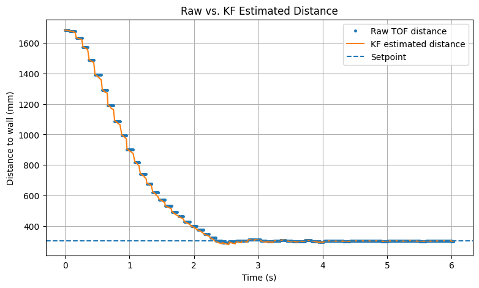
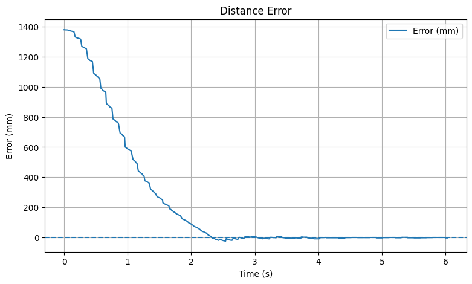
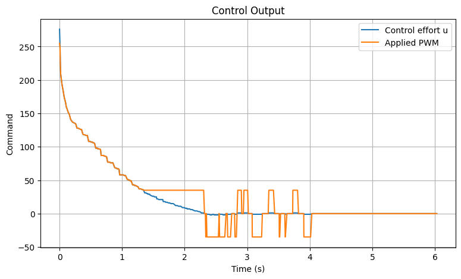
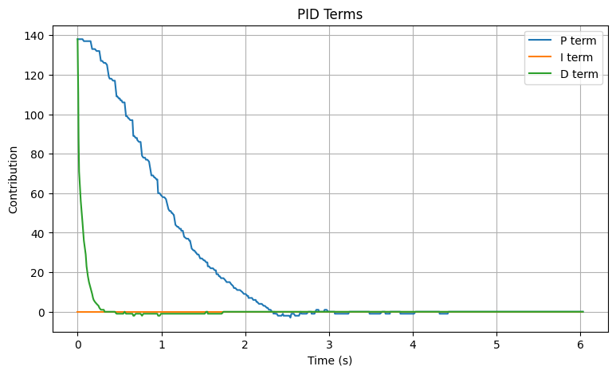

## Objective

The goal of this lab was to combine everything from the previous labs and make the robot do a fast stunt. Task A: Flip was chosen. The robot starts a few meters away from the wall, drives forward quickly, flips near the wall, and then drives back.

---

## Flip State Machine

The flip was implemented using a simple state machine with three main states:

```cpp
enum FlipState {
    FLIP_IDLE = 0,
    FLIP_DRIVE_TO_WALL = 1,
    FLIP_EXECUTE = 2,
    FLIP_DRIVE_AWAY = 3
};
```

The robot stays in FLIP_IDLE until the start command is sent from Python. When the stunt starts, all buffers and the Kalman Filter are reset, and the system enters FLIP_DRIVE_TO_WALL.

In this state, the robot drives forward at a constant PWM. A primed condition is used to prevent early triggering due to noise. Once the robot travels far enough, it becomes “primed”, and then waits until it is close enough to the wall to start the flip.

```cpp
case FLIP_DRIVE_TO_WALL:
{
    driveForwardCal(flip_forward_pwm, calibration_forward);
    flip_last_u_pwm = (float)flip_forward_pwm;

    log_flip_data(now_ms, FLIP_DRIVE_TO_WALL, raw_dist, est_dist, flip_forward_pwm, pitch_cf, roll_cf);

    if (est_dist >= flip_primed_distance_mm) {
        flip_primed = true;
    }

    if (flip_primed && est_dist <= flip_target_mm) {
        flip_state = FLIP_EXECUTE;
        flip_state_start_ms = now_ms;
    }

    break;
}
```

When the robot reaches the target distance, it switches to FLIP_EXECUTE. In this state, the robot reverses at high speed for a fixed amount of time. This generates enough momentum for the flip. This part is open loop because maximum speed is needed rather than controlled motion. After flip_time_ms passed, the robot switched to FLIP_DRIVE_AWAY.

```cpp
case FLIP_EXECUTE:
{
    driveReverseCal(flip_reverse_pwm, calibration_reverse);
    flip_last_u_pwm = (float)(-flip_reverse_pwm);

    log_flip_data(now_ms, FLIP_EXECUTE, raw_dist, est_dist, -flip_reverse_pwm, pitch_cf, roll_cf);

    if ((now_ms - flip_state_start_ms) >= (uint32_t)flip_time_ms) {
        flip_state = FLIP_DRIVE_AWAY;
        flip_state_start_ms = now_ms;
    }
    break;
}
```

Finally, in FLIP_DRIVE_AWAY, the robot drives forward and stops when it had moved far enough from the wall.

```cpp
case FLIP_DRIVE_AWAY:
{
    driveForwardCal(flip_forward_pwm, calibration_forward);
    flip_last_u_pwm = (float)(flip_forward_pwm);

    log_flip_data(now_ms, FLIP_DRIVE_AWAY, raw_dist, est_dist, flip_forward_pwm, pitch_cf, roll_cf);

    if (est_dist > 700) {
        coastStop();
        flip_active = false;
        flip_state = FLIP_IDLE;
        recording = false;
        record_done = true;
    }
    break;
}
```

---

## Python Control

On the Python side, a BLE handler was implemented to receive and parse the stunt data. These were appended into arrays for plotting, same as previous labs.

```cpp
initialize arrays
def parse_flip():
    parse incoming data
def flip handler:
    append data to arrays

clear arrays
start BLE notification
send START_FLIP_STUNT
send GET_FLIP_DATA
wait for data
stop BLE notification
plot data
```

After the run, the logged data was sent using GET_FLIP_DATA, which sends the number of samples and then all logged values.

---

## Kalman Filter

The same Kalman Filter from Lab 7 was reused. Inside flip_step(), the Kalman Filter was updated every loop using. The raw TOF distance was stored in raw_dist, while the estimated distance used by the stunt was calculated from the Kalman Filter state:

```cpp
kf_step(flip_last_u_pwm, new_tof_sample, (float)last_dist_mm);

int raw_dist = last_dist_mm;
int est_dist = (int)roundf(-kf_x);
```

Since the TOF sensor updates slowly, using only raw distance can lead to noise and delay. The Kalman Filter provides a smoother and more responsive estimate. This matches the same idea described in the previous Lab for using the KF in closed loop control.

---

## Results

<p align="center">
  
</p>
<p align="center">
  <b>Figure 4:</b> KF Distance vs. Raw TOF Distance.
</p>

<p align="center">
  
  
  
</p>
<p align="center">
  <b>Figure 5:</b> KF Error, PWM, and PID.
</p>

Video 1 below shows the result of KF PID controller. Same PID gains (from Lab 5) of Kp = 0.1, Ki = 0.001, and Kd = 0.001 were used.

<div style="text-align:center; margin:30px 0;">
  <iframe
    width="560"
    height="315"
    src="https://www.youtube.com/embed/ZfvJo3h3mO4"
    frameborder="0"
    allowfullscreen>
  </iframe>
</div>
<p style="text-align:center;">
  <b>Video 1:</b> PID Controller with KF.
</p>

---

## Discussion

This lab provided experience implementing a Kalman Filter on the robot and integrating it with a closed loop PID controller. Overall, it improved understanding of the Kalman Filter, and how showed how combining a system model with noisy TOF measurements can produce a smoother and more reliable estimate, which is useful when the sensor updates slower compared to the main loop.

---

## Acknowledgment

I referenced [Trevor Dales](https://trevordales.github.io/MAE4190/lab7/)’s pages from last year.

Parts of this report and website formatting were assisted by AI tools (ChatGPT) for grammar checking and webpage structuring. All code was written, tested, and validated by the author.
