## Objective

The goal of this lab was to construct a map of the environment using TOF distance measurements and IMU yaw data. The robot was placed at multiple locations and performed on axis turns while collecting TOF measurements. These local scans were then combined into a global frame to generate a full map.

---

## Mapping Control

Instead of open loop, orientation PID control from Lab 6 was reused. The mapping process was implemented using a simple state machine with four main states:

```cpp
enum MapState {
    MAP_IDLE = 0,
    MAP_TURN = 1,
    MAP_STOP = 2,
    MAP_WAIT = 3
};
```

The robot stays in MAP_IDEL until the start command is sent from Python. Then it enters MAP_TURN, which runs yaw PID to reach target angle. MAP_TURN uses DMP yaw instead of gyro integration because gyro integration accumulates drift over time, leading to large angular errors.

```cpp
float err = map_target_deg - yaw_unwrapped;
float u = Kp_yaw * err + Ki_yaw * yaw_i_accum - Kd_yaw * gz_dps;
```

When there is a small error, pwm was forced to 0 to avoid oscillation:

```cpp
if (fabs(err) < 2.0f) {
    pwm = 0;
}
```

To ensure the turn is completed accurately, the function map_turn_reached_from_err() was used to continue to next state if there are 3 good samples.

```cpp
bool map_turn_reached_from_err(float err)
{
    static int good_count = 0;

    if (fabs(err) < 3.0f) good_count++;
    else good_count = 0;

    return (good_count >= 3);
}
```

After reaching the desired angle, the robot will stop and wait to settle down for TOF measurements.

```cpp
case MAP_STOP:
{
    coastStop();
    if ((now_ms - map_stop_time_ms) >= map_stop_delay_ms) {
        map_state = MAP_WAIT;
    }
    break;
}
```

The robot then enters MAP_WAIT, where it collects multiple TOF readings and averages them.

```cpp
case MAP_WAIT:
{
    coastStop();
    if (new_tof_sample) {
        int d = last_dist_mm;

        if (d <= 0 || d >= 4000) {
            d = 4000;
        }

        map_dist_accum += d;
        map_avg_count++;

        if (map_avg_count >= map_avg_count_target) {
            int avg_dist = (int)(map_dist_accum / map_avg_count);
            log_map_data(now_ms, map_last_yaw_unwrapped, avg_dist);
            map_samples_taken++;
```

After logging one point, the next target angle is set:

```cpp
if (map_samples_taken < map_num_samples) {
    map_target_deg += map_step_deg;

    yaw_i_accum = 0.0f;
    yaw_prev_err = 0.0f;

    map_avg_count = 0;
    map_dist_accum = 0;

    map_state = MAP_TURN;
} else {
    stop_map_run();
}
```

This process repeats until a full rotation is done and data is collected.

#### Angle Handling

Yaw from the IMU is limited to -180 to 180 degrees. This causes jumps during rotation. To fix this, an unwrap function is used:

```cpp
double angle_no_wrap(double curr_angle)
{
    if ((curr_angle < 0) && (last_wrap_angle > 90)) {
        curr_angle = curr_angle + 360;
    }
    else if ((curr_angle > 0) && (last_wrap_angle < -90)) {
        curr_angle = curr_angle - 360;
    }

    last_wrap_angle = curr_angle;
    return curr_angle;
}
```

This makes yaw continuous so the robot can rotate smoothly.

Video 1 below shows the robot performing scan.

<div style="text-align:center; margin:30px 0;">
  <iframe
    width="560"
    height="315"
    src="https://www.youtube.com/embed/mDSQK26k4YE"
    frameborder="0"
    allowfullscreen>
  </iframe>
</div>
<p style="text-align:center;">
  <b>Video 1:</b> On Axis Turn During Scanning.
</p>


---

## Python Control

Python is used similar to previous labs, to start the scan and receive data for post processing.

```cpp
initialize arrays

def parse_map():
    parse incoming data

def map_handler():
    append data

clear arrays
start BLE notify
send START_MAP_RUN
wait
send GET_MAP_DATA
wait for done
stop notify
plot data
```

---

## Results

The mapping data was first plotted in polar coordinates for each scan location. Each polar plot shows the measured TOF distance as a function of yaw angle. 

<p align="center">
  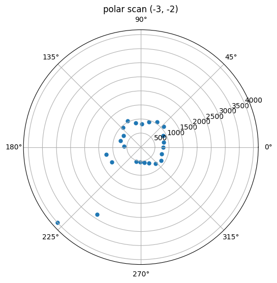
  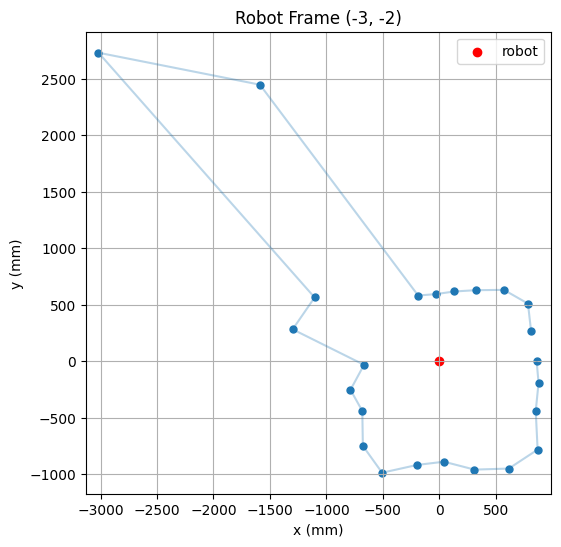
</p>
<p align="center">
  <b>Figure 1:</b> Polar and Robot Frame at (-3, -2).
</p>

<p align="center">
  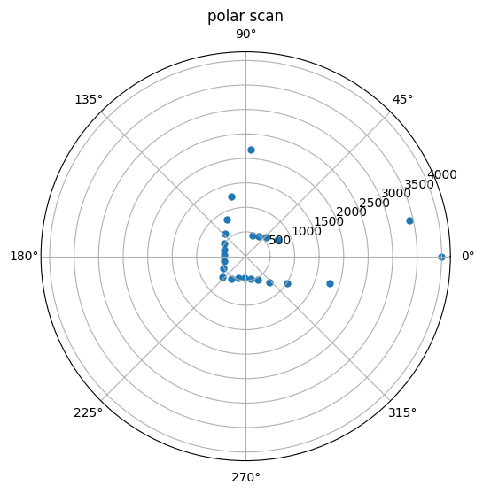
  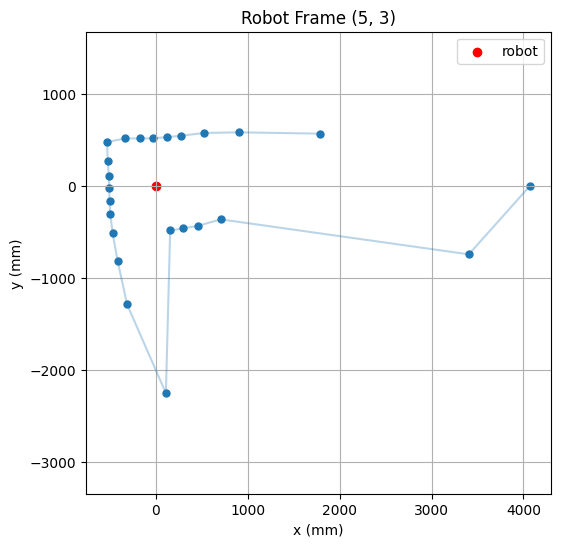
</p>
<p align="center">
  <b>Figure 2:</b> Polar and Robot Frame at (5, 3).
</p>

<p align="center">
  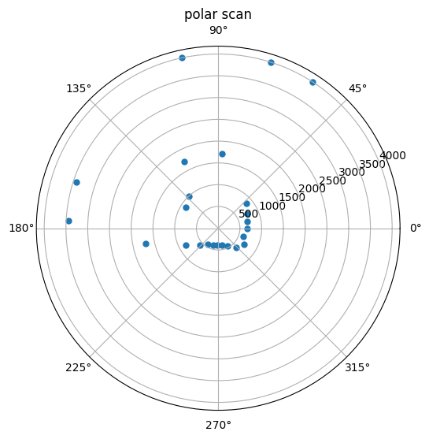
  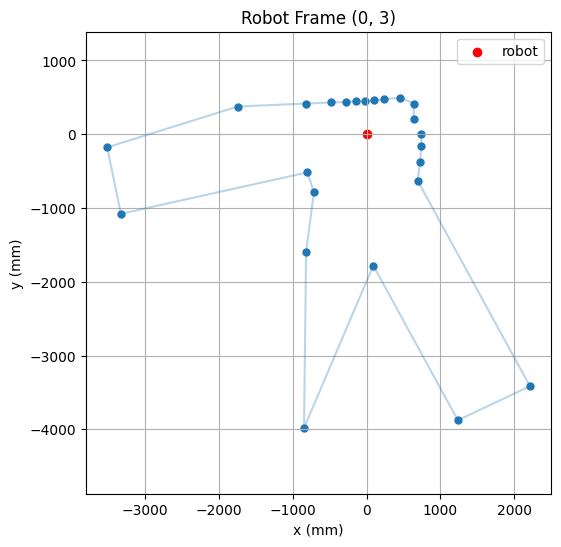
</p>
<p align="center">
  <b>Figure 3:</b> Polar and Robot Frame at (0, 3).
</p>

<p align="center">
  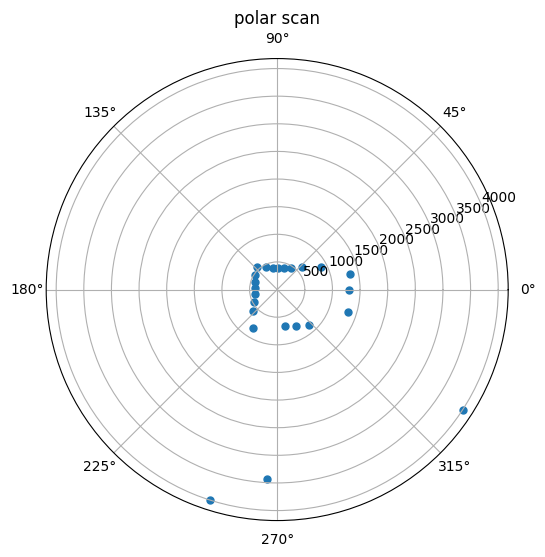
  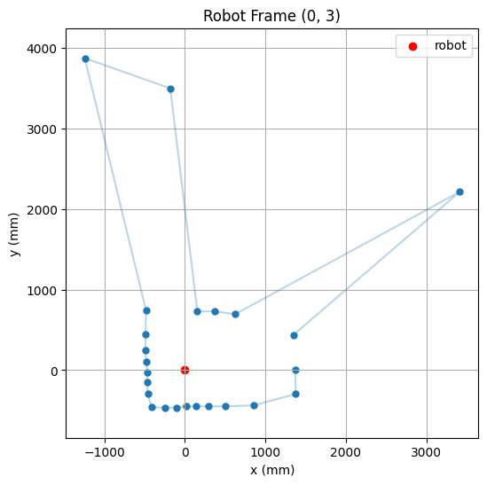
</p>
<p align="center">
  <b>Figure 4:</b> Polar and Robot Frame at (5, -3).
</p>

<p align="center">
  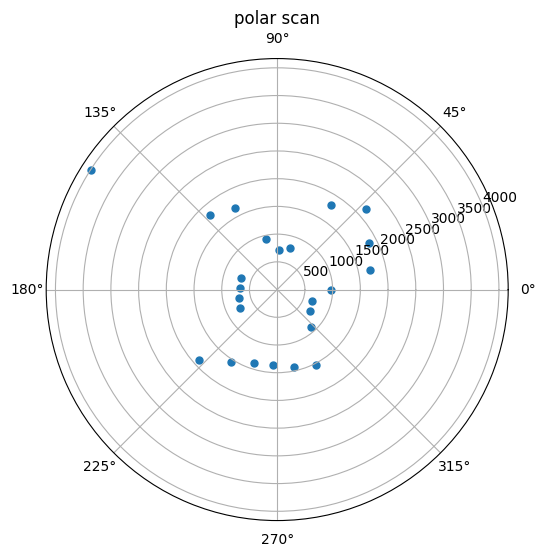
  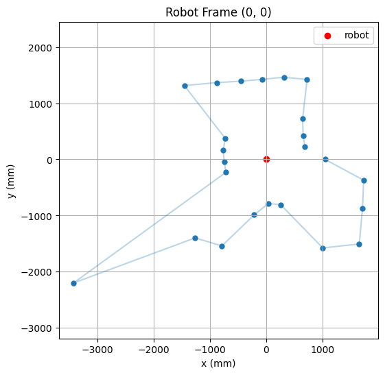
</p>
<p align="center">
  <b>Figure 5:</b> Polar and Robot Frame at (0, 0).
</p>

After checking the local scans, the points were converted from the robot frame into the global Cartesian frame. This used the robot position for each scan, the measured yaw angle, and the sensor offset from the center of the robot, which was measured to be 7 cm.

```cpp
def new_scan_to_world(map_yaw_deg, map_dist_mm, robot_pos_ft,
                      sensor_x_mm=70, sensor_y_mm=0,
                      yaw_sign=1):
    MM_TO_FT = 3.28084 / 1000.0

    yaw = np.array(map_yaw_deg)
    dist = np.array(map_dist_mm)

    yaw0 = yaw[0]
    yaw_rel = yaw - yaw0
    theta = yaw_sign * np.deg2rad(yaw_rel)

    px_mm = sensor_x_mm + dist
    py_mm = sensor_y_mm * np.ones_like(dist)

    px_mm = -px_mm
    py_mm = -py_mm

    x_world = robot_pos_ft[0] + (px_mm * np.cos(theta) - py_mm * np.sin(theta)) * MM_TO_FT
    y_world = robot_pos_ft[1] + (px_mm * np.sin(theta) + py_mm * np.cos(theta)) * MM_TO_FT

    return x_world, y_world
```

The combined global frame is shown in figure 6.

<p align="center">
  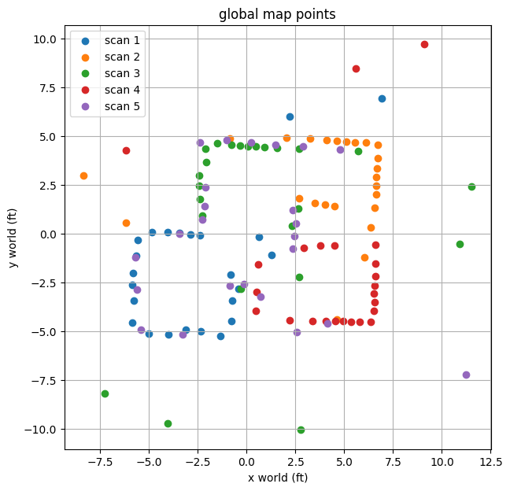
</p>
<p align="center">
  <b>Figure 6:</b> Combined Global Frame.
</p>

Straight line segments were drawn on top of the scatter plot to build the line based map as shown in figure 7.

```cpp
starts = [(6.5, 5),(-2.5, 5),(-2.5, 0),(-6, 0),(-6, -5),(-1, -5),(-1, -2.5),
(1, -5),(6.5, -5),(1, -2.5),(2.5, 1.25),(2.5, -1),(4.5, -1),(4.5, 1.25),]

ends = [(-2.5, 5),(-2.5, 0),(-6, 0),(-6, -5),(-1, -5),(-1, -2.5),(1, -2.5),
(6.5, -5),(6.5, 5),(1, -5),(2.5, -1),(4.5, -1),(4.5, 1.25),(2.5, 1.25),]
```

<p align="center">
  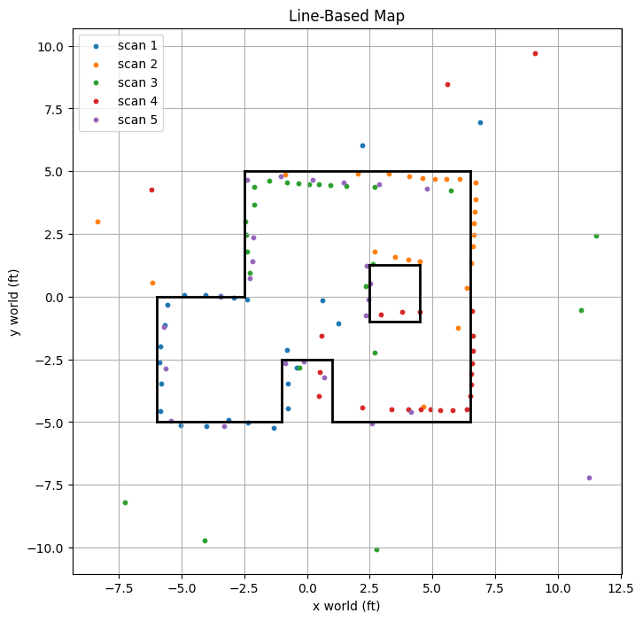
</p>
<p align="center">
  <b>Figure 7:</b> Combined Global Line-Based Map.
</p>

---

## Discussion

This lab focused on building a map using rotation and TOF. The robot used PID control to turn to fixed angles, and using state machine helped organize the turning, stopping, and measuring steps, which made the behavior more stable.

One challenge encountered was one of the motor driver stopped working for some reason, which made one side of wheel turned a lot slower than the other. I was stuck on this for awhile, and I ended up redoing Lab 4 to replace the motor drivers and the Artemis.

---

## Acknowledgment

I referenced [Aidan McNay](https://aidan-mcnay.github.io/fast-robots-docs/lab9/)’s pages from last year.

Parts of this report and website formatting were assisted by AI tools (ChatGPT) for grammar checking and webpage structuring. All code was written, tested, and validated by the author.
